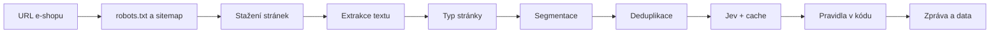

# Zadání: CLI prototyp kontroly textů e-shopu s Jevem

Sep 25, 2026 · @Jan Balcařík

## K čemu to slouží

Nástroj automaticky prochází texty e-shopů a hledá věty, za které hrozí pokuta, s vysvětlením a odkazem na předpis. Cílem je produkt pro české a slovenské e-shopy, které nemají kapacitu nechat právníka projít tisíce produktových textů. Tento testovací projekt má ověřit, že to s Jevem funguje dost přesně a levně.

**Proč teď.**

- Na Slovensku od 27. 9. 2026 platí novela zákona o ochraně spotřebitele. Mezi klamavé praktiky přidává obecná environmentální tvrzení, neuznané značky udržitelnosti a tvrzení o neutralitě díky kompenzaci emisí ([Podnikajte.sk](https://www.podnikajte.sk/zakonne-povinnosti-podnikatela/novela-zakona-o-ochrane-spotrebitela-od-2026)).
- Česko transpoziční lhůtu zmeškalo a novela (sněmovní tisk 53) ani k 25. 9. 2026 není schválená: je po 2. čtení, 3. čtení neproběhlo ([psp.cz](https://www.psp.cz/sqw/historie.sqw?o=10&T=53)). Klamavá eko tvrzení ale může ČOI trestat už dnes přes obecný zákaz klamavých praktik ([Pravano](https://pravano.cz/empco/baze/empco-transpozice-cr/)).
- ČOI při kontrolách internetových obchodů ve 2. čtvrtletí 2025 zjistila porušení ve 106 ze 125 kontrol; v tomto období nabylo právní moci 167 pokut za 3,45 mil. Kč. Nejčastěji chyběly informace o reklamacích, mimosoudním řešení sporů a odstoupení ([Lupa.cz](https://www.lupa.cz/aktuality/ceska-obchodni-inspekce-rozdala-e-shopum-pokuty-3-5-milionu-za-porusovani-zakonu/), [ČOI](https://coi.gov.cz/wp-content/uploads/2025/08/2025-08-19-kontroly-internet-2Q-2025.docx)). V 1. čtvrtletí 2025 šlo nejčastěji o § 1820 občanského zákoníku (114×, z toho odstoupení 58×), § 13 (80×) a § 14 (31×) zákona o ochraně spotřebitele.
- ČOI vybírá e-shopy ke kontrole podle vlastního screeningu webů, takže se vyplatí zkontrolovat se dřív ([Lupa.cz](https://www.lupa.cz/aktuality/ceska-obchodni-inspekce-rozdala-e-shopum-pokuty-3-5-milionu-za-porusovani-zakonu/)).
- Ruční služby k eko tvrzením se už prodávají, například balíček za 39 900 Kč bez DPH ([Pravano](https://pravano.cz/empco/baze/empco-transpozice-cr/)). Automatická kontrola může být výrazně levnější.

**Proč Jev.** Kontrola znamená tisíce malých úsudků ano/ne nad jednotlivými větami. Jev je dělá rychle, levně a s kalibrovanou pravděpodobností, takže jisté nálezy jdou rovnou do zprávy a nejisté k ručnímu ověření. Čísla a data řeší kód, klasické LLM se přidá až pro návrhy oprav.

**Na co má testovací projekt odpovědět.**

1. Jak přesně Jev pozná sledovaná tvrzení v češtině a slovenštině (precision a recall po otázkách). Dokumentace Jevu uvádí angličtinu jako primární jazyk a jiné jazyky jako „not equally well“, takže tohle je skutečně otevřená otázka.
2. Jestli fungují lépe otázky v angličtině, nebo v češtině.
3. Při jakých prazích je málo falešných poplachů a přitom se neztratí nic podstatného.
4. Kolik stojí a jak dlouho trvá kontrola reálného e-shopu.
5. Jestli jde jádro bez úprav použít ve skutečném produktu.

## Cíl a rozsah

Postav jednoduchou konzolovou aplikaci v C# (.NET 10), která projde web e-shopu, vytáhne z něj texty a pomocí modelu Jev v nich najde potenciálně problémová tvrzení. Jde o testovací projekt. Hlavní cíl je ověřit, jak přesně Jev funguje na českých a slovenských textech, ne postavit hotový produkt.

Jádro patří do samostatné knihovny `EshopGuard.Core`, aby šlo po ověření použít ve skutečném produktu. Konzolová aplikace je jen tenká vrstva nad ní.

Aplikace umí:

- projít web podle sitemap.xml (záložně podle odkazů) s limitem počtu stránek,
- vytáhnout hlavní text stránek a rozdělit ho na věty nebo odstavce,
- vyhodnotit texty sadou otázek z konfiguračních souborů (modul eko tvrzení a modul právních stránek),
- vytvořit zprávu v Markdownu a data v JSON a CSV,
- změřit přesnost na ručně označeném vzorku.

Mimo rozsah je webové UI, uživatelské účty, platby, databázový server, Docker a kontrola obrázků. Návrhy oprav přes klasické LLM se nyní neimplementují, jen se pro ně připraví rozhraní.

Výstup je screening, ne právní posouzení. Všechny právní odkazy a otázky v tomto zadání jsou návrh, který musí zkontrolovat právník.

## Technické zadání

.NET 10 (LTS), jedno řešení se třemi projekty: knihovna `EshopGuard.Core` s veškerou logikou, konzolová aplikace `EshopGuard.Cli` (spustitelný soubor `eshopguard`) a testy knihovny. Jediná externí služba je API Jevu, vše ostatní běží lokálně.

Doporučené knihovny (další jen po souhlasu zadávajícího):

| Účel | Knihovna | Projekt |
| --- | --- | --- |
| CLI a výpis do konzole | Spectre.Console.Cli 0.55.0, Spectre.Console 0.55.x (ne alfa 1.0) | CLI |
| Načtení `.env` | DotNetEnv | CLI |
| DI kontejner | Microsoft.Extensions.DependencyInjection | CLI |
| Logování | Serilog, Serilog.Sinks.File, Serilog.Extensions.Logging (most do `ILogger<T>`) | CLI |
| Abstrakce pro DI, konfiguraci a logování | Microsoft.Extensions.DependencyInjection.Abstractions, Microsoft.Extensions.Options, Microsoft.Extensions.Logging.Abstractions | Core |
| HTTP | HttpClient přes IHttpClientFactory (Microsoft.Extensions.Http) | Core |
| Parsování HTML | AngleSharp | Core |
| Extrakce hlavního textu | SmartReader (port Mozilla Readability), záložně vlastní heuristika nad AngleSharp | Core |
| Sitemap | System.Xml.Linq a GZipStream (součást .NET) | Core |
| YAML | YamlDotNet | Core |
| JSON | System.Text.Json (součást .NET) | Core |
| CSV | CsvHelper | Core |
| Cache | Microsoft.Data.Sqlite | Core |
| Limit požadavků | System.Threading.RateLimiting | Core |
| Testy | xunit.v3 (verze 2 se už nevyvíjí) | Tests |

Poznámky k použití knihoven (ověřeno zkušebním buildem na SDK 10.0.401, 25. 9. 2026):

- SmartReader volej jako `new Reader(url, html).GetArticle()`. Přetížení `Reader.ParseArticle(url, html)` bere druhý argument jako User-Agent a stránku si stáhne samo, tedy mimo robots.txt a limit rychlosti. Nikdy ho nepoužívej.
- xunit.v3 pod SDK 10 potřebuje v kořeni `global.json` s `{"test": {"runner": "Microsoft.Testing.Platform"}}` a nesmí odkazovat `Microsoft.NET.Test.Sdk` ani `xunit.runner.visualstudio`, jinak `dotnet test` skončí chybou. `global.json` zároveň fixuje SDK 10.0.4xx. Test bez klíče se přeskočí přes `Assert.SkipUnless`.
- Spectre.Console.Cli 0.55: `AsyncCommand<T>.ExecuteAsync` má podpis `(CommandContext, TSettings, CancellationToken)`. Příkazy si DI kontejner s knihovnou sestaví samy podle svých voleb (`--mock`, `--no-cache`), takže propojení Spectre s DI (`TypeRegistrar`) není potřeba.

Pravidla pro stahování:

- respektuj robots.txt (vlastní jednoduchý parser: User-agent \*, Allow, Disallow, Sitemap),
- výchozí rychlost 1 požadavek za sekundu na doménu,
- vlastní User-Agent s kontaktem, např. `EshopGuard/0.1 (+mailto:...)`,
- timeout 20 s, maximální velikost stránky 5 MB, jen content-type text/html,
- jen stejná doména, přesměrování následuj jen v rámci domény.

Konfiguraci čte jen CLI: tajné hodnoty z `.env` (klíč a adresa API), ostatní z `config/settings.yaml`, a předá je knihovně jako options. Když `JEV_API_KEY` chybí, použije se proměnná prostředí `TYPESAFE_API_KEY` (pod tímto názvem ji čtou oficiální SDK). Čísla, data a lhůty (např. „14 dní“) zjišťuje vždy kód přes regulární výrazy, nikdy Jev.

## Knihovna EshopGuard.Core

Veškerá logika je v knihovně `EshopGuard.Core`. CLI jen načte konfiguraci, zavolá knihovnu a vypíše výsledek. Knihovnu tak půjde bez úprav použít ve skutečném produktu, například ve webové aplikaci nebo backendové službě.

Veřejné API:

```csharp
// Registrace do DI
services.AddEshopGuard(options =>
{
    options.Jev.ApiKey = configuration["JEV_API_KEY"];
    options.Jev.BaseUrl = new Uri("https://api.typesafe.ai/v1/systemone");
    options.Jev.Model = "jev-1.13.0";
    options.Crawl.MaxPages = 200;
    options.Rules.Directory = "rules";
});

public interface IEshopGuard
{
    // Projde web a vyhodnotí jeho stránky
    Task<ScanResult> ScanSiteAsync(Uri siteUrl, ScanOptions options,
        IProgress<ScanProgress>? progress = null, CancellationToken ct = default);

    // Vyhodnotí texty bez stahování webu, např. popisy produktů z databáze před publikací
    Task<AnalysisResult> AnalyzeTextsAsync(IReadOnlyList<TextInput> texts, AnalyzeOptions options,
        CancellationToken ct = default);
}
```

`scan` v CLI volá `ScanSiteAsync` a `check-text` volá `AnalyzeTextsAsync`. `evaluate` používá veřejnou třídu `Evaluator`, aby šla přesnost měřit i ve skutečném produktu.

Rozšiřitelná místa mají rozhraní a výchozí implementaci:

| Rozhraní | Výchozí implementace | Proč |
| --- | --- | --- |
| `IJevClient` | `JevClient`, `MockJevClient` | Jiný přístup k Jevu (OpenRouter), testy bez API |
| `IJevCache` | `SqliteJevCache`, `NullJevCache` | V produktu třeba Redis nebo databáze |
| `IRuleSetProvider` | `YamlRuleSetProvider` | Pravidla později z databáze |
| `IPageFetcher` | `HttpPageFetcher` | Testy bez sítě, později headless prohlížeč pro weby v JavaScriptu |
| `IReportWriter` | Markdown, JSON a CSV writer | Vlastní výstupy nebo zobrazení v UI |
| `IFixSuggester` | Vrací `null` | Pozdější návrhy oprav přes LLM |

Zásady návrhu:

- Veřejné jsou jen `IEshopGuard`, `Evaluator`, options, vstupní a výstupní modely (`ScanResult`, `AnalysisResult`, `Finding`, `Segment`, `PageInfo`, `ScanStats`, `ScanProgress`) a rozhraní z tabulky. Ostatní je `internal`, testy mají přístup přes `InternalsVisibleTo`.
- Knihovna nic nevypisuje do konzole a nečte `.env` ani `settings.yaml`. Konfiguraci dostane přes `IOptions<T>` a loguje jen přes `ILogger<T>`.
- `HttpClient` získává přes `IHttpClientFactory`, aby fungovala i ve webové aplikaci.
- Vše je asynchronní s `CancellationToken`. Služby jsou bezstavové a bezpečné pro souběh, jdou registrovat jako singleton.
- Výsledek je čistý objektový model serializovatelný do JSON. Writery jsou volitelné, produkt může nálezy zobrazit ve vlastním UI.
- Jmenný prostor `EshopGuard.Core.Jev` nezávisí na zbytku knihovny, aby šel později vyčlenit do samostatného balíčku.
- Nullable reference types zapnuté, XML dokumentace k veřejnému API, verze 0.1.0 a `dotnet pack` pro lokální NuGet feed.

## Příkazy CLI

Aplikace má čtyři příkazy. `scan` projde web, `check-text` vyhodnotí jeden text pro rychlé experimenty, `evaluate` měří přesnost a `serve-fixture` spustí lokální testovací e-shop. Během vývoje se volá přes `dotnet run --project src/EshopGuard.Cli -- <příkaz>`.

```text
eshopguard scan <url> [volby]
eshopguard check-text "<text>" [--kind sentence|legal] [--modules eco,legal] [--mock]
eshopguard evaluate <labeled.csv> [--question-lang en|cs|both] [--mock]
eshopguard serve-fixture [--port 8000]
```

Volby příkazu `scan`:

| Volba | Výchozí | Význam |
| --- | --- | --- |
| `--max-pages` | 200 | Maximální počet stažených stránek |
| `--sample-products` | 100 | Maximální počet produktových stránek |
| `--modules` | eco,legal | Které moduly pravidel spustit |
| `--country` | cz | Sada právních pravidel (cz nebo sk) a jazyk zprávy |
| `--question-lang` | en | Jazyk otázek pro Jev (en nebo cs), kvůli A/B testu |
| `--rate` | 1.0 | Požadavky za sekundu při stahování webu |
| `--concurrency` | 8 | Paralelní požadavky na Jev |
| `--include` / `--exclude` | – | Regulární výrazy pro filtrování URL |
| `--out` | out/ | Složka pro výstupy |
| `--mock` | vypnuto | Místo Jevu použije falešný klient, žádná volání API |

`check-text` vypíše tabulku: ID otázky, pravděpodobnost a výsledek každého pravidla. Používá stejnou cache i stejná pravidla jako `scan`.

## Zpracovací pipeline

Každý krok je samostatný modul, aby šel testovat zvlášť. Jev se volá až nad deduplikovanými segmenty.



1. **Objevení URL.** Přečti robots.txt a sitemap v něm uvedenou, jinak `/sitemap.xml`. Podporuj sitemap index i `.gz`. Bez sitemap procházej odkazy od úvodní stránky do hloubky 3. Odkazy z úvodní stránky projdi vždy: právní stránky v sitemap často chybí a bývají odkázané z patičky.
2. **Filtrování URL.** Vyřaď košík, přihlášení, vyhledávání, řazení, stránkování, filtry, PDF a obrázky. Normalizuj URL: odstraň `utm_*`, fragmenty a duplicity. Odkazy na PDF, jejichž URL nebo text odkazu odpovídá právní stránce (viz krok 3), se nestahují, ale zapíšou se do výsledku jako nezkontrolované právní dokumenty.
3. **Typ stránky (kód, heuristiky).** Právní stránky poznáš podle URL a titulku: obchodni-podminky, obchodne-podmienky, reklamacni-rad, reklamacny-poriadok, odstoupeni, odstupenie, vraceni, vratenie, doprava, kontakt. Produktové podle JSON-LD `Product` nebo `og:type=product`. Ostatní jsou obsahové. Úvodní stránku a všechny právní stránky zpracuj vždy, i nad limit.
4. **Extrakce.** Hlavní text přes SmartReader, záložně přes AngleSharp bez script, style, nav, header, footer a aside. Text z header, footer a aside se vytáhne zvlášť jako „rám stránky“ a zpracuje se také: eko tvrzení bývají i v patičce a opakovaný rám pozná deduplikace jako šablonový. Ulož i titulek, meta description, popis z JSON-LD a alt texty a názvy souborů obrázků; titulek, meta description a popis z JSON-LD se také dělí na věty a vyhodnocují. Každý segment si pamatuje svůj zdroj (hlavní text, rám, titulek, meta, JSON-LD). Oddělování textu v HTML:
   - blok ukončují blokové prvky (odstavec, nadpis, položka seznamu, buňka tabulky, `div` a další) a `<br>`,
   - formátovací značky uvnitř slova text nespojují mezerou (`<b>Eko</b>logický` → „Ekologický“),
   - ostatní vložené prvky (`span`, `a`, `label`, `img`, neznámé značky) se oddělí mezerou (`<span>Novinka</span><span>EKO</span>` → „Novinka EKO“, ne „NovinkaEKO“),
   - text skrytý atributem `hidden` nebo stylem se zpracuje také, protože sbalené záložky a akordeony zákazník otevře.
5. **Segmentace.** Obsahové a produktové stránky děl na věty. Splitter musí znát české a slovenské zkratky (např., tzv., č., s.r.o., a.s., atd., resp., cca, min., max.) a desetinnou čárku. Segment se vyhodnotí, když má aspoň 3 znaky **a** aspoň jedno slovo se 3 písmeny (obě hodnoty nastavitelné v `settings.yaml`). Znaky se počítají po sjednocení mezer a počítají se všechny včetně mezer, číslic a interpunkce; slovo je souvislá řada písmen včetně diakritiky, číslice a značky se nepočítají. Projdou tedy štítky „EKO“ a „BIO“, „Ekologický“ i „Ekologický šampon.“, neprojde „189,90 Kč“, „5 %“ ani „★★★★★“. Kratší úlomky se nevyhodnocují, ale zůstávají v kontextu sousedních vět. Segmenty delší než 600 znaků rozděl. Každá věta dostane kontext: předchozí a následující věty ze stejného zdroje na stejné stránce (výchozí 2 a 2, nastavitelné v `settings.yaml`). Důvod: zákon posuzuje upřesnění tvrzení „na stejném médiu“, podle Q&A Komise hned vedle tvrzení, ne jen ve stejné větě. Právní stránky děl na odstavce do 1 500 znaků a každému předsaď nejbližší nadpis; jejich text se navíc dělí na věty pro eko modul (viz krok 7).
6. **Deduplikace.** Normalizuj mezery a velikost písmen a spočítej hash z textu a kontextu. Každý unikátní segment (text + kontext) se vyhodnotí jednou a pamatuje si všechny URL, kde se vyskytuje. Text na více než 30 % stránek označ jako šablonový (patička, menu).
7. **Vyhodnocení.** Pro každý segment a modul jde jeden požadavek na Jev se všemi otázkami modulu najednou. Eko modul běží nad větami ze všech typů stránek včetně právních (tvrzení typu „klimaticky neutrální doprava“ bývají na stránce dopravy), právní modul nad odstavci právních stránek. Žádný klíčový předfiltr: měříme i úplnost, takže se vyhodnocuje vše.
8. **Pravidla.** Kód skládá pravděpodobnosti otázek podle logiky pravidla z YAML, doplní kontroly regulárními výrazy a seznamy a u právních stránek vyhodnotí přítomnost informace za celý web.
9. **Výstupy.** Zpráva a data podle sekce Výstupy.

Obrázky Jev nevidí. Alt texty a názvy souborů obsahující eko slova (eko, eco, green, bio, zelen) jen označ k ruční kontrole.

## Jev: klient, cache a mock

Klient volá jeden endpoint a posílá všechny otázky modulu v jednom požadavku. Před implementací si přečti [API referenci](https://docs.typesafe.ai/api) a [index dokumentace](https://docs.typesafe.ai/llms.txt). Názvy polí nehadej.

Požadavek (otázky typu yes\_no z YAML se mapují na typ `noul`). Věta jde jako objekt s kontextem, `state` smí být podle dokumentace řetězec, objekt i pole. Odstavec právní stránky jde jako řetězec.

```json
POST https://api.typesafe.ai/v1/systemone
Authorization: Bearer <JEV_API_KEY>

{
  "model": "jev-1.13.0",
  "state": {
    "sentence": "Naše kosmetika je ekologická a šetrná k přírodě.",
    "context_before": "Vyrábíme ručně v Brně.",
    "context_after": "Obal je ze 100 % recyklovaného papíru."
  },
  "questions": {
    "eco_claim": { "type": "noul", "instructions": "Does this sentence claim or imply ...?" },
    "eco_generic": { "type": "noul", "instructions": "Does the environmental claim ...?" }
  }
}
```

Odpověď (hodnoty jsou ilustrační):

```json
{
  "model": "jev-1.13.0",
  "answers": {
    "eco_claim": { "type": "noul", "noul": 0.97 },
    "eco_generic": { "type": "noul", "noul": 0.91 }
  },
  "usage": { "input_tokens": 180, "output_tokens": 10 }
}
```

Požadavky na klienta (`JevClient` s rozhraním `IJevClient`):

- metoda `Task<JevResult> EvaluateAsync(object state, IReadOnlyDictionary<string, JevQuestion> questions, CancellationToken ct)` vrací odpovědi, využití tokenů a název modelu,
- podpora všech tří typů otázek (ověřeno v dokumentaci 25. 9. 2026):
  - `noul`: odpověď má pole `noul`, pravděpodobnost odpovědi „ano“ (0 = ne, 1 = ano). Nemá `confidence`. V požadavku smí mít nepovinné `criteria: {"true": …, "false": …}`.
  - `choice`: v požadavku **povinné** `criteria`, mapa možnost → popis (nejvýš 255 možností). Odpověď má `choice`, `probabilities` (součet 1) a `confidence`.
  - `score`: v požadavku **povinné** `criteria`, pole 2–10 uspořádaných úrovní. Odpověď má `score` (vážený průměr indexů úrovní, může ležet mezi nimi), `legend`, `probabilities` a `confidence`; klíče v `legend` a `probabilities` jsou řetězce „0“, „1“, …
  - `instructions` i `criteria` smí být řetězec, objekt i pole,
- serializace přes System.Text.Json s `JsonNamingPolicy.SnakeCaseLower` (API používá např. `input_tokens`); `DictionaryKeyPolicy` nenastavuj, klíče otázek a možností musí zůstat beze změny. Neznámá pole v odpovědi ignoruj (OpenRouter přidává např. `id`, `provider`, `usage.cost`),
- konfigurace přes `JevOptions`: `ApiKey`, `BaseUrl` (výchozí `https://api.typesafe.ai/v1/systemone`) a `Model`; CLI je plní z `.env` (`JEV_API_KEY`, `JEV_BASE_URL`, `JEV_MODEL`),
- model zafixuj na konkrétní verzi (`jev-1.13.0`), ne `jev-latest`, aby se prahy neposouvaly; vrácený model loguj u každého volání,
- limity podle dokumentace: 1 200 požadavků za minutu **a** 250 000 tokenů za sekundu (překročení kteréhokoli vrací 429) a mohou se měnit bez ohlášení. Kontext je 64 000 tokenů na požadavek, z toho nejvýš 32 000 pro `state` plus nejdelší otázku,
- paralelismus přes `SemaphoreSlim` (`--concurrency`) a globální limit požadavků za minutu přes System.Threading.RateLimiting s hodnotou v options (výchozí 1 200),
- výsledky nejsou deterministické: pravděpodobnosti se mezi běhy mírně liší. Stejný výsledek při opakování zajišťuje cache, testy proti skutečnému Jevu potřebují toleranci,
- `HttpClient` přes `IHttpClientFactory` (typed client) s timeoutem 30 s.

Chyby podle dokumentace:

| Status | Reakce klienta |
| --- | --- |
| 401 | Okamžitě skonči se srozumitelnou hláškou o klíči |
| 422 | Zaloguj požadavek i tělo chyby, segment přeskoč a započti jako chybu |
| 429, 529, 5xx | Exponenciální backoff s náhodným rozptylem, maximálně 6 pokusů; když odpověď nese `Retry-After` nebo `retry-after-ms`, počkej podle ní |

Oficiální SDK existují jen pro Python a JavaScript, v C# proto napiš tenkého klienta nad `HttpClient`. Bez přímého přístupu k API jde Jev volat přes [OpenRouter](https://openrouter.ai/typesafe/jev-1.13) se stejným tvarem požadavku: `JEV_BASE_URL=https://openrouter.ai/api/v1/systemone`, `JEV_MODEL=jev-1.13` (bez „.0“) a klíč OpenRouteru. V odpovědi pak přijde jiný název modelu (snapshot, např. `typesafe/jev-1.13-20260917`), proto se klíč cache počítá z nastaveného modelu, ne z vráceného.

Náklady: sčítej `input_tokens` a vynásob cenou ze `settings.yaml`. Výchozí hodnota je 0,042 USD za milion vstupních tokenů, výstupní tokeny jsou zdarma (ověřeno 25. 9. 2026).

**Cache.** Rozhraní `IJevCache` s výchozí implementací nad SQLite (tabulka `cache(key, response_json, created_at)`) a `NullJevCache`. Klíč je SHA-256 z modelu, verze sady otázek, jazyka otázek, kanonického JSON otázek a kanonického JSON `state` (věta i kontext). Přepínač `--no-cache` cache obejde.

**Mock.** `MockJevClient` implementuje `IJevClient` a vrací deterministické pravděpodobnosti z jednoduchých klíčových slov pro každou otázku plus stabilní šum z hashe textu. Slouží k testování celé pipeline bez API.

**Hook pro LLM.** Připrav rozhraní `IFixSuggester` s metodou `Task<string?> SuggestFixAsync(Finding finding)` a implementaci, která zatím vrací `null`. Později sem přijde návrh opravy přes LLM a jeho zpětné ověření Jevem.

## Zdroj otázek

Otázky nejsou vymyšlené: každá vychází z konkrétního ustanovení a v YAML u ní je odkaz na něj. Předpis se rozloží na malé pozorovatelné znaky, na každý znak vznikne jedna otázka pro Jev a právní závěr z odpovědí skládá kód.

| Modul | Předpis | Co otázky kontrolují |
| --- | --- | --- |
| Eko tvrzení (EU) | Směrnice 2005/29/ES, příloha I, body 2a, 4a, 4b a 4c ve znění směrnice (EU) 2024/825 | Neuznané značky, obecná tvrzení, tvrzení o celku místo části, neutralita přes kompenzace |
| Eko tvrzení (SK) | Zákon č. 108/2024 Z. z. ve znění zákona č. 310/2025 Z. z., příloha č. 1 body 3, 6, 7 a 8, účinné od 27. 9. 2026 | Totéž ve slovenské úpravě |
| Eko tvrzení (CZ) | Novela zákona č. 634/1992 Sb. (sněmovní tisk 53), k 25. 9. 2026 neschválená | Do schválení jen přes obecný zákaz klamavých praktik |
| Právní stránky (CZ) | § 13 a § 14 odst. 1 zákona č. 634/1992 Sb., § 1820 odst. 1 písm. i) a s) zákona č. 89/2012 Sb. | Informace o reklamacích, mimosoudním řešení sporů, odstoupení a vzorový formulář |
| Právní stránky (SK) | Zákon č. 108/2024 Z. z. ve znění od 27. 9. 2026: § 5 ods. 1 písm. q) (alternatívne riešenie sporov, do 26. 9. 2026 písm. l), § 5 ods. 1 písm. f) a § 622 a násl. Občianskeho zákonníka (reklamácia), § 15 ods. 1 písm. f)–i) a § 19 (odstúpenie), príloha č. 2 (vzorový formulár), § 20a (tlačítko „odstúpiť od zmluvy tu“) | Totéž ve slovenské úpravě; modul je zatím vypnutý |

Zdroje: [Pravano](https://pravano.cz/empco/baze/empco-transpozice-cr/) pro body směrnice a stav v Česku, [Podnikajte.sk](https://www.podnikajte.sk/zakonne-povinnosti-podnikatela/novela-zakona-o-ochrane-spotrebitela-od-2026) pro slovenskou novelu, [Lupa.cz](https://www.lupa.cz/aktuality/ceska-obchodni-inspekce-rozdala-e-shopum-pokuty-3-5-milionu-za-porusovani-zakonu/) pro nálezy ČOI. Čísla bodů slovenské přílohy a paragrafy jsou ověřené v [konsolidovaném znění zákona 108/2024 od 27. 9. 2026](https://static.slov-lex.sk/static/SK/ZZ/2024/108/20260927.html); nečíslovaný výčet na Podnikajte.sk vede k chybnému číslování 7–9 (bod 9 je vábivá reklama). Hranici mezi obecným a upřesněným tvrzením, uznané značky a výjimku pro biopotraviny popisují [otázky a odpovědi Komise k EmpCo ze září 2026](https://commission.europa.eu/document/download/3c257883-bb2a-4dd9-a6dc-501d587bb34f_en?filename=Q%26A%20ECGT_Directive_Sept%202026.pdf). Stažené kopie všech podkladů jsou ve složce `podklady/` vedle tohoto zadání.

Postup od předpisu k otázce:

1. Vybrat ustanovení, která se projevují v textu webu: zákaz nějakého tvrzení, nebo povinnost něco uvést.
2. Rozložit ho na znaky, které jde poznat z jedné věty nebo odstavce.
3. Na každý znak napsat jednu otázku ano/ne bez právních závěrů typu „je to nezákonné?“.
4. V pravidle určit, jak se odpovědi skládají, jaký má nález štítek kontrolovatelnosti a jaké vysvětlení se ukáže.
5. Předat právníkovi ke kontrole a pak otestovat na označeném vzorku.

Příklad: bod 4a zakazuje obecné environmentální tvrzení bez uznaného vynikajícího environmentálního profilu. Ten prokazuje například ekoznačka EU nebo úředně uznaná národní ekoznačka typu I podle EN ISO 14024. Z toho vznikly otázky `eco_claim` a `eco_generic` a kontrola seznamu značek s uznaným vynikajícím profilem v kódu.

Pozor na dva různé seznamy značek. Bod 2a (značka udržitelnosti) povoluje každou značku založenou na certifikačním systému nebo zavedenou orgánem veřejné moci, například FSC, PEFC, Fairtrade nebo logo EU pro ekologické zemědělství. Bod 4a (obecné tvrzení) omlouvá jen uznaný vynikající environmentální profil, tedy EU Ecolabel nebo uznanou národní ekoznačku typu I. Proto `config/labels.yaml` má dva seznamy a každé pravidlo používá svůj.

Výjimka pro biopotraviny: podle otázky 14 Q&A Komise smí certifikované biopotraviny používat „bio“ a „eko“ podle nařízení (EU) 2018/848, i když by jinak šlo o obecné tvrzení. Pravidlo pro obecné tvrzení proto tyto věty vylučuje otázkou `eco_organic_food`.

Další podklady:

- odůvodnění směrnice (bod 9) a otázky a odpovědi Komise k EmpCo (září 2026) určují hranici mezi obecným a upřesněným tvrzením: upřesnění musí být jasně a výrazně „na stejném médiu“, například na stejném prodejním rozhraní, a to hned vedle tvrzení nebo jako jeho součást,
- zprávy ČOI z kontrol e-shopů ukazují, které povinnosti se porušují nejčastěji, a tedy co kontrolovat přednostně,
- právník kontroluje znění otázek a odkazy (stavy „ověřit“ a „doplnit“ v YAML) a označuje testovací data.

Slovenská příloha obsahuje další body kontrolovatelné z textu, například nepravdivé tvrzení, že produkt léčí nemoc, nebo prezentaci zákonných požadavků jako přednosti. Spolu se zdravotními tvrzeními u doplňků stravy jsou to kandidáti na další moduly. Když se předpis změní, vznikne nová verze sady otázek.

## Pravidla a otázky

Všechna pravidla a otázky jsou v YAML souborech ve složce `rules/`. Kód obsahuje jen obecné vyhodnocovače, žádnou právní logiku natvrdo. Úvodní sada níže je návrh k odladění a právní kontrole, ne hotový výklad zákona.

Sémantika polí:

- `applies_to`: `sentence` (věty z obsahových a produktových stránek) nebo `legal_paragraph` (odstavce právních stránek).
- `questions`: typ `yes_no`, `choice` nebo `score`; text v `text_en` a `text_cs`, použije se podle `--question-lang`. Výchozí je angličtina, protože je pro Jev primární jazyk.
- `scope: segment`: nález na úrovni segmentu. Podmínky v `all` musí platit všechny, skóre nálezu je minimum jejich pravděpodobností. U `any` stačí jedna a skóre je maximum. Podmínky v `none` nesmí platit žádná (pravděpodobnost pod prahem) a do skóre vstupují jako 1 minus pravděpodobnost, s ostatními přes minimum.
- `scope: site_presence`: informace musí být aspoň v jednom odstavci právních stránek. Je přítomná, když maximum přes odstavce dosáhne `presence_threshold`. Jinak vždy vznikne nález se skóre 1 minus toto maximum, nejméně v pásmu „k ověření“. Nepřítomná informace se nikdy neignoruje; bez toho by při maximu 0,5–0,7 informace nebyla ani přítomná, ani nahlášená. Když web odkazuje na právní dokument v PDF, nález dostane poznámku, že informace může být v PDF, které nástroj nečte, a pásmo nejvýš „k ověření“.
- `bands`: skóre od `high` (výchozí 0,85) je „vysoká jistota“, od `review` (výchozí 0,5) „k ověření“, níž se u `scope: segment` ignoruje.
- `code_checks`: `allowlist_absent` (žádná položka ze seznamu v `config/labels.yaml` není v textu segmentu při `where: segment`, nebo na stránce včetně alt textů obrázků při `where: page`; u `page` nález uvede jen stránky bez položky a bez nich nevznikne) a `regex_required` (vzor se musí na právních stránkách vyskytnout, jinak nález „k ověření“).
- `checkability`: `text` (rozhodnutelné z textu), `verify` (tvrzení je na webu, legalita závisí na faktech mimo web) nebo `not_checkable`.
- `version` na začátku souboru je součástí klíče cache i hlavičky zprávy.

Vestavěné pravidlo v kódu: když web nemá žádnou právní stránku, vznikne nález „Nenalezeny právní stránky“.

`rules/eco.yaml` (EU základ; na Slovensku účinné od 27. 9. 2026, v Česku zatím čeká na transpozici):

```yaml
version: "eco-2026-09-25-draft2"
module: eco
applies_to: sentence
jurisdictions: [sk, cz]
questions:
  eco_claim:
    type: yes_no
    text_en: "Does the sentence (field sentence) claim or imply that the product, its packaging, its delivery or the company has a positive, neutral or reduced impact on the environment or the climate?"
    text_cs: "Tvrdí nebo naznačuje věta (pole sentence), že produkt, jeho obal, doprava nebo firma má pozitivní, neutrální nebo menší dopad na životní prostředí či klima?"
  eco_generic:
    type: yes_no
    text_en: "Does the sentence (field sentence) use a general environmental term (for example eco-friendly, ecological, green, nature-friendly, sustainable, climate-friendly, energy efficient, biodegradable) without a specific, verifiable fact that explains it in the sentence itself or right next to it in context_before or context_after?"
    text_cs: "Používá věta (pole sentence) obecný environmentální pojem (např. ekologický, zelený, šetrný k přírodě, udržitelný, šetrný ke klimatu, energeticky účinný, biologicky rozložitelný), aniž by přímo v ní nebo hned vedle ní v context_before či context_after byl konkrétní ověřitelný údaj, který ho vysvětluje?"
  eco_neutral:
    type: yes_no
    text_en: "Does the sentence (field sentence) claim that the product, its delivery or the company is climate neutral, carbon neutral or CO2 neutral, or that its emissions are offset or compensated?"
    text_cs: "Tvrdí věta (pole sentence), že produkt, doprava nebo firma je klimaticky, uhlíkově nebo CO2 neutrální, případně že její emise jsou kompenzované?"
  eco_label:
    type: yes_no
    text_en: "Does the sentence (field sentence) mention an eco-label, sustainability label, environmental certificate or seal?"
    text_cs: "Zmiňuje věta (pole sentence) ekoznačku, značku udržitelnosti, environmentální certifikát nebo pečeť?"
  eco_part_as_whole:
    type: yes_no
    text_en: "Does the sentence (field sentence) present the whole product or the whole company as environmentally beneficial while the benefit stated in the sentence or right next to it in context_before or context_after concerns only one part of it, such as the packaging?"
    text_cs: "Prezentuje věta (pole sentence) celý produkt nebo celou firmu jako environmentálně přínosnou, ačkoli výhoda uvedená v ní nebo hned vedle ní v context_before či context_after se týká jen její části, například obalu?"
  eco_organic_food:
    type: yes_no
    text_en: "Does the sentence (field sentence) use 'bio', 'eco', 'organic' or a similar term only to say that a food or agricultural product comes from certified organic farming?"
    text_cs: "Používá věta (pole sentence) výraz „bio“, „eko“, „z ekologického zemědělství“ nebo podobný jen k označení, že potravina nebo zemědělský produkt pochází z certifikovaného ekologického zemědělství?"

rules:
  - id: eco_generic_claim
    title: "Obecné environmentální tvrzení bez upřesnění"
    scope: segment
    logic:
      all: [{q: eco_claim, gte: 0.5}, {q: eco_generic, gte: 0.5}]
      none: [{q: eco_organic_food, gte: 0.5}]
    code_checks: [{type: allowlist_absent, list: excellent_performance_labels, where: page}]
    bands: {high: 0.85, review: 0.5}
    severity: high
    checkability: text
    legal_refs:
      - {jurisdiction: eu, ref: "Směrnice 2005/29/ES, příloha I bod 4a, ve znění směrnice (EU) 2024/825", status: "ověřit"}
      - {jurisdiction: sk, ref: "Zákon č. 108/2024 Z. z. ve znění zákona č. 310/2025 Z. z., príloha č. 1 bod 6, účinnost od 27. 9. 2026", status: "ověřit"}
      - {jurisdiction: cz, ref: "Transpozice do zákona č. 634/1992 Sb. zatím neschválena; ověřit stav", status: "ověřit"}
    explanation: "Obecná environmentální tvrzení jsou zakázaná, pokud obchodník neprokáže uznaný vynikající environmentální profil. Tvrzení jasně a výrazně upřesněné na stejném médiu, hned vedle tvrzení, se za obecné nepovažuje. Certifikované biopotraviny smí „bio“ a „eko“ používat."
    recommendation: "Tvrzení odstraňte, nebo ho nahraďte konkrétním a doložitelným údajem přímo u něj."
  - id: eco_neutrality
    title: "Tvrzení o klimatické nebo uhlíkové neutralitě"
    scope: segment
    logic:
      all: [{q: eco_neutral, gte: 0.5}]
    bands: {high: 0.85, review: 0.5}
    severity: high
    checkability: verify
    legal_refs:
      - {jurisdiction: eu, ref: "Směrnice 2005/29/ES, příloha I bod 4c, ve znění směrnice (EU) 2024/825", status: "ověřit"}
      - {jurisdiction: sk, ref: "Zákon č. 108/2024 Z. z. ve znění zákona č. 310/2025 Z. z., príloha č. 1 bod 8, účinnost od 27. 9. 2026", status: "ověřit"}
    explanation: "Tvrzení o neutrálním, sníženém nebo pozitivním dopadu na klima založené na kompenzaci emisí je zakázané vždy."
    recommendation: "Ověřte, na čem tvrzení stojí. Pokud na kompenzacích, odstraňte ho."
  - id: eco_label_unrecognized
    title: "Značka udržitelnosti mimo seznam certifikovaných"
    scope: segment
    logic:
      all: [{q: eco_label, gte: 0.5}]
    code_checks: [{type: allowlist_absent, list: sustainability_labels, where: segment}]
    bands: {high: 0.85, review: 0.5}
    severity: medium
    checkability: verify
    legal_refs:
      - {jurisdiction: eu, ref: "Směrnice 2005/29/ES, příloha I bod 2a, ve znění směrnice (EU) 2024/825", status: "ověřit"}
      - {jurisdiction: sk, ref: "Zákon č. 108/2024 Z. z. ve znění zákona č. 310/2025 Z. z., príloha č. 1 bod 3, účinnost od 27. 9. 2026", status: "ověřit"}
    explanation: "Značka udržitelnosti je zakázaná, pokud nevychází z certifikačního systému nebo ji nezavedl orgán veřejné moci."
    recommendation: "Ověřte, zda značka splňuje tyto podmínky. Pokud ne, odstraňte ji."
  - id: eco_part_as_whole
    title: "Tvrzení o celém produktu, ačkoli se týká jen části"
    scope: segment
    logic:
      all: [{q: eco_claim, gte: 0.5}, {q: eco_part_as_whole, gte: 0.5}]
    bands: {high: 0.85, review: 0.5}
    severity: medium
    checkability: text
    legal_refs:
      - {jurisdiction: eu, ref: "Směrnice 2005/29/ES, příloha I bod 4b, ve znění směrnice (EU) 2024/825", status: "ověřit"}
      - {jurisdiction: sk, ref: "Zákon č. 108/2024 Z. z. ve znění zákona č. 310/2025 Z. z., príloha č. 1 bod 7, účinnost od 27. 9. 2026", status: "ověřit"}
    explanation: "Environmentální tvrzení o celém produktu nebo firmě je zakázané, pokud se týká jen určitého aspektu."
    recommendation: "Upřesněte, které části se výhoda týká, například jen obalu."
```

`config/labels.yaml` (příklady k vyzkoušení, úplný seznam a posouzení doplní právník):

```yaml
# Bod 4a: uznaný vynikající environmentální profil. Omlouvá obecné environmentální tvrzení.
# EU Ecolabel a národní ekoznačky typu I podle EN ISO 14024 uznané v členských státech
# (Q&A Komise jmenuje Nordic Swan, Blue Angel, rakouskou ekoznačku a Milieukeur).
excellent_performance_labels:
  - "EU Ecolabel"
  - "Ekoznačka EU"
  - "Ekologicky šetrný výrobek"
  - "Ekologicky šetrná služba"
  - "Environmentálne vhodný produkt"
  - "Nordic Swan"
  - "Blauer Engel"
  - "Blue Angel"
  - "Österreichisches Umweltzeichen"
  - "Milieukeur"
# Bod 2a: značky udržitelnosti založené na certifikačním systému nebo zavedené orgánem veřejné moci.
# Obsahuje i všechny značky z prvního seznamu.
sustainability_labels:
  - "EU Ecolabel"
  - "Ekoznačka EU"
  - "Ekologicky šetrný výrobek"
  - "Ekologicky šetrná služba"
  - "Environmentálne vhodný produkt"
  - "Nordic Swan"
  - "Blauer Engel"
  - "Blue Angel"
  - "Österreichisches Umweltzeichen"
  - "Milieukeur"
  - "FSC"
  - "PEFC"
  - "Fairtrade"
  - "MSC"
  - "Produkt ekologického zemědělství"
  - "EU Organic"
eco_image_keywords: ["eko", "eco", "green", "zelen", "bio", "nature", "sustainab"]
```

`rules/legal_cz.yaml`:

```yaml
version: "legal-cz-2026-09-25-draft2"
module: legal
applies_to: legal_paragraph
jurisdictions: [cz]
presence_threshold: 0.7
questions:
  legal_adr:
    type: yes_no
    text_en: "Does this text name the body for out-of-court resolution of consumer disputes (for example the Czech Trade Inspection Authority, ČOI) or link to its website?"
    text_cs: "Uvádí tento text subjekt mimosoudního řešení spotřebitelských sporů (např. Českou obchodní inspekci) nebo odkaz na jeho web?"
  legal_complaints:
    type: yes_no
    text_en: "Does this text explain how, where and under what conditions a customer can file a complaint about defective goods?"
    text_cs: "Popisuje tento text, jak, kde a za jakých podmínek může zákazník reklamovat vadné zboží?"
  legal_withdrawal:
    type: yes_no
    text_en: "Does this text inform the consumer about the right to withdraw from a contract concluded at a distance, including the time limit and the procedure?"
    text_cs: "Informuje tento text spotřebitele o právu odstoupit od smlouvy uzavřené na dálku, včetně lhůty a postupu?"
  legal_withdrawal_form:
    type: yes_no
    text_en: "Does this text contain a model withdrawal form or a link to one?"
    text_cs: "Obsahuje tento text vzorový formulář pro odstoupení od smlouvy nebo odkaz na něj?"

rules:
  - id: legal_adr_missing
    title: "Chybí informace o mimosoudním řešení sporů"
    scope: site_presence
    question: legal_adr
    severity: high
    checkability: text
    legal_refs:
      - {jurisdiction: cz, ref: "§ 14 odst. 1 zákona č. 634/1992 Sb., o ochraně spotřebitele", status: "ověřit"}
      - {jurisdiction: cz, ref: "§ 1820 odst. 1 písm. s) zákona č. 89/2012 Sb., občanský zákoník", status: "ověřit"}
    explanation: "Prodávající musí spotřebitele informovat o subjektu mimosoudního řešení spotřebitelských sporů."
    recommendation: "Doplňte do obchodních podmínek příslušný subjekt (typicky ČOI) a odkaz na jeho web."
  - id: legal_complaints_missing
    title: "Chybí informace o reklamacích"
    scope: site_presence
    question: legal_complaints
    severity: high
    checkability: text
    legal_refs:
      - {jurisdiction: cz, ref: "§ 13 zákona č. 634/1992 Sb., o ochraně spotřebitele", status: "ověřit"}
    explanation: "Prodávající musí informovat o rozsahu, podmínkách a způsobu reklamace a o tom, kde ji lze uplatnit."
    recommendation: "Doplňte reklamační podmínky včetně místa a způsobu uplatnění."
  - id: legal_withdrawal_missing
    title: "Chybí informace o odstoupení od smlouvy"
    scope: site_presence
    question: legal_withdrawal
    code_checks:
      - {type: regex_required, pattern: '(?i)(14|čtrnáct\w*)\s*-?\s*(dn|den)'}
    severity: high
    checkability: text
    legal_refs:
      - {jurisdiction: cz, ref: "§ 1820 odst. 1 písm. i) zákona č. 89/2012 Sb., občanský zákoník", status: "ověřit"}
    explanation: "Před uzavřením smlouvy na dálku musí spotřebitel dostat podmínky, lhůtu a postup pro odstoupení."
    recommendation: "Doplňte podmínky, 14denní lhůtu a postup pro odstoupení."
  - id: legal_withdrawal_form_missing
    title: "Chybí vzorový formulář pro odstoupení"
    scope: site_presence
    question: legal_withdrawal_form
    severity: medium
    checkability: text
    legal_refs:
      - {jurisdiction: cz, ref: "§ 1820 odst. 1 písm. i) zákona č. 89/2012 Sb., občanský zákoník", status: "ověřit"}
    explanation: "Spolu s informací o odstoupení musí spotřebitel dostat vzorový formulář."
    recommendation: "Přidejte vzorový formulář pro odstoupení od smlouvy."
```

`rules/legal_sk.yaml` vytvoř se stejnými otázkami ve slovenštině a s `enabled: false`. Použij ověřená ustanovení zákona č. 108/2024 Z. z. ve znění od 27. 9. 2026 se statusem „ověřit“: alternatívne riešenie sporov § 5 ods. 1 písm. q) a ods. 3, reklamácia § 5 ods. 1 písm. f) a § 622 a násl. Občianskeho zákonníka, odstúpenie § 15 ods. 1 písm. f)–i) a § 19, vzorový formulár príloha č. 2. Kandidát na další pravidlo je tlačítko „odstúpiť od zmluvy tu“ podle § 20a (kontrola regulárním výrazem na webu). Jiná čísla paragrafů nevymýšlej.

## Výstupy

Knihovna vrací objektový model `ScanResult`. CLI z něj přes implementace `IReportWriter` vytvoří složku `out/<doména>-<YYYYMMDD-HHMM>/` s pěti soubory.

| Soubor | Obsah |
| --- | --- |
| `report.md` | Zpráva pro člověka v češtině |
| `findings.json` | Všechny nálezy se všemi poli a pravděpodobnostmi otázek |
| `findings.csv` | Řádek na nález a prázdné sloupce `human_label` a `note` pro ruční označení |
| `segments.csv` | Všechny unikátní segmenty se všemi pravděpodobnostmi, podklad pro prahy a testovací sadu |
| `run.log` | Průběh běhu včetně chyb API |

Struktura `report.md`:

1. Hlavička: doména, datum, moduly, země, verze sad otázek, model a jazyk otázek.
2. Statistika: stránky podle typu, segmenty, unikátní segmenty, volání Jevu, chyby, tokeny, odhad ceny a doba běhu.
3. Souhrnná tabulka: pravidlo, závažnost, počet nálezů „vysoká jistota“ a „k ověření“.
4. Nálezy podle pravidla, seřazené podle závažnosti a skóre: citovaná věta, až 5 URL a celkový počet výskytů, skóre a pásmo, vysvětlení, doporučení a právní odkazy se statusem.
5. Obrázky k ruční kontrole: alt texty a názvy souborů s eko slovy.
6. Co nebylo zkontrolováno: text v obrázcích, obsah vykreslený až JavaScriptem, procesní povinnosti, stránky nad limit a právní dokumenty v PDF (se seznamem odkazů).
7. Upozornění, že jde o screening, ne právní posouzení.

Jeden nález v `findings.json`:

```json
{
  "rule_id": "eco_generic_claim",
  "module": "eco",
  "title": "Obecné environmentální tvrzení bez upřesnění",
  "severity": "high",
  "checkability": "text",
  "scope": "segment",
  "band": "high",
  "score": 0.91,
  "text": "Tento šampon je ekologický a šetrný k přírodě.",
  "context_before": "Bylinný šampon pro každodenní použití.",
  "context_after": "Vyrábíme ho v Brně.",
  "sources": ["main"],
  "urls": ["https://example.cz/sampon-bylinny"],
  "occurrences": 1,
  "boilerplate": false,
  "question_probs": { "eco_claim": 0.97, "eco_generic": 0.91, "eco_organic_food": 0.02 },
  "legal_refs": [{ "jurisdiction": "eu", "ref": "...", "status": "ověřit" }],
  "explanation": "...",
  "recommendation": "...",
  "notes": [],
  "segment_hash": "sha256:..."
}
```

## Evaluace a testovací e-shop

Hlavním výsledkem testovacího projektu jsou čísla přesnosti. Proto má aplikace příkaz `evaluate` a lokální testovací e-shop se známými chybami.

**Označená data.** Každý řádek hodnotí jednu otázku, ne celé pravidlo, aby šla měřit každá otázka zvlášť. Sloupce `context_before` a `context_after` jsou nepovinné a posílají se Jevu stejně jako při scanu. Šablonu ulož do `data/labeled_sample.csv`:

```csv
text,context_before,context_after,kind,question_id,expected,source
"Naše kosmetika je ekologická a šetrná k přírodě.",,,sentence,eco_generic,1,synthetic
"Obal je ze 100 % recyklovaného papíru.",,,sentence,eco_generic,0,synthetic
"Doprava je klimaticky neutrální díky kompenzaci emisí.",,,sentence,eco_neutral,1,synthetic
"BIO jablečný mošt z certifikovaného ekologického zemědělství.",,,sentence,eco_organic_food,1,synthetic
"Subjektem mimosoudního řešení sporů je Česká obchodní inspekce, www.coi.cz.",,,legal_paragraph,legal_adr,1,synthetic
```

**Výstup `evaluate`** (`eval.md` a `eval.json`):

- pro každou otázku počet příkladů, pozitivních a precision, recall a F1 při prahu 0,5, 0,7 a 0,85,
- kalibrační tabulka v pěti pásmech (0–0,2 až 0,8–1,0): počet, průměrná předpovězená pravděpodobnost a skutečný podíl pozitivních,
- 10 nejhorších falešně pozitivních a 10 falešně negativních s pravděpodobností,
- s `--question-lang both` srovnání anglických a českých otázek vedle sebe.

**Velikost vzorku.** Začni se 150–200 příklady na modul, z toho zhruba 40 % pozitivních. Zdrojem jsou reálné věty ze `segments.csv` a syntetické varianty, označí je právník nebo poučený člověk. 30 % nech stranou jako kontrolní sadu pro ověření prahů po ladění.

**Testovací e-shop.** Statické HTML ve `tests/EshopGuard.Core.Tests/Fixtures/site/`. Pro ruční běh CLI ho servíruje `eshopguard serve-fixture --port 8000`, jednoduchý statický server nad `HttpListener`:

| Stránka | Nastražený obsah | Očekávaný výsledek |
| --- | --- | --- |
| `index.html` | „Doprava je klimaticky neutrální díky kompenzaci emisí.“ | eco\_neutrality |
| `produkt-1.html` | „Tento šampon je ekologický a šetrný k přírodě.“ | eco\_generic\_claim |
| `produkt-2.html` | „Obal je ze 100 % recyklovaného papíru.“ | žádný nález |
| `produkt-3.html` | „Ekologický produkt – obal je z recyklovaného papíru.“ | eco\_part\_as\_whole |
| `produkt-4.html` | „Oceněno certifikátem GreenStar Planet.“ (smyšlená značka) | eco\_label\_unrecognized |
| `produkt-5.html` | „Nese ekoznačku EU Ecolabel.“ | žádný nález (allowlist) |
| `produkt-6.html` | „BIO jablečný mošt z certifikovaného ekologického zemědělství.“ | žádný nález (výjimka pro biopotraviny) |
| `obchodni-podminky.html` | Odstoupení se 14 dny a reklamace, bez ADR a bez formuláře | legal\_adr\_missing, legal\_withdrawal\_form\_missing |
| `reklamacni-rad.html` | Podrobný postup reklamace | žádný nález |
| `kosik.html` | Zakázáno v robots.txt | nesmí se stáhnout |

Produktové stránky mají JSON-LD `Product`. Web má `sitemap.xml`, `robots.txt` s `Disallow: /kosik` a na všech stránkách stejnou patičku (element `footer`) „Rodinný e-shop od roku 2010.“ kvůli testům šablonových segmentů. Soubory `sitemap.xml` a `robots.txt` obsahují místo adresy zástupný text `{{base_url}}`, který `serve-fixture` i testovací `IPageFetcher` nahradí skutečnou adresou. Očekávání ulož do `Fixtures/expected_findings.json` a soubory fixture kopíruj do výstupu testů (`CopyToOutputDirectory`).

Testy knihovny nepotřebují síť: použijí vlastní `IPageFetcher`, který mapuje URL na soubory ve `Fixtures/site/`. Test v mock režimu ověří pipeline: nalezené stránky, vyřazený košík, segmenty, označenou patičku a vytvořené výstupy.

Test s atributem `[Trait("Category", "Jev")]` běží jen s klíčem. Ověří, že Jev najde nastražené nálezy a u čistých vět mlčí; kvůli nedeterminismu Jevu porovnává pásma, ne přesné pravděpodobnosti. Bez klíče se přeskočí přes `Assert.SkipUnless`.

## Struktura projektu

Řešení má tři projekty: knihovnu s veškerou logikou, tenké CLI a testy knihovny. Složky `config/`, `rules/` a `data/` se čtou relativně k pracovnímu adresáři.

```text
eshop-guard/
├── EshopGuard.sln
├── global.json                       # pin SDK 10.0.4xx, test runner Microsoft.Testing.Platform
├── README.md
├── .env.example                      # JEV_API_KEY, JEV_BASE_URL, JEV_MODEL
├── config/
│   ├── settings.yaml                 # limity, ceny, prahy, User-Agent
│   └── labels.yaml
├── rules/
│   ├── eco.yaml
│   ├── legal_cz.yaml
│   ├── legal_sk.yaml                 # enabled: false
│   └── CHANGELOG.md
├── data/
│   └── labeled_sample.csv
├── src/
│   ├── EshopGuard.Core/            # knihovna, připravená pro NuGet
│   │   ├── IEshopGuard.cs
│   │   ├── EshopGuardService.cs
│   │   ├── ServiceCollectionExtensions.cs   # AddEshopGuard
│   │   ├── Options/
│   │   ├── Models/                   # ScanResult, Finding, Segment, PageInfo
│   │   ├── Crawl/                    # robots, sitemap, IPageFetcher, filtry URL
│   │   ├── Extract/                  # hlavní text, JSON-LD, alt texty
│   │   ├── Classify/                 # typ stránky
│   │   ├── Segment/                  # věty, odstavce, deduplikace
│   │   ├── Jev/                      # IJevClient, JevClient, MockJevClient; bez závislostí na zbytku
│   │   ├── Cache/                    # IJevCache, SqliteJevCache, NullJevCache
│   │   ├── Rules/                    # IRuleSetProvider, YAML, vyhodnocovače
│   │   ├── Fix/                      # IFixSuggester
│   │   ├── Report/                   # IReportWriter: Markdown, JSON, CSV
│   │   └── Evaluation/               # Evaluator
│   └── EshopGuard.Cli/             # AssemblyName = eshopguard
│       ├── Program.cs                # DI, Serilog, .env, settings.yaml
│       ├── Commands/                 # scan, check-text, evaluate, serve-fixture
│       └── FixtureServer.cs          # HttpListener
└── tests/EshopGuard.Core.Tests/    # xUnit
    ├── Fixtures/site/
    ├── Fixtures/expected_findings.json
    ├── FileSystemPageFetcher.cs      # IPageFetcher nad soubory fixture
    ├── SegmentTests.cs
    ├── RulesTests.cs
    └── ScanFixtureTests.cs
```

## Milníky a akceptační kritéria

Pracuj po čtyřech milnících. Další začni až po splnění kritérií předchozího a ukázce výstupu zadávajícímu.

**M1: Stažení a segmentace (bez Jevu)**

- [ ] `eshopguard scan http://localhost:8000 --mock` najde všechny stránky testovacího e-shopu kromě košíku.
- [ ] Typy stránek odpovídají (produkty, právní, ostatní).
- [ ] Patička je označená jako šablonový segment a vyhodnocuje se jednou.
- [ ] `segments.csv` obsahuje všechny unikátní segmenty s URL.
- [ ] Unit testy segmentace procházejí, včetně zkratek a desetinné čárky.

**M2: Pravidla, mock a zprávy**

- [ ] Pravidla se načítají z YAML a nevalidní soubor skončí srozumitelnou chybou.
- [ ] Unit testy vyhodnocovačů `all`, `any`, `site_presence`, `allowlist_absent` a `regex_required` s pevnými pravděpodobnostmi.
- [ ] V mock režimu vznikne `report.md`, `findings.json`, `findings.csv`, `segments.csv` a `run.log`.
- [ ] `dotnet test` projde bez klíče API, testy s kategorií Jev se přeskočí.
- [ ] CLI volá jen veřejné API knihovny a knihovna nezávisí na konzoli ani na konfiguračních souborech.

**M3: Skutečný Jev**

- [ ] Klient s cache, limitem požadavků, backoffem a počítáním tokenů a ceny.
- [ ] `eshopguard check-text "Tento šampon je ekologický a šetrný k přírodě."` vypíše pravděpodobnosti a výsledky pravidel.
- [ ] Scan testovacího e-shopu s Jevem najde všechny nastražené nálezy z `expected_findings.json` a u stránek bez nálezu mlčí; u každého nálezu se zapíše pásmo (cíl je „vysoká jistota“). Odchylky se zapíšou do reportu k ladění otázek, ne do kódu.
- [ ] Druhý běh stejného scanu jde celý z cache a nestojí nic.

**M4: Evaluace**

- [ ] `eshopguard evaluate data/labeled_sample.csv` vytvoří `eval.md` s metrikami a kalibrační tabulkou.
- [ ] `--question-lang both` porovná anglické a české otázky.
- [ ] `dotnet pack src/EshopGuard.Core` vytvoří balíček s XML dokumentací.
- [ ] README popisuje instalaci, nastavení klíče, spuštění testovacího e-shopu, všechny příkazy a ukázku použití knihovny bez CLI.

## Pravidla práce pro agenta

Drž projekt jednoduchý a ověřitelný. Když si nejsi jistý, zeptej se místo hádání.

- Před kódem si přečti celé zadání a dokumentaci Jevu. Oficiální skill TypeSafe pro kódovací agenty existuje, ale pro tenkého klienta není potřeba; ověřené údaje z dokumentace jsou v sekci o Jevu.
- Názvy polí API nehadej. Co nejde ověřit, nech za mockem s poznámkou TODO.
- Používej jen uvedené knihovny. Novou závislost přidej až po souhlasu zadávajícího.
- Nová logika patří do knihovny, ne do CLI. CLI jen načítá konfiguraci, volá veřejné API knihovny a vypisuje výsledky.
- Žádná právní logika v C#, všechna pravidla a otázky jsou v YAML. Čísla paragrafů nevymýšlej, chybějící označ stavem „doplnit“.
- Čísla, data a lhůty zjišťuje kód, nikdy Jev.
- Když Jev na testovacím e-shopu chybuje, uprav formulaci otázky v YAML, zvyš verzi sady a změnu zapiš do `rules/CHANGELOG.md`. Kód kvůli konkrétní větě neupravuj.
- Ochrana rozpočtu: před voláním Jevu vypiš odhad počtu volání a tokenů. Nad limitem `max_calls_without_confirm` (výchozí 5 000) požaduj potvrzení, přepínač `--yes` ho přeskočí.
- Klíč API nikdy nelog a necommituj. Do `.gitignore` patří `.env`, `out/`, `bin/`, `obj/` a soubor cache.
- Skenuj jen lokální testovací e-shop a weby, ke kterým má zadávající svolení. Respektuj robots.txt a limit rychlosti.
- Zpráva a hlášky CLI jsou česky. Kód, identifikátory a komentáře anglicky.
- Po každém milníku spusť `dotnet test`, ukaž ukázku výstupu a shrň, co je hotové a co zůstává otevřené.

## Zdroje

- [TypeSafe API reference](https://docs.typesafe.ai/api): endpoint, typy otázek a odpovědí, chybové kódy; [modely a limity](https://docs.typesafe.ai/models.md).
- [Otázky a odpovědi Komise k EmpCo, září 2026](https://commission.europa.eu/document/download/3c257883-bb2a-4dd9-a6dc-501d587bb34f_en?filename=Q%26A%20ECGT_Directive_Sept%202026.pdf): obecné vs. upřesněné tvrzení, uznané ekoznačky, biopotraviny.
- [Představení System One a Jevu](https://typesafe.ai/blog/introducing-system-one-models-and-jev): cena, latence, limity.
- [Pravano: EmpCo v českém právu](https://pravano.cz/empco/baze/empco-transpozice-cr/): body černé listiny, stav transpozice v Česku, uznané ekoznačky.
- [Podnikajte.sk: novela zákona o ochrane spotrebiteľa](https://www.podnikajte.sk/zakonne-povinnosti-podnikatela/novela-zakona-o-ochrane-spotrebitela-od-2026): slovenská úprava a účinnost od 27. 9. 2026.
- [Lupa.cz: výsledky kontrol ČOI](https://www.lupa.cz/aktuality/ceska-obchodni-inspekce-rozdala-e-shopum-pokuty-3-5-milionu-za-porusovani-zakonu/): nálezy a pokuty za 2. čtvrtletí 2025.

Předpisy k ověření právníkem:

- [Směrnice (EU) 2024/825 v češtině](https://eur-lex.europa.eu/legal-content/CS/TXT/PDF/?uri=OJ%3AL_202400825)
- [Zákon č. 310/2025 Z. z., znění účinné od 27. 9. 2026](https://static.slov-lex.sk/static/SK/ZZ/2025/310/20260927.html)
- [Zákon č. 108/2024 Z. z., konsolidované znění od 27. 9. 2026](https://static.slov-lex.sk/static/SK/ZZ/2024/108/20260927.html)
- [ČOI: výsledky kontrol internetových obchodů za 1. čtvrtletí 2025](https://coi.gov.cz/wp-content/uploads/2025/06/2025-06-19-kontroly-internet-1Q-2025.docx)

## Změny zadání

**25. 9. 2026, po ověření zdrojů** (předpisy, dokumentace Jevu a zkušební build knihoven):

- Upřesnění obecného tvrzení se hledá ve větě i v sousedních větách, ne jen ve stejné větě (zákon: „na stejném médiu“). Věta jde Jevu jako objekt s kontextem.
- Dva seznamy značek: pro bod 2a (certifikační systém) a pro bod 4a (uznaný vynikající profil). Značka omlouvající obecné tvrzení se hledá na celé stránce, ne jen ve větě.
- Výjimka pro certifikované biopotraviny (otázka `eco_organic_food`, podmínka `none`).
- Nepřítomná povinná informace se vždy nahlásí aspoň jako „k ověření“; dříve by v pásmu 0,5–0,7 zmizela.
- Eko modul běží i nad právními stránkami (doprava, kontakt). Rám stránky (patička, hlavička) a titulek, meta description a popis z JSON-LD se vyhodnocují také.
- Právní dokumenty v PDF se zapíšou jako nezkontrolované a nálezy „chybí informace“ dostanou poznámku.
- Opravena čísla bodů SK přílohy (3, 6, 7, 8), doplněn § 1820 odst. 1 písm. s) OZ a ověřená SK ustanovení pro `legal_sk`, aktualizován stav sněmovního tisku 53 a formulace o kontrolách ČOI.
- Jev: pole `criteria` u `choice` a `score`, dvojí limit, kontext 64k/32k, opakování i při 5xx s `Retry-After`, nedeterminismus, volání přes OpenRouter, záložní proměnná `TYPESAFE_API_KEY`.
- Knihovny: Serilog.Extensions.Logging, xunit.v3 s `global.json`, správné volání SmartReaderu, Spectre.Console.Cli 0.55.0.
- Kritérium M3 upřesněno (nastražené nálezy mají i závažnost medium), doplněna fixture `produkt-6.html`, opraven překlep, odstraněna prázdná tabulka.

**25. 9. 2026, během M2** (rozhodnutí zadávajícího):

- Minimální segment místo 20 znaků: aspoň 3 znaky a zároveň jedno slovo se 3 písmeny (krok 5). Důvod: krátká tvrzení jako „Ekologický šampon.“ (18 znaků) a štítky „EKO“ nebo „BIO“ se dřív zahazovala.
- Popsáno oddělování textu v HTML (krok 4): vložené prvky se oddělují mezerou, formátování uvnitř slova ne; skrytý obsah se zpracuje.
- `check-text` a `AnalyzeTextsAsync` jsou hotové už v M2 s falešným klientem, protože používají stejné vyhodnocení jako `scan`.

**25. 9. 2026, během M3:**

- Od prvního ladění proti skutečnému Jevu je platné znění otázek a pravidel v `rules/*.yaml` a historie změn v `rules/CHANGELOG.md`; YAML v tomto zadání je výchozí návrh (draft2).
- Odhad tokenů před voláním počítá 2,6 znaku na token (naměřeno na testovacím e-shopu), cena ve výstupech je z tokenů, které Jev účtuje.
