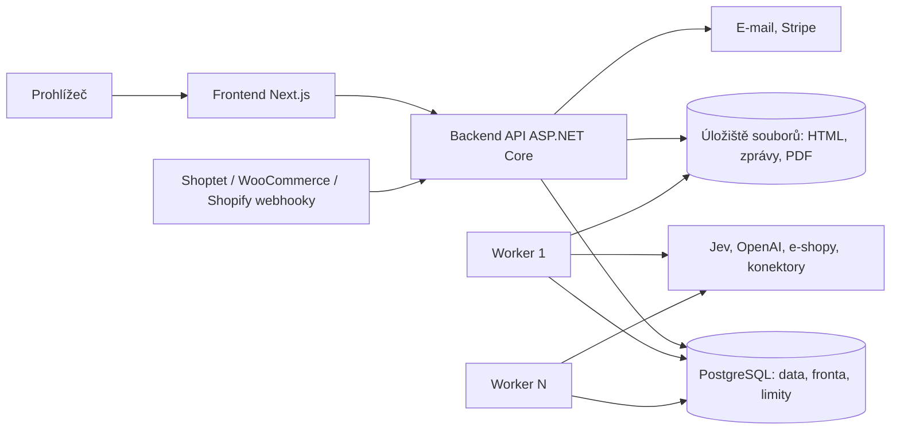

# EshopGuard: architektura pro více zákazníků a souběžné kontroly

Návrh z 1. 10. 2026, zatím se nic nestaví. Navazuje na bod 12 v [navrhy-rozvoje-2026-09-30.md](navrhy-rozvoje-2026-09-30.md) (Web MVP: ASP.NET Core, fronta na pozadí, Next.js) a na knihovnu `eshop-guard/src/EshopGuard.Core`.

## 1. Doporučení v kostce

- **Tři aplikace, jedna databáze.** Frontend (Next.js), backend API (ASP.NET Core) a worker (.NET, libovolný počet instancí). Spojuje je PostgreSQL, který drží data, frontu úloh i limity, a úložiště souborů (S3 kompatibilní nebo Azure Blob). Žádný další systém na začátku není potřeba.
- **Tenant = účet zákazníka.** Účet má N e-shopů a N uživatelů (role). Každý řádek dat nese `tenant_id`. Izolace se hlídá na čtyřech úrovních: API, databázový filtr, Row-Level Security v PostgreSQL a cesty souborů. Cache odpovědí Jevu, profily šablon, paměť rozhodnutí a doklady jsou taky po tenantech. Mezi tenanty se nesdílí nic.
- **Každá kontrola je běh rozdělený na malé dávky.** Úloha ve frontě zpracuje jednu dávku (např. 100 stránek nebo 200 vět), uloží výsledek a zařadí pokračování na konec fronty. Proto:
  - pád workeru stojí nejvýš jednu dávku;
  - velký e-shop nezablokuje ostatní;
  - spravedlivé dělení výkonu mezi zákazníky plyne přímo z pořadí ve frontě.
- **Sdílené limity jsou globální.** Jev a OpenAI mají jeden limit na klíč pro všechny workery. Cizí web smí stahovat jen jeden běh najednou (zdvořilost, robots.txt), i když ho mají dva tenanti.
- **Priority:** kontrola při uložení a odhad ceny (vteřiny) → události z konektorů (minuty) → analýzy spuštěné uživatelem (hodiny) → noční sledování (do rána) → údržba. Část limitu Jevu je trvale vyhrazená pro rychlé kontroly.
- **Provoz začne na jednom serveru** (rozhodnuto 1. 10. 2026): Linux, Docker Compose a zálohy mimo server. Část 7.1. Kód je od začátku stejný jako pro víc serverů, takže přechod je změna nasazení, ne aplikace.
- **Pozor na předpoklad „Jev není brzda“.** U úvodní analýzy velkého e-shopu Jev brzda je: při dnešním limitu 1 200 požadavků/min zabere jeden e-shop s 5 000 stránkami Jevu asi 2,4 hodiny, stahování asi 33 minut (výpočet v části 8). Navýšení limitu u TypeSafe je proto nutné. Návrh s ním počítá, limit je jen číslo v nastavení.

## 2. Aplikace



| Aplikace | Co dělá | Co nedělá |
|---|---|---|
| **Frontend** (Next.js + Payload CMS) | Prezentační web s obsahem z CMS (vydání sk a cz) a obrazovky aplikace podle návrhu UI (přehled, opravy, sledování, doklady, předplatné), průběh běhů živě, texty v jazyce uživatele (část 12) | K datům zákazníků přistupuje jen přes API. Do databáze smí jen CMS, a to jen do schématu `cms` |
| **Backend API** (ASP.NET Core) | Přihlášení, tenanti a role, e-shopy, ceny a platby (Stripe), schválení odhadu, nálezy a opravy, konektory (uložení klíčů, příjem webhooků), zakládání běhů, živý průběh (SSE) | Žádnou dlouhou práci: jen zapíše běh a úlohu do fronty a hned odpoví |
| **Worker** (.NET Generic Host, N instancí) | Bere úlohy z fronty a spouští knihovnu `EshopGuard.Core`: stahování, extrakce, profily, segmenty, Jev, pravidla, přepisy, publikování přes konektor | Nemá žádné vlastní uživatelské rozhraní ani stav; po restartu pokračuje z fronty |
| **Plánovač** (uvnitř workeru, běží v jedné instanci podle zámku v databázi) | Zakládá noční sledování, rozkládá je do nočního okna, dotahuje zpožděné, spouští údržbu | Nic nepočítá, jen zakládá úlohy |

Doporučená struktura v `eshop-guard/`:

```
src/
  EshopGuard.Core        knihovna (dnešní), rozdělená na kroky (část 9)
  EshopGuard.Cli         dnešní CLI, běží kroky v paměti jako teď
  EshopGuard.Data        EF Core + PostgreSQL, migrace, RLS, kontext tenanta, úložiště cache a profilů
  EshopGuard.Jobs        fronta, leasy, limity, plánovač, orchestrace kroků (sdílí API i worker)
  EshopGuard.Connectors  Shoptet, WooCommerce, Shopify… (čtení textů, webhooky, zápis oprav)
  EshopGuard.Api         backend API
  EshopGuard.Worker      worker
web/                       frontend Next.js
deploy/                    docker-compose pro vývoj (postgres, minio, api, worker, web) a pro produkční server (část 7.1)
```

## 3. Multitenance

### Model

- **Tenant (účet):** fakturační jednotka. Má předplatné sledování (za účet podle sledovaných stránek) a platí jednorázové analýzy (za e-shop), jak je ve strategii.
- **Uživatel:** globální identita (e-mail). K tenantům patří přes **členství s rolí**: vlastník, správce, editor (schvaluje a publikuje opravy), čtenář. Jeden uživatel může být ve více tenantech, například agentura, která spravuje e-shopy klientů. Ve frontendu se pak přepíná účet.
- **E-shop:** patří právě jednomu tenantovi. Identita je základní adresa (`vegis.sk`). Jazykové verze (`vegis.sk/cz/`) patří k jednomu e-shopu (část 12). Stejnou doménu můžou mít dva tenanti: vzniknou dva oddělené e-shopy s vlastními daty, profily i cache.

### Co je po tenantech (vše, co nese obsah)

E-shopy, konektory a jejich klíče, běhy, stránky a jejich snímky HTML, segmenty, cache odpovědí Jevu, cache přepisů, profily šablon, nálezy a jejich stavy, opravy a publikace, paměť rozhodnutí, doklady, protokoly PDF, události z webhooků, auditní záznam, spotřeba a faktury.

**Globální je jen koordinace bez obsahu:** fronta (řádek nese `tenant_id`, ale jen se ukazuje na data tenanta), zámky domén pro zdvořilé stahování a čítače limitů Jevu a OpenAI.

Cache odpovědí Jevu je po tenantech, i když texty z veřejného webu se mezi e-shopy opakují (texty výrobců). Sdílená cache by ušetřila, ale porušila by požadavek, že data tenanta jsou jen jeho; texty z konektorů navíc můžou být nezveřejněné koncepty. Neměřeno, kolik by se ušetřilo.

### Jak se izolace vynucuje (čtyři úrovně)

1. **API:** tenant se bere z adresy (`/api/t/{tenantId}/...`) a ověří se proti členství přihlášeného uživatele. Role určuje, co smí, například publikovat opravy jen editor a výš.
2. **Aplikace:** EF Core má na každé tabulce tenanta globální filtr `tenant_id = aktuální tenant`. Při ukládání `tenant_id` doplní interceptor sám. Zápis s cizím `tenant_id` skončí chybou.
3. **Databáze:** PostgreSQL Row-Level Security s `FORCE ROW LEVEL SECURITY` na všech tabulkách tenanta. Aplikace se připojuje rolí, která RLS nemůže obejít. Na začátku každého požadavku API i každé úlohy workeru se nastaví `SET LOCAL app.tenant_id = ...`. Pak ani chyba v kódu (zapomenutý filtr, ruční SQL) nevrátí cizí řádky. Údržba a administrace mají zvláštní roli a každý přístup se zapisuje do auditu.
4. **Soubory:** cesty `tenants/{tenantId}/shops/{shopId}/...`. Úložiště není veřejné, soubory se vydávají přes API krátkodobými podepsanými odkazy.

Dál k izolaci patří:
- **Klíče konektorů** se šifrují (ASP.NET Core Data Protection, hlavní klíč v trezoru cloudu) a do logů se nikdy nedostanou.
- **Provozní logy** nesou `tenant_id` a `run_id`, ale nikdy texty stránek. Uživatel vidí průběh svého běhu z tabulky událostí běhu, ne z provozních logů.
- **Testy izolace jsou povinná součást sady.** Dva tenanti se stejnou doménou a pro každou tabulku kontrola, že čtení přes API, přes EF i přímým SQL s nastaveným `app.tenant_id` nevrátí cizí data.
- **Export a smazání tenanta:** všechna data jsou pod `tenant_id` a soubory pod jednou předponou. Smazání je jedna úloha (zálohy se dočistí jejich rotací).

## 4. Druhy kontrol a priority

| Třída | Co | Kdo spouští | Očekávaná doba | Poznámka |
|---|---|---|---|---|
| **P0 interaktivní** | Kontrola konceptu při uložení v e-shopu, zjištění rozsahu a odhad ceny nového e-shopu, přegenerování návrhu opravy | uživatel čeká | vteřiny | Vyhrazená část limitu Jevu (např. 20 %), aby ji nic nezablokovalo |
| **P1 konektory** | Změna produktu nebo stránky přes webhook nebo dotaz „změněno od“, publikování opravy | událost | minuty | Události se slučují: hromadný import 500 produktů dá 1 dávku, ne 500 úloh |
| **P2 analýzy** | Úvodní analýza, bezplatná kontrola (vzorek 100 stránek), ruční „zkontrolovat znovu“ | uživatel | minuty až hodiny | Bezplatná kontrola má strop stránek a vlastní frontu, aby nezabrala placené |
| **P3 noční sledování** | Změněné stránky a nové URL, rámec webu, rotující kontrola zbytku | plánovač | do rána | Rozložené do okna 0:00–6:00 podle e-shopu, ne všechny ve 2:00 |
| **P4 údržba** | Nová verze pravidel (jen dotčený modul), nové profily, úklid | plánovač | kdykoli | Jen když je volno |

Navíc platí strop na tenanta: například nejvýš 2 souběžné analýzy na účet podle tarifu, ostatní se zobrazí jako „ve frontě“. Když čekají jiní zákazníci, jeden tenant nedostane víc než polovinu výkonu Jevu.

## 5. Worker a fronta

### Fronta v PostgreSQL

Tabulka `jobs`: `id, tenant_id, run_id, kind, priority, payload, state, attempts, not_before, lease_owner, lease_until, concurrency_key, created_at`.

- **Výběr úlohy:**
  ```sql
  SELECT … FROM jobs
  WHERE state = 'queued' AND not_before <= now() AND kind = ANY(@kinds)
  ORDER BY priority, <férové pořadí tenantů>, created_at
  FOR UPDATE SKIP LOCKED
  LIMIT @n
  ```
  Víc workerů tak nikdy nevezme stejnou úlohu a nikdo na nikoho nečeká.
- **Lease a heartbeat:** úloha dostane lease na 2 minuty a worker ho každých 30 s prodlužuje. Když worker spadne, lease vyprší, úloha se vrátí do fronty a počet pokusů se zvýší.
- **Zakládání v transakci:** úloha se zakládá ve stejné transakci jako běh nebo událost (vzor outbox). Nemůže se stát, že běh existuje a úloha ne.
- **Opakování:** dočasné chyby (429, 5xx, timeout) se opakují s rostoucím odstupem přes `not_before`. Po vyčerpání pokusů je úloha „selhala“ a jde z toho upozornění provozu.
- **Pojistky u externích služeb:** došlý kredit nebo odmítnutý klíč Jevu či OpenAI nezabije běhy. Pozastaví všechny úlohy, které danou službu potřebují, a pošle upozornění. Po nápravě se pokračuje.
- **Zrušení:** uživatel nastaví u běhu `cancel_requested`. Úloha to zkontroluje mezi dávkami a skončí čistě.
- **Ukončení workeru:** při nasazení nové verze worker přestane brát úlohy, dokončí rozdělanou dávku (vejde se do leasu) a pustí leasy.

### Úlohy po dávkách

Běh není jedna dlouhá úloha. Každý krok zpracuje dávku, uloží ji do databáze a zařadí pokračování:

| Krok | Dávka | Omezení |
|---|---|---|
| Zjištění rozsahu (robots.txt, sitemap) | celý e-shop | P0, rychlé; výsledek je počet stránek a cena |
| Stahování | do 100 stránek nebo 60 s | Zámek domény: jeden běh na doménu. Tempo 1–3 požadavky/s a Crawl-delay jako dnes |
| Extrakce a profily | do 100 stránek | CPU, souběh podle jader. Profil se vytváří, když je doména stažená |
| Segmenty a odhad Jevu | celý e-shop | Deduplikace vět v rámci e-shopu |
| Jev | 200 vět | Globální limit Jevu. Pokračování jde na konec fronty, takže dávky různých zákazníků se střídají |
| Pravidla | celý e-shop | Rychlé, bez API |
| Návrhy oprav | stránky s nálezy, po dávkách | Globální limit OpenAI. Hromadné opravy se počítají jednou za skupinu |
| Publikování přes konektor | jedna oprava | Klíč idempotence. Před zápisem se ověří, že text v e-shopu se mezitím nezměnil, jinak konflikt a nová kontrola |

Každý krok je **idempotentní**: dávku jde spustit znovu bez škody, protože výsledek se zapisuje s jedinečným klíčem (běh, stránka; tenant, věta, verze otázek). Proto stačí zpracování „aspoň jednou“.

### Globální limity

- **Jev a OpenAI:** čítač tokenů v PostgreSQL (tabulka `rate_limits`, doplňování podle času). Dávka si najednou rezervuje tolik požadavků, kolik vět zpracuje. P2–P4 smí čerpat jen do 80 % limitu, P0–P1 vše. Limit je v nastavení: po navýšení u TypeSafe se změní jedno číslo a žádný kód.
- **Domény:** tabulka `domain_leases(domain, holder, until)`. Stahovací úloha běží jen se zámkem domény a po dávce zámek pustí. Dva běhy na stejnou doménu (i od dvou tenantů) se tak střídají a server e-shopu nikdy nedostane dvojnásobné tempo. Data se nesdílejí: každý běh si stránky stahuje sám.

### Plánovač nočního sledování

- Každý e-shop má minutu v nočním okně podle hashe svého ID. Zátěž se tak rozloží a ráno je hotovo. Úloha má jedinečný klíč (e-shop, datum), takže dvojí založení nehrozí.
- Co se kontroluje, aby se nestahovalo všech 5 000 stránek každou noc:
  1. **E-shopy s konektorem:** jen produkty a stránky změněné od minula (webhooky průběžně, k tomu noční dotaz „změněno od“ jako pojistka). Web se prochází jednou týdně kvůli šabloně, odznakům a patičce.
  2. **E-shopy bez konektoru:**
     - rozdíl sitemap: nové, zmizelé a změněné URL podle `lastmod`;
     - úvodní, právní a šablonové stránky každou noc;
     - podmíněné stažení (`If-None-Match` / `If-Modified-Since`), nezměněná stránka vrátí 304 a nic se nepočítá;
     - zbytek rotačně, každou noc 1/7, takže každá stránka aspoň jednou týdně.
- U změněné stránky se znovu počítají jen změněné věty. Ostatní se vezmou z cache tenanta a stejný text dostane stejnou opravu z paměti rozhodnutí.
- Frekvenci lze nastavit podle tarifu (část 11).

### Konektory

Podklad: [podklady/reserse/konektory-api-2026-10-01.md](podklady/reserse/konektory-api-2026-10-01.md).

**Co platformy pushují:**
- Změny produktů pushují Shoptet (od 29. 7. 2026 v betě), Upgates, WooCommerce a Shopify.
- Stránky a články nepushuje nikdo.
- BiznisWeb nepushuje nic.
- Texty šablony (hlavička, patička, bannery) API nevrací kromě Shopify.

**Ani jeden webhook nedoručuje spolehlivě:**
- Shoptet zkusí 3× a pak zprávu zahodí.
- U Upgates se timeout 3 s počítá jako doručení.
- WooCommerce neopakuje a po 5 chybách webhook vypne.
- Shopify po 4 h odběr smaže.

Z toho plynou **tři cesty ke změnám**:

1. **Webhook (rychle, minuty):**
   - API ověří podpis, uloží událost do `connector_events` a **odpoví do 1 s** (limit Upgates).
   - Duplicity se odstraňují podle ID události, kde ho platforma posílá. Jinak podle otisku (e-shop, produkt, typ, čas).
   - Zpracování běží až ve workeru.
2. **Dorovnávání „změněno od“ (pojistka, každou hodinu a v noci):**

   | Platforma | Dotaz |
   |---|---|
   | Shoptet | `/products/changes` |
   | Upgates | `last_update_time_from` |
   | WooCommerce | `modified_after` |
   | Shopify | `updated_at` |

   Kurzor posledního dorovnání je uložený u konektoru. Tudy se chytí ztracené webhooky i stránky a články, pro které webhook neexistuje. BiznisWeb filtr změn nemá, takže jen noční projití všech produktů a porovnání otisků textů.
3. **Procházení webu:** šablona, odznaky tak, jak je vidí zákazník, a stránky, které API nevrací. U e-shopu s konektorem stačí týdně a po změně `eshop:design` (Shoptet) nebo `THEMES_*` (Shopify).

**Zpracování události:**
- **Slučovač:** události jednoho e-shopu za 2 minuty se sloučí do úlohy „zkontrolovat produkty [ID]“. Import 300 produktů dá jednu dávku.
- **Načtení aktuálního stavu:** worker vždy načte aktuální stav přes API, protože pořadí zpráv se nezaručuje a obsah bývá jen ID. Pak spustí `AnalyzeTextsAsync` (knihovna ho už má).
- **Limit na každý konektor zvlášť** podle pravidel platformy:
  - Shoptet: 3 spojení a 10/s na e-shop;
  - Upgates: 3 souběžné;
  - BiznisWeb: 2 000/min a denní kvóta;
  - Shopify: body za sekundu podle tarifu.

  Tento limit je oddělený od limitu Jevu.

**Hlídač odběrů:** jednou za hodinu ověří, že webhooky existují a jsou aktivní (Shopify je maže, WooCommerce vypíná, Shoptet a Upgates je ruší při změně práv), a obnoví je. Výpadek ukáže v aplikaci.

**Zápis oprav:**
- Před zápisem se text znovu načte a porovná s textem, ze kterého vznikl nález. Když se mezitím změnil, je to konflikt a nová kontrola.
- Původní znění se uloží pro vrácení.
- Kde zápis nejde, aplikace nabídne „Kopírovať text“:
  - Upgates: produkt bez kódu;
  - BiznisWeb: bez partnerské smlouvy;
  - šablona všude kromě Shopify.

**Kontrola „při uložení“** proběhne až po uložení, protože háček před uložením nemá žádná platforma. Před zveřejněním jen u produktu uloženého jako skrytý nebo koncept (Shoptet, Upgates, WooCommerce, Shopify; BiznisWeb ne). Skutečnou kontrolu před uložením by dal jen náš plugin pro WooCommerce.

**Přístup je obchodní krok:**
- Shoptet: doplněk se smlouvou a schválením, odpověď do 4 týdnů; privátní API jen pro Premium.
- Upgates: schválený doplněk bez poplatků za API, s pravidly pro AI doplňky (náhled a potvrzení změn, záloha, souhlas se zpracováním přes OpenAI).
- BiznisWeb: zápis jen s partnerskou smlouvou.
- WooCommerce a Shopify: technicky hned (u Shopify buď schválení v App Store, nebo aplikace pro jeden obchod).

## 6. Průběh analýzy a schválení ceny

```
Založeno → Zjišťování rozsahu → Čeká na schválení a platbu → Stahování → Profily → Segmenty → Jev → Pravidla → Návrhy oprav → Hotovo
                                    ↘ Zrušeno / Selhalo (s důvodem a možností pokračovat)
```

- Dnešní knihovna se ptá na potvrzení odhadu uprostřed skenu (`ConfirmJevCalls`). Ve webu se z toho stane stav **„Čeká na schválení“**: krok zjištění rozsahu spočítá stránky a cenu, uživatel zaplatí nebo potvrdí a teprve pak se založí stahování.
- Cena pro zákazníka je podle počtu zveřejněných produktů ve verzích s vlastními texty (ceník) a je garantovaná z ukázky (část 12). Vnitřní náklady (Jev, OpenAI) se sledují po bězích. Když překročí odhad, běh se **nezastaví**, dokončí se a provoz dostane upozornění (opraveno 1. 10. 2026 podle části 12). Zákazník tuto částku nevidí. Pojistkou proti zneužití je férové užití.
- Průběh: worker zapisuje čítače kroků do `runs` a události do `run_events`. API je posílá do prohlížeče přes SSE s oznámením přes PostgreSQL `LISTEN/NOTIFY`. Funguje to i s více instancemi API a bez dalšího systému. Po dokončení jde e-mail.
- Odhad doby: z průběhu dávek a z pozice ve frontě („před vámi 2 analýzy, hotovo asi ve 14:30“).

## 7. Spolehlivost, bezpečnost, provoz

- **SSRF:** uživatel zadává libovolnou adresu a worker ji stahuje. Před každým požadavkem, i po přesměrování, se musí ověřit, že doména nevede na vnitřní, místní nebo metadatovou adresu (10.x, 172.16–31.x, 192.168.x, 127.x, 169.254.x, IPv6 obdoby). Povolené jsou jen porty 80 a 443. **Bez toho nejde web spustit.**
- **Nepřátelské HTML:** strop velikosti stránky (dnes 5 MB), časový limit extrakce jedné stránky (SmartReader nejde přerušit, poběží v odděleném úkolu s timeoutem). Stránka, která limit překročí, se označí „nezpracováno“ a objeví se ve zprávě. Paměť běhu nezávisí na velikosti e-shopu, protože stránky se ukládají po dávkách.
- **Výpadek cizího e-shopu:** 429/503 → zpomalení podle Retry-After (už umí knihovna), dlouhý výpadek → běh čeká a pokračuje, po stanovené době skončí s částečným výsledkem a jasně řekne, co nebylo zkontrolováno.
- **Sledování provozu:** OpenTelemetry. Délka fronty podle třídy, stáří nejstarší úlohy, vrácené leasy, spotřeba limitu Jevu a OpenAI, cena za běh, chyby podle služby. Upozornění, když P0 čeká déle než 30 s nebo noční běhy nestihnou okno.
- **Nasazení:** nejdřív jeden server (část 7.1). Později kontejnery `web`, `api` (2 instance), `worker` (N instancí podle délky fronty) a spravovaný PostgreSQL se zálohami a obnovou k bodu v čase. Workery se dají přidávat za běhu a nic se nepřenastavuje.
- **Testy spolehlivosti:**
  - zabití workeru uprostřed běhu: běh doběhne a nic se nezdvojí;
  - dva tenanti se stejnou doménou: střídání, žádný únik dat;
  - zátěžový test: 50 souběžných analýz proti testovacím e-shopům (stejně jako dnešní fixture).

### 7.1 Nasazení na jeden server (Fáze 0, rozhodnuto 1. 10. 2026)

Pro start stačí jeden server: noční sledování 100 e-shopů je v průměru ≤ 1 jádro a úvodní analýza ~0,7 jádra po ~30 min (část 8).

**Server:**
- jeden virtuál s vyhrazenými jádry a automatickými zálohami;
- výběr poskytovatele je v [hostovani-srovnani-2026-10-01.md](hostovani-srovnani-2026-10-01.md), oddíl „Jeden server na start“: Hetzner Cloud CCX23 ~104 €, OVH VPS ~23 €, Webglobe Praha ~2 500–2 800 Kč;
- systém Ubuntu 24.04 LTS (nebo Debian).

**Docker Compose, kontejnery:**

| Kontejner | Účel |
|---|---|
| `caddy` | vstup z internetu, automatický HTTPS certifikát, přesměrování na `web` a `api` |
| `web` | frontend Next.js |
| `api` | backend ASP.NET Core |
| `worker` | worker s plánovačem (1 instance; na stejném serveru jde zvýšit přes `docker compose up --scale worker=2`) |
| `postgres` | PostgreSQL, data na disku serveru, port jen ve vnitřní síti Dockeru |
| `walg` | průběžná záloha změn databáze (WAL) a denní plná záloha do S3 u jiného poskytovatele |

- Soubory (snímky HTML, protokoly PDF) jdou do S3 kompatibilního úložiště mimo server.
- Pro vývoj na počítači je stejný Compose s MinIO místo S3.
- **Kód je stejný jako pro víc serverů.** Fronta s leasy, globální limity v databázi i živý průběh přes `LISTEN/NOTIFY` fungují s jednou instancí i s deseti. Přechod na víc serverů tak znamená jiné nasazení, ne změnu aplikace.

**Nasazení nové verze:**
1. GitHub Actions sestaví a otestuje aplikaci a nahraje obrazy do GitHub Container Registry. Značka je commit.
2. Migrace databáze proběhne jako samostatný krok před startem API (balíček migrací EF Core).
3. Na serveru přes SSH: `docker compose pull && docker compose up -d`.
4. Vrácení verze = spuštění předchozí značky.
5. Ručně se na server nesahá.

Restart při nasazení trvá vteřiny. Nasazuje se v noci nebo mimo špičku. Pokud to začne vadit, přidá se Kamal (nasazení bez výpadku).

**Tajné klíče:** soubor `.env` na serveru s právy jen pro uživatele nasazení. Obsahuje klíče Jevu, OpenAI a Stripe, šifrovací klíč pro klíče konektorů a heslo databáze. Nikdy není v repozitáři.

**Zabezpečení:**
- SSH jen klíčem, bez přihlášení roota heslem;
- firewall (ufw): ven jen 80 a 443, SSH jen z vybraných adres;
- automatické bezpečnostní aktualizace systému (unattended-upgrades);
- databáze nemá port otevřený ven;
- obrazy se aktualizují s každým nasazením.

**Zálohy ve třech vrstvách:**
1. **WAL-G:** průběžně, plus denně plná záloha do S3 u jiného poskytovatele, uchování 14–30 dní. Ztráta dat je nejvýš minuty a přežije i výpadek celého poskytovatele.
2. **Automatické zálohy virtuálu** od poskytovatele (denně) jako druhá vrstva.
3. **Jednou měsíčně zkouška obnovy** skriptem na čistý server. Měří, jak dlouho obnova trvá; cíl je 1–2 h.

**Hlídání:**
- externí kontrola dostupnosti každou minutu s upozorněním e-mailem nebo SMS;
- endpoint `/health` hlásí délku fronty, stáří nejstarší úlohy a volné místo na disku;
- logy Dockeru s rotací.

**Údržba:** aktualizace systému a restart v noci s ohlášenou odstávkou. Výpadek pár hodin provoz snese: noční běhy se doženou a změny z konektorů se dorovnají dotazem „změněno od“.

**Kdy přejít dál:**
- jeden server nestihne noční okno;
- klientů jsou stovky;
- začneme prodávat SLA;
- nebo nebude kdo server hlídat.

Postup: druhý server pro workery, pak spravovaná databáze, případně Kubernetes. Z Compose souboru se udělá Helm chart, aplikace se nemění.

## 8. Kapacita (výpočet)

| Veličina | Hodnota | Zdroj |
|---|---|---|
| Velikost e-shopu | vegis 5 872, naturfyt 4 022 URL v sitemap | změřeno 30. 9. 2026 |
| Tempo stahování | 107 stránek za 42 s (≈ 2,5/s) | sken vegis 30. 9. 2026 |
| Volání Jevu na stránku | ≈ 35 se sítem (3 759 volání na 108 stránek) | vzorek vegis 1. 10. 2026; pro celý e-shop neměřeno (šablonové věty se opakují, takže spíš méně) |
| Limit Jevu | 1 200 požadavků/min na klíč | dokumentace jev-1.13.0 |
| Profil šablony | 0,07–0,13 USD | sonda 1. 10. 2026 |

**Úvodní analýza e-shopu s 5 000 stránkami:**
- stahování 5 000 / 2,5 ≈ **33 min** (jedna doména se nedá zrychlit, ale různé e-shopy běží souběžně);
- Jev 5 000 × 35 ≈ 175 000 volání, při 1 200/min ≈ **2,4 h celého limitu**.

Při dnešním limitu je to strop asi 10 velkých analýz denně, a to bez nočního sledování. Při 10× vyšším limitu (12 000/min) asi 15 min Jevu na e-shop.

**Noční sledování:** podíl měněných stránek za den neměřeno. Když se denně změní 2 % stránek, je to 100 stránek × 35 ≈ 3 500 volání na e-shop (nejvýš, cache to sníží). Noční okno 6 h dává při 1 200/min 432 000 volání, tedy asi **120 e-shopů**. Při 12 000/min asi **1 200**.

**CPU workeru:** změřeno 1. 10. 2026 na 17 stránkách vegis a naturfyt (Release sestavení). Extrakce, tři čtení HTML a porovnání s profilem stojí **0,25–0,28 s procesoru na stránku** při průměrné velikosti HTML 298 kB:
- úvodní analýza 5 000 stránek ≈ 23 min procesoru;
- noční sledování 100 e-shopů ≈ 45 min až 6 h procesoru za noc podle podílu změn.

Kolik souběžných domén zvládne jedna instance, ukáže zátěžový test ve fázi 1. Možná úspora: stránka se dnes čte jako HTML třikrát, jedno čtení by stačilo.

Závěr: stahování a CPU se škálují přidáním workerů. Jev se škáluje jen navýšením limitu u TypeSafe. Pro první měsíce stačí dnešní limit, pro stovky e-shopů ne.

## 9. Co se musí změnit v knihovně

1. **Rozdělit `ScanSiteAsync` na kroky** s ukládatelným vstupem a výstupem: zjištění rozsahu, stažení a extrakce stránky, profily, segmenty, odhad, Jev po dávkách, pravidla. CLI je dál spouští v paměti za sebou, takže se pro uživatele CLI nic nemění. Worker je spouští jako úlohy.
2. **Stahování po stránkách:** crawler dnes drží celý sken v paměti. Nově bude vydávat stránky průběžně, frontu URL bude mít uloženou (pokračování po pádu) a dostane podmíněné stažení (ETag, Last-Modified).
3. **Úložiště za rozhraní s tenantem:** `IJevCache`, `IRewriteCache` a `IPageProfileStore` už jsou rozhraní. Přibudou implementace pro PostgreSQL v `EshopGuard.Data`, vytvářené pro jednu úlohu s kontextem tenanta a e-shopu. SQLite zůstane pro CLI.
4. **Limit Jevu a OpenAI za rozhraní** `IRateLimiter`: dnes si ho každý proces drží sám (`requests_per_minute`, `concurrency`). Ve workeru ho nahradí globální čítač z databáze.
5. **Potvrzení odhadu** přes callback nahradí samostatný krok „odhad“. Callback zůstane jen v CLI.
6. **Ochrana proti SSRF** v `HttpPageFetcher`: kontrola cílové adresy po DNS i po přesměrování.

**Workery (rozhodnuto 1. 10. 2026):** ve stejné síti jako databáze, přímé napojení. Interní API pro vzdálené workery zatím ne, rozhraní `IWorkerStore` ho umožní doplnit později.

**Podrobný návrh databáze, struktury aplikace a plán implementace (F0–F10):** [databaze-a-plan-implementace-2026-10-01.md](databaze-a-plan-implementace-2026-10-01.md).

## 10. Fáze

| Fáze | Obsah | Hotovo, když |
|---|---|---|
| 0 Jeden server | Server s Linuxem, Docker Compose (Caddy, web, api, worker, postgres, WAL-G), nasazení z GitHub Actions, tajné klíče, firewall a SSH, zálohy mimo server, měsíční zkouška obnovy, hlídání dostupnosti | Nová verze se nasadí jedním krokem a obnova na čistý server projde do 2 h |
| 1 Kostra | Struktura řešení, databáze s tenanty a RLS, testy izolace, fronta s leasy, worker spouští dnešní sken jako jednu úlohu, SSRF, zátěžový test | Dva tenanti, souběžné běhy, zabitý worker nezpůsobí ztrátu ani únik |
| 2 Kroky a dávky | Rozdělení knihovny (část 9), dávky, globální limity, priority, schválení ceny, živý průběh | Velký e-shop neblokuje malé, P0 do 30 s i při plné frontě |
| 3 Web MVP | Frontend podle návrhu UI, platby, zpráva, opravy, protokol | Prodejní tok od bezplatné kontroly po zaplacenou analýzu |
| 4 Sledování | Plánovač, rozdíl sitemap, podmíněné stahování, rotace, paměť rozhodnutí | Noční běhy stihnou okno, mění se jen změněné věty |
| 5 Konektory | Shoptet (webhooky, změněno od, zápis), slučovač událostí, publikování s kontrolou konfliktu | Změna produktu je zkontrolovaná do pár minut |

## 11. K rozhodnutí

1. **Hostování:** rozhodnuto 1. 10. 2026, že začneme na jednom serveru s Linuxem a Docker Compose (část 7.1). Zbývá vybrat poskytovatele ([hostovani-srovnani-2026-10-01.md](hostovani-srovnani-2026-10-01.md)): Hetzner Cloud CCX23 (~104 € se zálohami, přesun při poruše), OVH VPS (~23 €, ověřit vyhrazená jádra) nebo Webglobe Praha (~2 500–2 800 Kč, české DC). Spravované Kubernetes a databáze až při růstu.
2. **O kolik požádat TypeSafe:** podle části 8 je pro stovky e-shopů potřeba zhruba 10× dnešní limit.
3. **Frekvence sledování podle tarifu:** denně změněné stránky a týdně celý web jako výchozí návrh?
4. **Ověření vlastnictví e-shopu** (meta značka, DNS nebo konektor) před plnou analýzou a vždy před publikováním. Brání skenování cizích e-shopů na cizí účet. Bezplatný vzorek bez ověření?
5. **Platby a fakturace:** podklad [platby-a-fakturace-2026-10-01.md](platby-a-fakturace-2026-10-01.md). Doporučení: Stripe (Checkout, Billing, portál), daňové doklady přes API SuperFaktúry kvůli slovenské povinné e-faktuře přes Peppol od 1. 1. 2027. Daňové body potvrdí účetní.
6. **Přihlášení:** rozhodnuto 1. 10. 2026: vlastní účty v ASP.NET Core Identity, výchozí je odkaz v e-mailu, dále heslo a Google (pravidla odkazu v [databaze-a-plan-implementace-2026-10-01.md](databaze-a-plan-implementace-2026-10-01.md), část 9). Doplněk Shoptetu později přidá přihlášení přes Shoptet.
7. **Měna pro české zákazníky:** Kč, nebo euro? Doporučení: Kč (český zákazník to čeká; Stripe umí víc měn, ceník se vede pro každou měnu zvlášť). Měna se pevně určí u tenanta při první platbě. Fakturaci ze slovenské firmy v Kč potvrdí účetní.
8. **Domény:** které domény EshopGuard máme (.sk, .cz, .com)? Podle toho vydání webu buď na vlastních doménách, nebo na jedné doméně s cestou `/sk`, `/cz`.
9. **Nabídka na českém webu:** v Česku zatím neplatí zákazy EmpCo, kontrola českého e-shopu je dnes užší (co trestá ČOI a zákonné povinnosti). Má český web prodávat i kontrolu českých e-shopů, nebo zatím jen kontrolu slovenských e-shopů pro české firmy? Podle čl. 6 nařízení Řím I a slovenských zákonů 108/2024 a 22/2004 musí český e-shop prodávající na Slovensko splnit slovenská pravidla (část 12, Místa prodeje), takže silná nabídka je „kontrola podle slovenského zákona pro české e-shopy“.
10. **Druhé místo prodeje v ceně? Jazykové verze do pásma?** Doporučení: další podporovaná země v ceně; do pásma se počítají produkty ve verzích s vlastními texty, práh 20 % (část 12). Navýšení ceny běhu je malé (neměřeno), jednodušší ceník a silný argument pro české e-shopy prodávající na Slovensko.

## 12. Jazyky, trhy a obsah webu (rozhodnuto 1. 10. 2026)

**Rozhodnutí uživatele:**
- prezentační web i aplikace jsou od začátku vícejazyčné; teď slovenština a čeština, další trhy přidáme, jakmile budou připravené;
- texty prezentačního webu se upravují v Payload CMS, ne v kódu.

### Čtyři různé věci, které se nesmí slít

| Pojem | Kde je uložený | Co určuje | Příklad |
|---|---|---|---|
| **Jazyk rozhraní** | `users.locale` | texty aplikace, e-maily uživateli, vysvětlení nálezů a otázky | Čech, který spravuje slovenský e-shop, má aplikaci česky |
| **Místa prodeje e-shopu (jurisdikce)** | `shop.shop_markets` (víc zemí, včetně domovské) | moduly pravidel, odkazy na zákon, osnova povinných informací; kontroluje se podle všech zvolených zemí | slovenský e-shop se kontroluje podle slovenského zákona, i když je aplikace česky; když prodává i do Česka, také podle českého |
| **Jazyk obsahu e-shopu** | `shops.language`, jazyk stránky | jazyk návrhu opravy, vstup pro Jev | návrh opravy slovenského e-shopu je vždy slovensky |
| **Fakturační trh** | `tenants.country_code`, `tenants.currency`, `tenants.locale` | měna, DPH, jazyk faktur | česká firma může platit v Kč (k rozhodnutí, část 11) |

### Místa prodeje e-shopu (rozhodnuto 1. 10. 2026)

**Proč:** obchodník, který zaměřuje činnost do jiného členského státu, musí vůči tamním spotřebitelům splnit tamní pravidla:
- smlouvy: nařízení Řím I, čl. 6;
- ochrana spotřebitele: na Slovensku zákon 108/2024 Z. z., § 1 ods. 2, a zákon 22/2004 Z. z., § 3 ods. 4.

Český nebo polský e-shop, který prodává na Slovensko, tak už teď potřebuje slovenské zákazy EmpCo. Jde o odvození z textu, potvrdí právník.

**Pojem:** místo prodeje = každá země, kde e-shop prodává, včetně domovské. Zaškrtnout jde i Česko u e-shopu, který prodává jen tam.

**Zásady (uživatel):**
- Klientovi ukazujeme jen země, které umíme kontrolovat (teď SK a CZ). Ostatní zjištěné země si systém uloží skrytě. Až přibude jejich podpora, nabídnou se samy a klient dostane upozornění „Odteraz kontrolujeme aj …“.
- Systém musí jít rozšířit o další země bez přestavby: číselník `ref.markets`, pravidla s `jurisdictions`.

**Jak to funguje:**
1. **Rozbor při ukázce zdarma (LLM):**
   - technické znaky: `html lang`, `hreflang`, odkazy přepínače, měny ve strukturovaných datech, telefonní předvolby;
   - seznam odkazů z úvodní stránky;
   - model vybere až 4 stránky, kde e-shop píše o prodeji a doručení (doprava, obchodní podmínky, reklamace, kontakt);
   - druhé volání určí země a domovskou zemi. Ke každé zemi dá doslovné citace, které se ověří proti textu stránek. Neověřená citace se nepoužije.
2. **Síla důkazu pro každou zemi:**
   - *silný*: vlastní jazyková verze nebo doména, měna, sídlo, místní úřad v podmínkách;
   - *doručení*: konkrétní podmínky doručení do té země (cena, dopravce);
   - *obecné*: „doručujeme do celej EÚ“.
   U podporovaných zemí předvyplníme silný důkaz i doručení, obecné ne. Klient vše potvrdí na obrazovce 3c „Kde predávate“, u každé země vidí důvod.
3. **Domovská země**, když ji nejde doložit (chybí adresa provozovatele), se doplní z domény a klient ji potvrdí.
4. **Vyhodnocení:**
   - odpovědi Jevu jsou společné, pravidla se vyhodnotí pro každou zaškrtnutou zemi;
   - nález nese verdikt pro každou zemi (např. „SK · porušení“, „CZ · na posouzení“) a řadí se podle nejpřísnějšího;
   - návrh opravy musí projít ve všech zemích;
   - povinnosti za celý web se ukazují po zemích;
   - protokol uvádí, podle kterých zemí kontrola proběhla.
5. **Při sledování:** nový silný znak (nová jazyková verze, nová měna) vyvolá upozornění „Vyzerá to, že predávate aj …“. Trh se sám nepřidá.

**Ověření 1. 10. 2026 (9 e-shopů: vegis, naturfyt, bonami, freshlabels, goodie, havlikovaapoteka, panakeia, nutriadapt, footshop; gpt-6.1-sol, skript `research/langprobe-2026-10-01/sales.py`, jen lokálně):**

| Měřítko | Výsledek |
|---|---|
| Cena | 0,42 USD celkem, 0,03–0,08 USD na e-shop (průměr 0,047) |
| Citace | 62 z 62 doslova nalezeno v textu stránek |
| Domovská země | 8 z 9 správně (panakeia.cz správně SK, je to slovenská firma), 1× poctivě „nejisté“ (goodie, na vybraných stránkách chyběla adresa) |
| SK a CZ | u všech e-shopů souhlasí s jazykovými verzemi a doménami |
| Výběr stránek | 7 z 9 našlo stránku dopravy nebo obchodní podmínky; vegis a goodie ne → pojistka: stránky z konektoru nebo z odkazů v patičce |
| Chyba | freshlabels: 26 zemí jako „cílí“ jen kvůli tabulce cen dopravy. Proto tři síly důkazu. U SK a CZ to výsledek nemění, u dalších trhů by to přidalo šum |

### Jazykové verze e-shopu (rozhodnuto 1. 10. 2026)

**Proč:** průzkum 46 produktů v 5 e-shopech (1. 10. 2026):
- většinou je slovenská verze věrný překlad;
- našli jsme ale úplně jiné texty (panakeia, 9 z 9), zkrácené texty (havlikovaapoteka, 1 z 7) i český popis na slovenském webu (goodie, 2 z 10, s tvrzeními „čistě přírodní“, „netoxické složení“);
- liší se i doprava, ceny a vrácení zboží (freshlabels).

Kontrola jedné verze proto o druhé nic neříká.

**Jedno pravidlo pro všechny varianty:** kontrolují se verze, které používají zákazníci zaškrtnutých míst prodeje (přesné pravidlo níže, „Která verze se kontroluje a podle čeho“), a v nich každý viditelný text. Pravidlo se nevětví podle toho, jestli se přepíná jen menu, nebo i texty. Stejný text ve dvou verzích vyhodnotí Jev jen jednou díky cache podle otisku věty.

**Která verze se kontroluje a podle čeho (upřesněno 1. 10. 2026, cena se počítá dynamicky):**
- kontroluje se verze v jazyce každého zaškrtnutého místa prodeje; když pro něj verze není, hlavní verze e-shopu;
- každá kontrolovaná verze se posuzuje podle všech zaškrtnutých zemí, jejichž zákazníci ji můžou číst: čeština a slovenština navzájem, protože slovenský zákazník může nakoupit přes českou verzi;
- odškrtnutí země vyřadí verzi, kterou potřebovala jen ta země. Cena se na obrazovce 3c přepočítá hned (počet produktů v kontrolovaných verzích s vlastními texty → pásmo);
- verze pro nepodporované trhy (např. polská) se nekontrolují a klientovi se neukazují.

**Najít a přepnout:**
- najít: `hreflang` na stránkách a v sitemapě, přepínač jazyka, `html lang`, u konektoru jazyky z API; když to ze stavby nejde poznat, určí přepínač LLM ze stejného rozboru jako místa prodeje;
- přepnout: verze s vlastní adresou (cesta, subdoména, doména) se projde jako samostatný web; verze přepínaná přes cookie nebo jazyk prohlížeče se prochází s vlastní cookie a hlavičkou jazyka;
- spárovat stejné produkty mezi verzemi (přes `hreflang` nebo ID z konektoru) není pro kontrolu nutné, slouží jen k propojení stejného nálezu ve dvou verzích;
- **verze na jiné doméně** jsou časté (5 z 9 ověřených e-shopů: goodie.sk, bonami.sk, freshlabels.sk, footshop.sk, panakeia.sk). Klient jednou potvrdí „Patrí goodie.sk k tomuto e-shopu?“, jinak jde o samostatný e-shop.

**Co klient uvidí:** žádné zaškrtávání verzí, jen shrnutí jednou větou na 3c a podrobnosti na 3d. Například:
- „Našli sme slovenskú a českú verziu. Česká má vlastné preložené texty pri 96 % produktov z ukážky, preto kontrolujeme obe.“
- „Slovenská verzia má rovnaké texty ako česká, preložené je len menu.“

Výjimky („túto verziu nekontrolovať“) jsou v nastavení e-shopu.

**Cena:**
- do pásma se počítají produkty ve verzích s vlastními texty: verze s aspoň 20 % odlišných textů (návrh, neměřeno);
- verze, kde je přeložené jen menu, se nepočítá;
- klient to vidí v odhadu ceny s vysvětlením.

**Rozbor verzí v ukázce zdarma (rozhodnuto 1. 10. 2026):** běží jen tehdy, když má e-shop víc verzí pro podporovaná místa prodeje.

Co zjistí u každé verze:
1. jestli je text v jazyce verze;
2. jestli má vlastní texty, nebo stejné jako jiná verze;
3. druh rozdílu: překlad, zkrácený nebo jiný text, nepřeložený text;
4. jestli se liší povinné a obchodní stránky (doprava, obchodní podmínky, reklamace);
5. počet produktů (sitemapa nebo konektor).

Rozdělení 100 stránek:
- ~20 stejných produktů v obou verzích, spárovaných přes `hreflang`, ID z konektoru, EAN nebo kód produktu;
- povinné stránky každé verze;
- zbytek náhodné produkty po verzích.

Když verze spárovat nejdou, porovná se, kolik vět jedné verze se doslova vyskytuje ve druhé.

Metody:
- shoda otisků vět (bez LLM, dává podíl vlastních textů pro cenu);
- překlad, nebo jiný text: podle délky a počtu vět (bez LLM);
- jazyk textu: jedno volání LLM nad ~30 úseky na verzi, jen hlavní text produktu (recenze a bloky dopravy zvlášť).

Výsledek: věty na 3c a podrobnosti na 3d. Český text na slovenské verzi je upozornění, ne porušení. Pravidla se na něj použijí stejně.

**Ověření 1. 10. 2026 (46 uložených párů z 5 e-shopů, 0,043 USD, skript `research/langprobe-2026-10-01/validate.py`, jen lokálně):**
- výsledek souhlasí s ručním čtením ve 44 ze 46 párů:
  - bonami 10× překlad;
  - havlikovaapoteka 6× překlad, 1× zkráceno;
  - panakeia 9× jiný text;
  - goodie 2× nepřeložený popis;
- obě odchylky vznikly tím, že výzkumný skript bral popis i s recenzemi a bloky dopravy: české recenze na goodie.sk, hraniční délka u freshlabels. Extraktor knihovny hlavní text odděluje.

**Přepínání bez JavaScriptu (ověřeno 1. 10. 2026):** všech 7 e-shopů s víc verzemi má pro každou verzi vlastní adresu:
- cesta `neco.cz/sk/`: havlikovaapoteka;
- vlastní doména `neco.sk`: goodie, bonami, footshop, freshlabels, panakeia, nutriadapt.

Každá verze se načte obyčejným stažením se správným `html lang`. Žádný e-shop neměl překladový widget ani přepínač bez odkazu.

Pojistky pro případy, které ve vzorku nebyly:
- **přepnutí přes cookie** (odkaz `?lang=sk` nastaví cookie): crawler projde verzi s vlastní cookie;
- **přepínač jen přes JavaScript**: jednorázově otevřít v prohlížeči (Chromium, plánované v návrzích rozvoje), zjistit cookie a dál procházet bez prohlížeče;
- **překlad až v prohlížeči** (Weglot v režimu JS, GTranslate, Google Translate): přeložený text v HTML není. Kontrolujeme původní text a klientovi to řekneme. Weglot v režimu adres (`/sk/`) se prochází normálně;
- **přesměrování podle IP nebo jazyka prohlížeče**: hlavička jazyka podle verze; když server přesto vrátí jinou verzi (pozná se podle `html lang`), upozornit a nabídnout konektor;
- **aplikace v JavaScriptu** (Next.js, Nuxt…): dnešní kontrola „text se nenačetl“ platí pro každou verzi zvlášť.

**Cena (rozhodnuto):**
- cena z ukázky je garantovaná: když analýza najde víc vlastních textů, zkontroluje se vše bez doplatku a bez zastavení;
- když vzorek nestačí, verze se do ceny nepočítá;
- sledování se upraví od dalšího období s upozorněním;
- pojistka proti zneužití: férové užití, ostatních stránek nejvýš ~2× počet produktů, nad to individuální nabídka (hranici upřesní pilot);
- náklad ~5,5 USD na 1 000 stránek (extrapolace z vegis), riziko chyby vzorku je proto malé.

### Prezentační web

- **Technika:**
  - Next.js a Payload CMS 3 v jedné aplikaci (MIT, zdarma, bez dalšího kontejneru);
  - obsah je v PostgreSQL ve schématu `cms`;
  - role `eshopguard_cms` má práva jen na toto schéma, k datům zákazníků se nedostane.
- **Vydání webu = trh + jazyk:**
  - teď `sk` (sk-SK) a `cz` (cs-CZ);
  - později `de`, `at` (de-AT si chybějící texty vezme z de-DE), `hu`, `pl`, `ro`.
  - Každé vydání má vlastní obsah. České vydání není překlad slovenského: v Česku zatím neplatí stejné zákazy (směrnice EmpCo není převzatá), jinak se kontroluje a cena může být v jiné měně.
- **Co je v CMS:**
  - texty stránek složené z připravených bloků (úvod, výhody, napojení, co kontrolujeme, časté otázky, článek);
  - menu a patička;
  - články;
  - SEO údaje (titulek, popis, obrázek pro sdílení);
  - koncepty, náhled před zveřejněním a historie verzí.
- **Co není v CMS:**
  - ceny: čtou se z `billing.price_tiers` přes API, jinak by existovaly dvě různé verze;
  - obchodní podmínky a zásady ochrany soukromí: verzované dokumenty v aplikaci, k objednávce se ukládá odsouhlasená verze;
  - texty nálezů: ty jsou součástí pravidel.
- **Adresy:**
  - pokud domény máme, `eshopguard.sk` povede na `sk` a `eshopguard.cz` na `cz`;
  - jinak jedna doména s cestou `/sk` a `/cz`;
  - knihovna next-intl umí obojí, přechod je jen změna konfigurace;
  - mezi vydáními `hreflang`, sitemap pro každé vydání zvlášť.
- **Výběr vydání:** podle domény, jinak podle jazyka prohlížeče; volba se pamatuje v cookie. Přesměrování podle IP adresy ne.
- **Administrace CMS (`/admin`):** jen pozvané účty, které nejsou zákaznické; přístup omezit (VPN nebo IP).

### Aplikace

- **Texty rozhraní:** soubory zpráv po jazycích (`messages/sk.json`, `messages/cs.json`) přes next-intl ve formátu ICU kvůli množnému číslu (1 nález, 2–4 nálezy, 5 nálezů; slovenština i čeština mají tři tvary).
- **Čísla, data a měny** formátuje `Intl` podle jazyka (`1 460`, `1. 10. 2026`, `29 €`, `690 Kč`).
- **Volba jazyka:**
  - položka „Jazyk“ v menu účtu (uloží `users.locale`);
  - před přihlášením přepínač na přihlašovací stránce;
  - výchozí jazyk podle vydání webu, ze kterého uživatel přišel.
- **API nevrací hotové věty, ale kódy a parametry** (stav, druh upozornění, druh chyby jako ProblemDetails s kódem). Text skládá frontend v jazyce uživatele.
- **Backend skládá jen dokumenty mimo aplikaci:**
  - e-maily (odkaz na přihlášení, upozornění, týdenní souhrn) v jazyce příjemce;
  - faktury v jazyce a měně tenanta;
  - protokol PDF ve zvoleném jazyce; návrh: výchozí je jazyk trhu e-shopu, protože protokol je pro úřad té země.
- **Texty nálezů a otázek pocházejí z pravidel, ne z LLM:**
  - nález nese `rule_id`, verzi pravidel a parametry;
  - text se skládá při čtení podle trojice pravidlo × jurisdikce × jazyk;
  - odkazy na zákon zůstávají v jazyce zákona (slovenský zákon se cituje slovensky).
- **Dnešní stav pravidel:**
  - texty jsou jen česky a přímo u pravidla: 33 zapnutých pravidel, asi 21 000 znaků názvů, vysvětlení a doporučení;
  - v F3 se texty oddělí do jazykových souborů (`rules/texts/sk/*.yaml`, `rules/texts/cs/*.yaml`) a doplní se slovenský překlad;
  - strojový překlad bez kontroly ne, jde o právní vysvětlení.
- **Kontrola úplnosti:** test porovná klíče všech jazyků (zprávy aplikace, texty pravidel, e-maily). Jazyk bez úplných textů nejde zapnout.

### Přidání dalšího trhu

| Krok | Obsah | Náročnost |
|---|---|---|
| 1. Jazyk | soubory zpráv, texty pravidel, e-maily, obsah webu v CMS | dny, hlavně překlad |
| 2. Trh | řádek v `ref.markets`, ceník a měna, DPH (Stripe Tax), jazyk a měna faktur (ověřit u SuperFaktúry) | dny |
| 3. Právo | rešerše předpisů země, moduly pravidel pro jurisdikci, osnova povinných informací, obchodní podmínky v jazyce (právník) | týdny, nejdelší krok |
| 4. Měření | kvalita Jevu v jazyce trhu na vzorku skutečných e-shopů; mimo SK a CZ zatím neměřeno | dny až týdny |
| 5. Platformy | konektory pro platformy běžné na trhu | podle platformy |

Vydání webu pro nový trh se zveřejní až po kroku 4. Do té doby může ukazovat „pripravujeme“.
