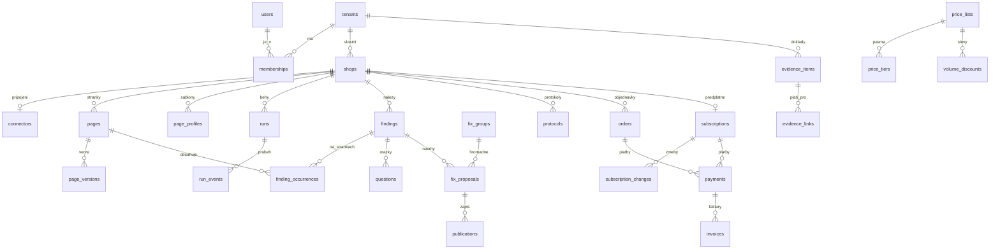

# EshopGuard: databáze, struktura aplikace a plán implementace

Návrh z 1. 10. 2026. Navazuje na:
- [architektura-multitenant-worker-2026-10-01.md](architektura-multitenant-worker-2026-10-01.md) (aplikace, fronta, priority, jeden server);
- [platby-a-fakturace-2026-10-01.md](platby-a-fakturace-2026-10-01.md) (Stripe, SuperFaktúra, změny cen);
- [podklady/reserse/konektory-api-2026-10-01.md](podklady/reserse/konektory-api-2026-10-01.md);
- návrh UI https://claude.ai/artifact/34wYLsJzieFtmWdueAwYay (verze 18).

Zatím se nic nestaví, dokument je podklad pro postup po fázích (část 8).

## 1. Výchozí stav

- **Knihovna `EshopGuard.Core`:** stahování (robots.txt, sitemap, zdvořilé tempo), extrakce (hlavní text, rámec, ostatní text, navigace, výpisy), profily šablon, segmenty, síto, Jev, pravidla (YAML moduly eco, dur, ucp, legal), přepisy přes OpenAI a zprávy. 192 testů.
- **CLI `EshopGuard.Cli`:** `scan`, `rewrite` a `check-text`.
- **Databáze zatím žádná.** Cache Jevu, přepisů a profilů jsou v SQLite, sken celý běží v paměti, potvrzení ceny je callback.
- **Lokálně:** PostgreSQL 18.6 (služba `postgresql-x64-18`, localhost:5432, testovací účet `postgres`/`postgres`). Vedle je databáze `eia_registry` jiného projektu, nesahat na ni. EshopGuard dostane vlastní databázi `eshopguard`.
- **Změřeno:** zpracování stránky stojí 0,25–0,28 s procesoru, průměrné HTML má 298 kB a Jev potřebuje ~35 volání na stránku (vzorek vegis).

## 2. Zásady návrhu

| Téma | Rozhodnutí |
|---|---|
| Databáze | Jedna databáze `eshopguard`, schémata podle oblastí: `iam`, `shop`, `content`, `checks`, `fixes`, `billing`, `usage`, `ops` |
| Identifikátory | `uuid` v7 (časově řazené, dobré pro indexy): v .NET `Guid.CreateVersion7()`, v databázi výchozí hodnota `uuidv7()`. Pro velké tabulky jen s přidáváním (fronta, události, spotřeba, audit) `bigint identity` |
| Tenant | Každá tabulka s daty zákazníka má `tenant_id`. Hlavní vazby mají cizí klíč přes dvojici (`tenant_id`, `id`), takže odkaz na řádek jiného tenanta nejde ani založit |
| Izolace | Row-Level Security na všech tabulkách tenanta s `FORCE ROW LEVEL SECURITY`. Politika `tenant_id = current_setting('app.tenant_id')::uuid`. Navíc globální filtr EF Core a doplnění `tenant_id` při ukládání |
| Role v databázi | `eshopguard_owner`: migrace, vlastník objektů. `eshopguard_app`: API, podléhá RLS. `eshopguard_worker`: worker, podléhá RLS u dat tenantů a má práva k frontě. `eshopguard_admin`: podpora, obchází RLS, každé použití jde do auditu. `eshopguard_cms`: Payload CMS prezentačního webu, práva jen na schéma `cms`. **Pozor: superuživatel `postgres` RLS vždy obchází, aplikace se proto i lokálně připojuje jako `eshopguard_app` / `eshopguard_worker`** |
| Čas | `timestamptz` v UTC. Sloupce `created_at` a `updated_at`. U e-shopů, uživatelů a dokladů měkké mazání přes `deleted_at`. Smazání tenanta je úloha, která maže natvrdo |
| Peníze | Ceny pro zákazníka `numeric(12,2)` + `currency char(3)`. Interní náklady `numeric(14,6)` v USD |
| Výčty | `text` s omezením `CHECK`. Snadno se rozšiřuje migrací, EF je mapuje na .NET enum |
| Proměnlivá data | `jsonb`: odpovědi Jevu, oblasti profilu, obsah událostí, přehled ceny, statistiky běhu |
| Souběžné úpravy | `xmin` jako token souběžnosti (Npgsql) u tabulek, které edituje člověk (návrhy oprav, doklady, předplatné) |
| Soubory | Mimo databázi za rozhraním `IBlobStore`, v databázi jen klíč. Cesty `tenants/{tenant}/shops/{shop}/…`. Rozhodnuto 1. 10. 2026: zatím lokální souborový systém (na serveru svazek Dockeru), úložiště v cloudu (Azure, AWS…) později jako další implementace; MinIO se nepoužívá |
| Velké tabulky | Rozdělené na části (partitioning): po e-shopu nebo tenantovi (`HASH`) nebo po měsících (`RANGE`), podle části 6. Primární klíč pak obsahuje klíč dělení |
| Texty zákazníka | Jen v tabulkách tenanta a v jeho souborech. Nikdy v provozních logech ani v globálních tabulkách |

## 3. Tabulky

Zkratky: **PK** primární klíč, **U** jedinečnost, **I** index, **RLS** politika tenanta. Sloupce `id`, `tenant_id`, `created_at` a `updated_at` se u tabulek tenanta neopakují, jsou všude.

### 3.1 `iam`: účty, uživatelé, role

| Tabulka | Hlavní sloupce | Pozn. |
|---|---|---|
| `tenants` | `name`, `legal_name`, `ico`, `dic`, `ic_dph`, adresa, `country_code`, `billing_email`, `locale` (sk/cs: jazyk faktur a e-mailů na fakturační adresu), `currency` (pevně od první platby, Stripe drží u zákazníka jednu měnu), `market_code`, `status` (active/suspended/deleted), `stripe_customer_id`, `superfaktura_client_id`, `partner_kind` (null/agency/lawyer/certifier), `founder_until`, `deleted_at` | Fakturační údaje firmy (menu účtu „Bylinkovo s. r. o.“). Bez RLS, přístup jen přes členství |
| `users` | `email` (U, bez rozlišení velikosti písmen), `email_confirmed`, `password_hash` (null u přihlášení jen přes Google nebo odkazem), `display_name`, `locale` (jazyk rozhraní: sk/cs/…), `last_login_at`, `security_stamp`, `concurrency_stamp`, `lockout_end`, `access_failed_count`, `deleted_at` | ASP.NET Core Identity, globální identita |
| `user_logins` | `user_id`, `provider` (google), `provider_key` (U) | „Pokračovať cez Google“ |
| `user_tokens` | `user_id` (null u odkazu pro nový účet), `email`, `purpose` (reset/confirm/magic_link), `token_hash` (U), `expires_at`, `used_at`, `requested_ip_hash` | „Zabudnuté heslo“, potvrzení e-mailu, přihlášení odkazem (pravidla v části 9, bod 1) |
| `memberships` | PK (`tenant_id`, `user_id`), `role` (owner/admin/editor/viewer), `invited_by` | Majitelka účtu = owner. Publikovat smí editor a výš |
| `invitations` | `email`, `role`, `token_hash`, `expires_at`, `accepted_at`, `invited_by` | RLS |
| `notification_settings` | `user_id`, `shop_id` (null = všechny), `email_new_violation`, `email_weekly_summary`, `email_run_finished` | Obrazovka Sledování, oddíl „Upozornenia“. RLS |
| `notifications` | `user_id` (null = všem v účtu), `shop_id`, `kind`, `params` jsonb, `link`, `read_at` (text se skládá v jazyce uživatele podle `kind`) | Zvoneček v mobilu. RLS |

### 3.2 `shop`: e-shopy, konektory, profily

| Tabulka | Hlavní sloupce | Pozn. |
|---|---|---|
| `shops` | `domain` (bez www), `base_url`, `base_path`, `name`, `home_country` (sk/cz: země sídla, výchozí jazyk a měna), `language`, `platform` (shoptet/upgates/biznisweb/woocommerce/shopify/other/unknown), `source_mode` (connector/feed/web), `status` (draft/sample/awaiting_payment/analyzing/active/paused/canceled), `product_count`, `page_count`, `tier_code`, `modules` text[], `check_hidden_on_save`, `ownership_verified_at`, `verification_method`, `monitor_slot_minute`, `last_full_run_id`, `last_run_at`, `deleted_at` | U (`tenant_id`, `domain`, `base_path`). Přepínač e-shopu v bočním menu. RLS |
| `shop_markets` | PK (`shop_id`, `country_code`), `is_home`, `status` (suggested/active/declined/unsupported), `evidence_level` (strong/delivery/generic), `source` (detected/user), `evidence` jsonb (ověřené citace a technické znaky), `detection_run_id`, `confirmed_by`, `confirmed_at` | Místa prodeje včetně domovské země: obrazovka 3c „Kde predávate“. Kontroluje se podle všech `active`. `unsupported` se klientovi neukazují; až trh dostane podporu, nabídnou se. RLS |
| `shop_languages` | PK (`shop_id`, `language`), `base_url` (např. `bylinkovo.sk/cz/`), `switch_method` (path/subdomain/domain/query/cookie), `source` (hreflang/switcher/connector/llm/user), `status` (active/excluded/needs_confirmation u jiné domény/unsupported), `own_text_share` (z ukázky), `language_share` jsonb (podíl textů po jazycích), `comparison` jsonb (překlad / zkrácený nebo jiný / nepřeložený, příklady), `sample_run_id`, `counted` (vlastní texty ≥ 20 %; při nejistotě ne), `product_count` | Jazykové verze. Kontroluje se každá aktivní verze podle míst prodeje, která ji používají. Do pásma jde součet `product_count` verzí s `counted`. RLS |
| `shop_verifications` | `shop_id`, `method` (meta/dns/connector), `token`, `status`, `checked_at` | Ověření vlastnictví. RLS |
| `connectors` | `shop_id`, `platform`, `status` (connected/error/revoked/paused), `external_shop_id`, `access` (read/read_write), `credentials_enc` bytea, `credentials_key_id`, `token_expires_at`, `scopes` text[], `sync_cursor`, `last_reconcile_at`, `last_webhook_at`, `webhook_secret_hash`, `health` jsonb | Klíče šifrované (Data Protection), nikdy v logu. RLS |
| `connector_webhooks` | `connector_id`, `event`, `external_id`, `status`, `last_verified_at` | Hlídač odběrů. RLS |
| `connector_events` | `id` bigint, `connector_id`, `shop_id`, `dedupe_key`, `event_type`, `resource_type`, `resource_external_id`, `payload` jsonb, `received_at`, `processed_at`, `status` | Po měsících, uchování 30 dní. I (`connector_id`, `dedupe_key`). RLS |
| `feeds` | `shop_id`, `url`, `format` (heureka/google), `etag`, `last_fetched_at` | Varianta připojení „Produktový feed“. RLS |
| `page_profiles` | `shop_id`, `number`, `prompt_version`, `model`, `regions` jsonb, `sample_urls` jsonb, `created_run_id`, `retired_at` | Nahradí `SqlitePageProfileStore`. RLS |
| `shop_facts` | `shop_id` (null = všechny e-shopy tenanta), `topic`, `text`, `created_by` | Fakta pro návrhy oprav (návrh 1a′). RLS |
| `free_sample_claims` | PK `domain`, `tenant_id`, `shop_id`, `claimed_at` | **Globální**: ukázka zdarma jednou na doménu. Bez RLS, přístup jen systémem |

### 3.3 `content`: stránky a co na nich je

| Tabulka | Hlavní sloupce | Pozn. |
|---|---|---|
| `pages` | PK (`shop_id`, `id`), `url`, `url_hash` (U se `shop_id`), `path`, `language` (verze e-shopu), `hreflang_group` (stejná stránka v jiné verzi), `page_type` (home/product/category/legal/content), `source` (crawl/connector/feed), `external_id` (číslo produktu v e-shopu), `title`, `status` (active/gone/robots_blocked/not_loaded/error), `is_hidden_in_shop`, `first_seen_at`, `last_seen_at`, `last_fetched_at`, `http_etag`, `http_last_modified`, `current_version_id`, `profile_id`, `profile_unknown_share`, `rotation_bucket` (0–6), `next_check_at` | HASH(`shop_id`). „Text zo Shoptetu, produkt č. 2429“. RLS |
| `page_versions` | PK (`shop_id`, `id`), `page_id`, `run_id`, `fetched_at`, `http_status`, `html_blob_key`, `extract_blob_key`, `text_hash`, `visible_chars`, `checked_chars`, `navigation_chars`, `listing_chars`, `profile_skipped_chars`, `extraction_method`, `script_app`, `text_not_loaded`, `segment_hashes` bigint[], `is_current` | HASH(`shop_id`). Nová verze vzniká jen při změně textu. Bez indexu GIN (rozhodnuto 1. 10. 2026: pod RLS ho PostgreSQL nepoužije, operátor `@>` není `LEAKPROOF`); „na kterých stránkách je tahle věta“ (hromadné opravy, „Rovnaký text na 38 stránkach“) se hledá v částech e-shopu, 20 000 stránek změřeno za 9–10 ms. RLS |

Text stránky (bloky hlavního textu, rámce a ostatního textu s pořadím) je v souboru `extract_blob_key` (JSON, gzip), ne v databázi. **Tabulka vět záměrně neexistuje.** Věty se poznají podle 64bitového otisku normalizovaného textu. Jejich text je v souboru stránky a v nálezu, odpovědi Jevu se hledají podle otisku. Ušetří to zhruba třetinu objemu (část 6).

### 3.4 `checks`: běhy, odpovědi Jevu, nálezy, otázky

| Tabulka | Hlavní sloupce | Pozn. |
|---|---|---|
| `rule_sets` | `module`, `version` (U s `module`), `jurisdictions` text[], `question_language`, `question_set_hash`, `definition` jsonb, `texts` jsonb (názvy, vysvětlení, doporučení a otázky po jazycích; jazyk bez úplných textů nejde zapnout), `source_hash`, `enabled`, `published_at` | **Globální** katalog verzí pravidel z YAML |
| `runs` | `shop_id`, `kind` (free_sample/full_analysis/monitoring/connector_check/recheck/rule_update/profile_refresh), `trigger` (user/schedule/webhook/system), `status` (queued/discovering/awaiting_payment/crawling/profiling/segmenting/evaluating/ruling/rewriting/finished/partial/failed/canceled), `priority`, `order_id`, `requested_by`, `jurisdictions` text[] (aktivní trhy v době běhu), `modules` text[], `rule_set_ids` uuid[], `estimate` jsonb, `progress` jsonb (počty po krocích), `stats` jsonb, `cancel_requested`, `error`, `started_at`, `finished_at` | Stavový automat z architektury, část 6. RLS |
| `run_events` | `id` bigint, `run_id`, `at`, `level`, `code`, `message`, `data` jsonb | Průběh pro uživatele (SSE). Po měsících, uchování 90 dní. RLS |
| `jev_answers` | PK (`tenant_id`, `cache_key`), `response` jsonb (celá odpověď Jevu), `model`, `question_set_hash`, `created_at` | HASH(`tenant_id`). Cache po tenantovi. `cache_key` = dnešní klíč `sha256:…` (`JevCacheKey.LegacyKey`), aby šlo převést 66 159 už zaplacených odpovědí ze SQLite. Upraveno 1. 10. 2026 (změna 5b): cache jen v PostgreSQL, stejně pro CLI i aplikaci, bez SQLite. RLS |
| `sieve_answers` | PK (`tenant_id`, `question_set_hash`, `chunk_hash`), `probabilities` real[] | HASH(`tenant_id`). RLS |
| `findings` | `shop_id`, `rule_id`, `rule_set_id`, `module`, `checkability` (text/assess/verify), `severity`, `band` (high/review), `scope` (segment/page/site), `segment_hash`, `page_id`, `text` (kopie), `score`, `verdicts` jsonb (po jurisdikcích: `band`, `severity`, `checkability`, `legal_refs`; řadí se podle nejpřísnějšího), `legal_refs` jsonb, `params` jsonb (vysvětlení se skládá při čtení z textů pravidla v jazyce uživatele, nekopíruje se), `status` (open/needs_answer/proposed/approved/published/kept/kept_with_evidence/dismissed/resolved), `occurrences`, `first_run_id`, `last_seen_run_id`, `resolved_run_id`, `resolved_at` | U (`shop_id`, `rule_id`, `segment_hash`) WHERE `scope='segment'`. Záložky Opravy: na riešenie, na schválenie, potrebujeme odpoveď, publikované. RLS |
| `finding_occurrences` | PK (`finding_id`, `page_id`), `shop_id`, `block_index` | Pohled „Podľa stránok“: 28 stránek s nálezem. RLS |
| `questions` | `shop_id`, `finding_id` (null u otázek za celý web), `scope` (finding/site), `code`, `params` jsonb (znění otázky z textů pravidla v jazyce uživatele), `status` (open/answered), `answer` (yes/no/text), `answered_by`, `answered_at`, `evidence_id` | „Rýchle odpovede“, „Áno, vieme doložiť / Nie, nevieme doložiť“, „Celý e-shop: košík a objednávka“. RLS |
| `page_changes` | `id` bigint, `shop_id`, `page_id`, `detected_at`, `source` (webhook/crawl/feed/save_hidden), `change_kind` (new/text_changed/removed/hidden_saved/fix_published), `run_id`, `result` (new_violation/new_assess/fix_confirmed/ok), `finding_ids` uuid[] | Obrazovka Sledování, tabulka „Posledné zmeny“. RLS |

### 3.5 `fixes`: opravy, rozhodnutí, doklady, protokoly

| Tabulka | Hlavní sloupce | Pozn. |
|---|---|---|
| `fix_groups` | `shop_id`, `kind` (repeated_text/template/site_obligation), `segment_hash`, `original_text`, `replacement_template`, `placeholders` jsonb, `filled_values` jsonb, `status` (draft/needs_value/approved/published/partially_published/rejected), `page_count`, `excluded_page_ids` uuid[], `approved_by`, `approved_at`, `locked_at` | Hromadná oprava, „Obal: [údaj]“, šablona webu. RLS |
| `fix_proposals` | `shop_id`, `page_id`, `page_version_id`, `group_id`, `finding_ids` uuid[], `field` (description/short_description/name/block), `block_index`, `original_text`, `proposed_text`, `alternatives` jsonb (např. „S upresnením“, „Bez environmentálneho slova“), `selected_alternative`, `edited_text`, `reason`, `placeholders` jsonb, `recheck_status` (ok/still_finding/pending), `model`, `prompt_version`, `status` (proposed/accepted/rejected/edited/published/conflict/superseded), `decided_by`, `decided_at`, `created_run_id` | „Zmena 1 z 5“, přijmout, upravit, zamítnout, „Nový text prešiel kontrolou“. RLS |
| `publications` | `shop_id`, `connector_id`, `page_id`, `external_id`, `field`, `language`, `old_value`, `old_value_hash`, `new_value`, `idempotency_key` (U), `status` (queued/published/failed/conflict/rolled_back), `attempts`, `error`, `requested_by`, `published_at`, `rolled_back_at`, `fix_proposal_ids` uuid[] | „Publikovať do e-shopu“, vrácení změny. RLS |
| `decision_memory` | `shop_id` (null = všechny), `segment_hash`, `normalized_text`, `decision` (replace/keep/keep_with_evidence/remove), `replacement_text`, `evidence_id`, `source_proposal_id`, `auto_publish`, `created_by`, `superseded_at` | Paměť rozhodnutí pro sledování: stejný text → stejná oprava bez LLM. RLS |
| `evidence_items` | `claim_text`, `subject_kind` (brand/product/group), `subject_label`, `kind` (certificate/license/test_report/statement/answer), `title`, `file_blob_key`, `file_name`, `source` (upload/registry/answer), `registry_ref`, `valid_from`, `valid_until`, `status` (valid/expiring/expired/awaiting_answer/claim_removed), `reminder_sent_at`, `created_by`, `deleted_at` | Obrazovka Doklady: tvrzení, doklad, platí pro, stav, odkud. Platí pro všechny e-shopy tenanta. RLS |
| `evidence_links` | `evidence_id`, `shop_id`, `page_id`, `external_id`, `finding_id` | „19 produktov“. RLS |
| `protocols` | `shop_id`, `number` (řada po tenantovi, např. EG-2026-0142), `period_from`, `period_to`, `locale`, `generated_by`, `pdf_blob_key`, `summary` jsonb, `rule_set_ids` uuid[] | Protokol PDF. RLS |
| `rewrite_cache` | PK (`tenant_id`, `key`), `answer` jsonb, `model` | Nahradí `SqliteRewriteCache`. RLS |

### 3.6 `billing`: ceník, objednávky, předplatné, platby, faktury

| Tabulka | Hlavní sloupce | Pozn. |
|---|---|---|
| `price_lists` | `name`, `market_code`, `currency`, `valid_from`, `published_at`, `status` (draft/published/retired), `notice_days` | **Globální**, verze ceníku |
| `price_tiers` | `price_list_id`, `code`, `min_products`, `max_products` (null = dohodou), `analysis_price`, `monitoring_monthly`, `monitoring_yearly`, `stripe_price_analysis`, `stripe_price_monthly`, `stripe_price_yearly`, `lookup_key` | **Globální**. Pásma 500 / 2 000 / 5 000 / 20 000 produktů |
| `volume_discounts` | `price_list_id`, `from_shop_number`, `percent`, `stripe_coupon_id` | **Globální**. „Od 3. e-shopu −[X] %“ |
| `promo_codes` | `code` (U), `percent`, `duration_months`, `valid_until`, `max_redemptions`, `stripe_promotion_code_id`, `tenant_id` (null = veřejný) | Zakládající zákazníci −30 %, partneři |
| `payment_methods` | `stripe_payment_method_id`, `brand`, `last4`, `exp_month`, `exp_year`, `is_default`, `detached_at` | „VISA •••• 4242 · platí do 08/28“. RLS |
| `orders` | `shop_id`, `kind` (analysis_with_trial/custom), `price_list_id`, `tier_code`, `amount_net`, `discount_amount`, `vat_rate`, `vat_amount`, `amount_gross`, `currency`, `status` (created/checkout_open/paid/expired/canceled/refunded), `stripe_checkout_session_id`, `stripe_payment_intent_id`, `run_id`, `created_by`, `paid_at` | Souhrn objednávky „Dnes zaplatíte“. RLS |
| `subscriptions` | `shop_id` (U pro aktivní), `stripe_subscription_id`, `status` (trialing/active/past_due/canceled/incomplete/paused), `interval` (month/year), `price_list_id`, `tier_code`, `unit_price`, `discount_percent`, `trial_end`, `current_period_start`, `current_period_end`, `cancel_at_period_end`, `canceled_at` | Tabulka e-shopů v Predplatné a platby. RLS |
| `subscription_changes` | `subscription_id`, `kind` (price_list/tier/discount/interval/cancel), `from` jsonb, `to` jsonb, `effective_at`, `notified_at`, `applied_at`, `status` | Automatická změna ceny, pásma a slevy od dalšího období. RLS |
| `payments` | `order_id`, `subscription_id`, `stripe_invoice_id`, `stripe_payment_intent_id`, `amount_gross`, `currency`, `status` (succeeded/failed/refunded/partially_refunded), `failure_code`, `paid_at`, `refunded_amount`, `card_brand`, `card_last4` | RLS |
| `invoices` | `shop_id`, `payment_id`, `kind` (invoice/credit_note/proforma), `number`, `superfaktura_id`, `issued_at`, `taxable_supply_date`, `due_date`, `buyer` jsonb (snímek údajů firmy), `items` jsonb, `amount_net`, `vat_amount`, `amount_gross`, `currency`, `reverse_charge`, `einvoice_required`, `einvoice_status` (not_required/queued/sent/delivered/failed), `einvoice_message_id`, `pdf_blob_key`, `status`, `credit_note_for` | Seznam faktur s filtrem e-shop/rok, PDF, ZIP. I (`tenant_id`, `issued_at` desc). RLS |
| `stripe_events` | PK `id` (evt_…), `type`, `tenant_id`, `received_at`, `processed_at`, `status`, `payload` jsonb, `error` | **Globální**, odstranění duplicit webhooků. Uchování 90 dní |

### 3.7 `usage`: interní spotřeba a náklady

| Tabulka | Hlavní sloupce | Pozn. |
|---|---|---|
| `usage_records` | `id` bigint, `tenant_id`, `shop_id`, `run_id`, `job_id`, `provider` (jev/openai/crawl), `model`, `operation` (sentence_eval/sieve/profile/rewrite/recheck/fetch), `calls`, `cache_hits`, `input_tokens`, `cached_tokens`, `output_tokens`, `bytes_in`, `cost_usd`, `occurred_at` | Po měsících. **Zapisuje se za dávku, ne za každé volání.** Zákazník ji nevidí. Bez RLS, čte jen interní přehled |
| `usage_daily` | PK (`day`, `tenant_id`, `shop_id`, `provider`, `operation`), součty | Plní noční úloha. Interní přehled marže: tržby z faktur proti nákladům po tenantovi a e-shopu |

### 3.8 `ops`: fronta, workery, limity, audit

| Tabulka | Hlavní sloupce | Pozn. |
|---|---|---|
| `jobs` | `id` bigint, `tenant_id`, `shop_id`, `run_id`, `kind`, `resource_class` (fetch/cpu/jev/llm/io/system), `priority` (0–4), `payload` jsonb, `state` (queued/running/succeeded/failed/canceled), `dedupe_key` (U, null povolen), `concurrency_key`, `attempts`, `max_attempts`, `not_before`, `lease_owner`, `lease_until`, `heartbeat_at`, `started_at`, `finished_at`, `last_error` | I (`resource_class`, `priority`, `not_before`, `id`) WHERE `state='queued'`. I (`lease_until`) WHERE `state='running'`. Hotové se po 7 dnech mažou |
| `workers` | PK `id` (host:pid), `version`, `slots` jsonb, `started_at`, `heartbeat_at`, `draining` | Přehled provozu |
| `domains` | PK `domain`, `robots_txt`, `robots_fetched_at`, `crawl_delay_ms`, `sitemaps` text[], `lease_job_id`, `lease_until`, `last_request_at`, `rate` real, `consecutive_errors`, `blocked_until` | **Globální**: zdvořilost k cizímu webu přes všechny tenanty. Obsahuje jen veřejná data |
| `rate_limit_buckets` | PK `key` (jev, openai, connector:shoptet:{eshop}…), `capacity`, `tokens`, `refill_per_sec`, `reserved` jsonb (podíl pro priority), `updated_at` | **Globální** |
| `schedules` | PK `shop_id`, `tenant_id`, `kind` (nightly/weekly_web/reconcile), `next_run_at`, `last_run_at` | Plánovač; úloha má `dedupe_key` `monitor:{shop}:{datum}` |
| `outbox` | `id` bigint, `tenant_id`, `kind` (email/invoice/einvoice), `payload` jsonb, `created_at`, `sent_at`, `attempts`, `error` | E-maily a volání SuperFaktúry se opakují při výpadku |
| `audit_log` | `id` bigint, `tenant_id`, `at`, `actor_user_id`, `actor_kind` (user/system/admin), `action`, `entity_type`, `entity_id`, `data` jsonb, `ip` | Po měsících. Kdo schválil, publikoval, vrátil, změnil cenu |
| `system_settings` | PK `key`, `value` jsonb | Limity Jevu a OpenAI, přepínače funkcí |

**Globální tabulky** (bez RLS, bez textů zákazníků): `rule_sets`, `price_lists`, `price_tiers`, `volume_discounts`, `promo_codes` (veřejné), `free_sample_claims`, `stripe_events`, `jobs`, `workers`, `domains`, `rate_limit_buckets`, `system_settings`, `usage_*`. Všechny ostatní mají RLS.

### 3.9 `ref`: trhy a jazyky (globální číselníky)

| Tabulka | Hlavní sloupce | Poznámka |
|---|---|---|
| `markets` | `code` (PK: sk, cz, později de, at, hu…), `country_code`, `default_locale` (sk-SK), `ui_locales` text[], `jurisdiction`, `currency`, `price_list_id`, `web_status` (hidden/preview/live), `checks_status` (none/limited/full) | **Globální**. Co je pro trh hotové. Nový trh = nový řádek + kroky v architektuře, část 12 |
| `locales` | `code` (sk, cs, …), `name`, `fallback_code`, `enabled` | **Globální**. Jazyky rozhraní. Zapnout jde jen jazyk s úplnými texty |

Obsah prezentačního webu je ve schématu `cms`, které spravuje Payload CMS svými migracemi (role `eshopguard_cms`). Na data zákazníků nemá vazby.

## 4. Hlavní vazby



## 5. Paralelní workery při tisících e-shopů

**Kolik práce je za noc** při 3 000 e-shopech po 5 000 produktech:
- rotace 1/7 webu + změny ≈ 800 stránek na e-shop, tedy **2,4 mil. stránek za noc**;
- stahování: při 2,5 požadavku/s na doménu a 300 doménách současně ≈ 53 minut;
- data: 2,4 mil. × 300 kB ≈ 720 GB. Podmíněné stažení (304) a konektory to výrazně sníží, kolik přesně, je neměřeno;
- procesor: 2,4 mil. × 0,27 s ≈ **180 jádrohodin**, v 6hodinovém okně ~30 jader. Jedno čtení HTML místo tří (fáze F3) to sníží zhruba na polovinu až třetinu; neměřeno.

Stahování je tedy levné a dá se dělat souběžně ve velkém. Rozhoduje procesor na extrakci a limit Jevu.

**Jak to fronta zvládne:**
1. **Druhy úloh podle zdroje** (`resource_class`), každý druh má ve workeru vlastní počet slotů:
   - `fetch`: stahování, asynchronní I/O, stovky souběžně;
   - `cpu`: extrakce a profily, počet podle jader;
   - `jev` a `llm`: volání API, omezená globálním čítačem;
   - `io`: zápis do e-shopu, SuperFaktúra, e-maily;
   - `system`: plánovač a údržba.

   Worker tedy stahuje stovky stránek a zároveň zpracovává tolik stránek, kolik má jader.
2. **Stahování odděleně od zpracování.** Úloha `fetch` stáhne dávku stránek jedné domény (se zámkem domény), uloží HTML do úložiště, zapíše `pages` a založí úlohu `cpu` na extrakci té dávky. Extrakce tak běží na libovolném workeru.
3. **Výběr úlohy:**

   ```sql
   SELECT … FROM ops.jobs
   WHERE state = 'queued' AND resource_class = @c AND not_before <= now()
   ORDER BY priority, id
   FOR UPDATE SKIP LOCKED
   LIMIT @n
   ```

   Workery se navzájem neblokují. Spravedlnost mezi tenanty: dávky se zařazují na konec fronty a pro každý tenant platí strop souběžných úloh, kontrolovaný při výběru.
4. **Lease 2 minuty s prodlužováním**, vrácení po pádu workeru, opakování s rostoucím odstupem. Při vyčerpaném kreditu nebo odmítnutém klíči se pozastaví celý druh úloh (z architektury).
5. **Zámky domén** v `ops.domains`: jedna doména = jeden běh stahování najednou přes všechny tenanty. Řádek se zamyká `FOR UPDATE SKIP LOCKED` a nese `lease_until`.
6. **Globální limity** v `ops.rate_limit_buckets`. Dávka si rezervuje tokeny jedním příkazem `UPDATE … RETURNING`. Rychlé kontroly (P0–P1) mají vyhrazený podíl.
**Rozhodnuto 1. 10. 2026: workery jsou ve stejné síti jako databáze a připojují se přímo** (role `eshopguard_worker`). Interní API pro workery zatím nestavíme. Obsluha úloh ale pracuje přes rozhraní `IJobQueue` a `IWorkerStore`. Kdyby jednou přišly stroje mimo síť, přidá se druhá implementace přes API (stahování s nahráním HTML do S3 přes podepsaný odkaz) a úlohy se přepisovat nebudou.

**Proč převzetí úloh nekoliduje:**
- Převzetí je jeden příkaz `UPDATE … WHERE id IN (SELECT … FOR UPDATE SKIP LOCKED) RETURNING`. Zamčené řádky ostatní workery přeskočí, takže stejnou úlohu nikdy nedostanou dva workery.
- Dokončení platí jen s vlastním leasem a číslem pokusu (`WHERE lease_owner = @me AND attempts = @attempt`). Zaseknutý worker, kterému úlohu mezitím převzal jiný, svůj výsledek nezapíše.
- Výsledky mají jedinečné klíče (běh, stránka, dávka), takže případný opakovaný zápis nic nezdvojí.
- Úlohy, které smějí běžet jen jednou na e-shop (pravidla, souhrn běhu), mají `concurrency_key`.
- Průběh běhu se mění jen přičítáním.
- Od řádově desítek workerů dát před databázi PgBouncer.

7. **Škálování:** další worker je jen další proces nebo server se stejnou konfigurací. Při tisících e-shopů zvlášť workery pro stahování (hodně slotů `fetch`, málo jader) a zvlášť pro výpočty (hodně jader). Databáze unese stovky výběrů úloh za sekundu. Kdyby nestačila, přidá se fronta Redis nebo RabbitMQ za stejné rozhraní `IJobQueue`.

## 6. Objem dat a dělení tabulek

Odhad pro e-shop s 5 000 produkty podle vzorku vegis (8 110 unikátních vět na 108 stránkách): **~300 000 unikátních vět**, neověřeno na celém e-shopu.

| Tabulka | 1 000 e-shopů | 5 000 e-shopů | Dělení | Uchování |
|---|---|---|---|---|
| `pages` | 5 mil. | 25 mil. | HASH(`shop_id`) 16 | stránky, které zmizely, se mažou po 90 dnech |
| `page_versions` (+ `segment_hashes`) | ~7,5 mil., ~40 GB včetně polí otisků | ~37 mil., ~200 GB | HASH(`shop_id`) 32 | aktuální + verze, na které odkazuje nález, publikace nebo protokol, + 90 dní |
| `jev_answers` | ~300 mil., ~75 GB | ~1,5 mld., ~375 GB | HASH(`tenant_id`) 32 | měsíční úklid otisků, které už nejsou na žádné stránce |
| `connector_events`, `run_events`, `usage_records`, `audit_log` | – | – | RANGE po měsících | 30 / 90 / 24 měsíců / 10 let (audit) |

Tabulka vět by přidala dalších ~300 mil. řádků. Proto ji nemáme: text věty je v souboru stránky a v nálezu. Měsíční části tabulek zakládá dopředu úloha údržby, bez dalšího rozšíření databáze. HTML a soubory extrakce leží v úložišti, ne v databázi.

**Velikost serveru:**
- do ~1 000 e-shopů stačí jeden PostgreSQL s NVMe a 32–64 GB RAM;
- při tisících e-shopů vlastní databázový server nebo spravovaná databáze;
- dělení po tenantech připravuje i rozdělení na víc databází (sharding), kdyby to bylo potřeba.

## 7. Struktura aplikace

```
eshop-guard/
  src/
    EshopGuard.Core/         dnešní knihovna, bez databáze; v F3 rozdělená na kroky
      Crawl/ Extract/ Profiles/ Segmentation/ Rules/ Jev/ Fix/ Report/
      Pipeline/                nově: Discovery, Fetch, Extract, Profile, Segment, Estimate, Evaluate, Rules, Rewrite
    EshopGuard.Cli/          dnešní CLI, kroky v paměti
    EshopGuard.Data/         EF Core 10 + Npgsql
      EshopGuardDb.cs        DbContext, schémata, globální filtry tenanta
      Configurations/          IEntityTypeConfiguration po schématech
      Migrations/              EF migrace + SQL soubory (role, RLS, dělení tabulek)
      Tenancy/                 ITenantContext, interceptor „SET LOCAL app.tenant_id“
      Stores/                  PostgreSQL implementace IJevCache, IRewriteCache, IPageProfileStore, …
      Bulk/                    hromadný zápis přes COPY (otisky vět, spotřeba)
    EshopGuard.Storage/      IBlobStore: zatím souborový systém, cloud později (rozhodnuto 1. 10. 2026)
    EshopGuard.Jobs/         fronta, leasy, sloty, limity, zámky domén, plánovač, obsluha úloh po druzích
    EshopGuard.Billing/      ceník, Stripe (Checkout, webhooky, změny cen), SuperFaktúra (faktury, e-faktúra)
    EshopGuard.Connectors/   Shoptet, Upgates, WooCommerce, Shopify (čtení, webhooky, dorovnání, zápis)
    EshopGuard.Api/          ASP.NET Core: Identity (e-mail, Google), tenanti, e-shopy, běhy, nálezy, opravy, doklady,
                               protokoly, sledování, upozornění, předplatné, webhooky (Stripe, konektory), SSE
    EshopGuard.Worker/       Generic Host: obsluha úloh ze EshopGuard.Jobs podle nastavených slotů
  web/                         Next.js podle návrhu UI + Payload CMS (prezentační web, schéma cms), next-intl, messages/sk.json, messages/cs.json
  deploy/
    (docker-compose.dev.yml s MinIO zrušen 1. 10. 2026; PostgreSQL běží lokálně jako služba)
    docker-compose.prod.yml    jeden server: caddy, web, api, worker, postgres, walg
  tests/
    EshopGuard.Core.Tests/   dnešních 192 testů
    EshopGuard.Data.Tests/   izolace tenantů (RLS) proti lokálnímu PostgreSQL, migrace
    EshopGuard.Jobs.Tests/   souběh workerů, leasy, pád workeru, zámky domén, limity
    EshopGuard.Api.Tests/    koncové body, oprávnění rolí
```

**Konfigurace (vývoj):**
- Připojení přes proměnné prostředí nebo `dotnet user-secrets`, nikdy v repozitáři:
  - `ConnectionStrings__App` = `Host=localhost;Port=5432;Database=eshopguard;Username=eshopguard_app;Password=…`;
  - `ConnectionStrings__Worker` (role `eshopguard_worker`);
  - `ConnectionStrings__Migrations` (role `eshopguard_owner`).
- Jednorázový skript `deploy/sql/00_roles.sql` založí databázi a role. Spustí se jednou jako `postgres`.
- Klíče Jevu, OpenAI, Stripe a SuperFaktúry: proměnné prostředí, lokálně user-secrets.

## 8. Plán implementace

Každá fáze končí ověřitelným stavem. Před každou fází krátce vysvětlím, co přinese, a počkám na souhlas. Velké změny se nedělají bez potvrzení.

| Fáze | Obsah | Hotovo, když |
|---|---|---|
| **F0 Základ** | Nejdřív přejmenování dnešního kódu na EshopGuard: složka `eshop-checker` → `eshop-guard`, řešení a projekty `EshopGuard.*` → `EshopGuard.*` včetně jmenných prostorů, `IEshopGuard` → `IEshopGuard`, `AddEshopGuard` → `AddEshopGuard`, spustitelný soubor `checker` → `eshopguard`, User-Agent `EshopGuard/0.1`, cesta cache, README a CHANGELOG. Potom projekty Data, Storage, Jobs, Api, Worker a jejich testy. `deploy/sql/00_roles.sql`, databáze `eshopguard` lokálně. `docker-compose.dev.yml` s MinIO. Konfigurace připojení | V kódu nezůstane `EshopGuard`. `dotnet build` a `dotnet test` projdou (192 testů jako dnes), migrace prázdného schématu proběhne jako `eshopguard_owner` |
| **F1 Datový model** | EF entity a konfigurace všech schémat z části 3 včetně `ref.markets` a `ref.locales`. Migrace. SQL pro RLS, role a dělení tabulek (`pages`, `page_versions`, `jev_answers`, `sieve_answers` HASH; události, spotřeba a audit po měsících). Kontext tenanta a interceptor. Úloha zakládající měsíční části | Testy izolace: dva tenanti se stejnou doménou, pro každou tabulku tenanta čtení přes EF i čistým SQL jako `eshopguard_app` vrací jen vlastní řádky. Zápis s cizím `tenant_id` selže |
| **F2 Fronta a worker** | `IJobQueue` a `IWorkerStore` (přímo PostgreSQL) nad `ops.jobs` (zařazení v transakci, výběr se SKIP LOCKED, lease, prodlužování, opakování, zrušení), sloty po druzích, `ops.domains` (zámky domén), `ops.rate_limit_buckets`, plánovač se zámkem, kostra workeru (Generic Host, ukončení po dokončení dávky) | Testy: 4 workery a 1 000 úloh bez dvojího zpracování. Zabitý worker: úloha se vrátí a doběhne. Zaseknutý worker po převzetí úlohy jiným nezapíše výsledek. Dvě úlohy na stejnou doménu se střídají |
| **F3 Knihovna po krocích** | Rozbor míst prodeje a jazykových verzí (technické znaky + LLM se ověřenými citacemi, ověřeno na 9 e-shopech za 0,42 USD), procházení verzí přes adresu, cookie nebo jazyk prohlížeče, podíl vlastních textů z ukázky a vyhodnocení pravidel pro víc jurisdikcí nad společnými odpověďmi Jevu. Texty pravidel do jazykových souborů (`rules/texts/cs`, `rules/texts/sk`) a slovenský překlad (~21 000 znaků), knihovna vrací kódy a parametry místo hotových vět. Rozdělení `ScanSiteAsync` a `Crawler` na kroky (zjištění rozsahu, stažení stránky, extrakce, profily, segmenty, odhad, Jev po dávkách, pravidla, přepis). Podmíněné stažení (ETag, Last-Modified), ochrana proti SSRF, jedno čtení HTML místo tří, PostgreSQL implementace cache a profilů | Výsledek CLI na vegis a naturfytu je stejný jako dnes (porovnání nálezů), 192+ testů projde, extrakce je měřitelně rychlejší |
| **F4 Běhy ve workeru** | Obsluha úloh pro ukázku zdarma a úvodní analýzu po dávkách (fetch → cpu → jev → pravidla → přepisy), zápis `pages`, `page_versions`, otisků vět, nálezů, výskytů, návrhů a spotřeby, události průběhu | Úvodní analýza vegis přes workery dá stejné nálezy jako CLI. Pád workeru uprostřed nic nezdvojí. `usage_records` sedí s cenou z CLI |
| **F5 API** | Jazyk uživatele (`users.locale`, jinak Accept-Language, jinak jazyk trhu), e-maily po jazycích, chyby jako kódy. Identity (odkaz e-mailem, e-mail + heslo, Google, potvrzení e-mailu), tenanti a pozvánky, e-shopy a onboarding, běhy a průběh (SSE), nálezy a opravy (stránky, změny, varianty, otázky, hromadné opravy, šablona), doklady, protokol PDF, sledování, upozornění, menu účtu. OpenAPI | Každá obrazovka návrhu UI má svá data z API. Testy oprávnění rolí. Izolace i přes API |
| **F6 Platby** | Ceník po trzích a měnách (EUR, případně Kč) v databázi a synchronizace do Stripe (Price, kupóny, `lookup_key`). Checkout: analýza + předplatné s 30 dny zdarma. Webhooky Stripe (deduplikace v `stripe_events`). Faktury přes SuperFaktúru včetně e-faktury. Změny cen, pásem a slev od dalšího období s upozorněním | Celý tok v testovacím režimu Stripe a SuperFaktúry: objednávka → platba → faktura → zkušební měsíc → první měsíční platba → změna ceníku |
| **F7 Frontend** | Payload CMS pro prezentační web (bloky, menu, články, vydání sk a cz, koncepty a náhled), next-intl (sk, cs), přepínač jazyka, hreflang, test úplnosti překladů. Next.js podle návrhu UI (desktop i mobil), přihlášení, onboarding, přehled, opravy, sledování, doklady, předplatné | Proklikání celého toku na lokálním prostředí slovensky i česky, mobilní šířka bez vodorovného posunu, text webu jde změnit v CMS bez nasazení |
| **F8 Konektor Shoptet** | OAuth instalace doplňku, webhooky (příjem do 1 s), dorovnávání přes `/products/changes`, hlídač odběrů, zápis oprav s kontrolou konfliktu a vrácením | Změna produktu v testovacím Shoptetu je zkontrolovaná do pár minut, publikace a vrácení fungují |
| **F9 Noční sledování** | Plánovač po e-shopech, rozdíl sitemap, rotace 1/7, podmíněné stažení, paměť rozhodnutí, týdenní souhrn, upozornění | Noční běh 100 testovacích e-shopů stihne okno. Mění se jen změněné věty |
| **F10 Provoz** | Jeden server podle architektury (Docker Compose, Caddy, WAL-G do S3, nasazení z GitHub Actions), hlídání, zátěžový test (souběh, tisíce e-shopů simulovaně) | Obnova na čistý server do 2 h, zátěžový test potvrdí kapacitu z části 5 |

**Pořadí a souběh:**
- F0–F2 jsou základ.
- F3 může běžet souběžně s F1–F2, protože nesahá na databázi.
- F5 a F7 se dají dělat průběžně po obrazovkách.
- F6 je potřeba před prvním prodejem.
- F8 a F9 až po pilotu.

## 9. Otevřená rozhodnutí

1. **Přihlášení:** rozhodnuto 1. 10. 2026, že **přihlášení odkazem v e-mailu bude** (výchozí volba), vedle hesla a Google. UI: obrazovky 2a–2c na plátně. Pravidla:
   - odkaz platí 15 minut a použije se jednou; v databázi je jen otisk tokenu (SHA-256), samotný token jen v e-mailu;
   - otevření odkazu (GET) token nespotřebuje, ukáže stránku „Prihlásiť sa“ a přihlášení proběhne až tlačítkem (POST). Náhled odkazu v poště nebo antivir proto odkaz nevyčerpá;
   - odpověď „Skontrolujte e-mail“ je stejná, ať účet existuje, nebo ne (nejde zjistit, kdo je zákazník);
   - nový účet vznikne až kliknutím na odkaz, e-mail je tím potvrzený; heslo si uživatel může nastavit později v Nastaveniach;
   - limit odeslání: znovu nejdřív po 60 s, nejvýš 5 odkazů za hodinu na e-mail a 20 na IP (`ops.rate_limit_buckets`);
   - nový odkaz zneplatní předchozí nepoužité; vypršelý nebo použitý odkaz nabídne „Poslať nový odkaz“.
2. **Uchování dat** po zrušení předplatného: jak dlouho držet nálezy, protokoly a snímky (návrh 12 měsíců; faktury podle zákona déle)?
3. **Výpovědní lhůta** při změně ceníku pro stávající zákazníky (návrh 30 dní).
4. **Poskytovatel serveru** (Hetzner Cloud CCX23 / OVH VPS / Webglobe) a úložiště S3 pro zálohy.
5. **Férové užití:** návrh ostatních stránek nejvýš ~2× počet produktů, nad to individuální nabídka; hranici volání Jevu u velkých e-shopů upřesní pilot. Cena z ukázky je garantovaná (rozhodnuto 1. 10. 2026, architektura část 12).
6. **Měna pro české zákazníky, domény a nabídka na českém webu:** viz architektura, část 11, body 7–9.
