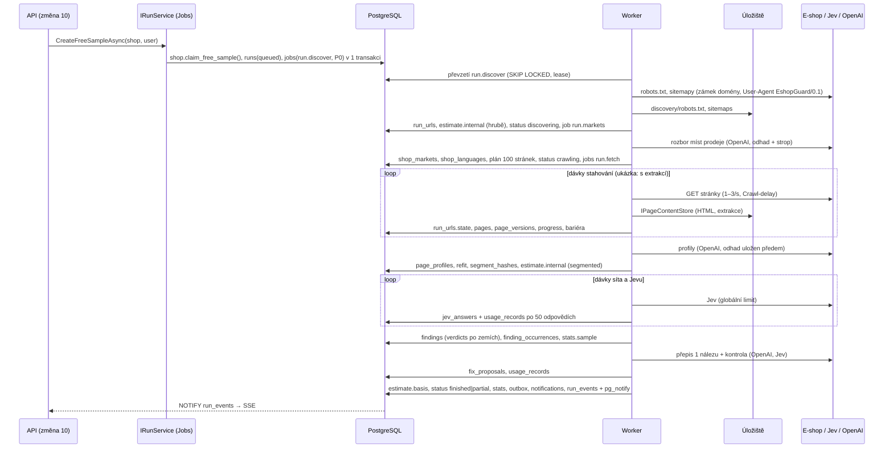

# Design: Běhy ukázky zdarma a úvodní analýzy ve workeru

Cesty jsou po přejmenování ze změny 1 (kořen `eshop-guard/`).

## Technical Approach

### Vrstvy

| Vrstva | Projekt | Co obsahuje |
|---|---|---|
| Kroky (čisté služby) | `EshopGuard.Core.Pipeline` (změna 5), `EshopGuard.Core` rozbor míst prodeje a verzí (změna 7), `VerdictOrder` (změna 6) | `DiscoveryStep`, `FetchStep`, `ExtractStep`, `ProfileStep` (`PlanAsync`, `CreateAsync`, `RefitAsync`), `SegmentStep`, `EstimateStep`, `SieveStep`, `EvaluateStep`, `RulesStep`, `RewriteStep`; bez databáze |
| Orchestrace běhu | `EshopGuard.Jobs/Runs` (nové) | stavový automat, `IRunService`, plán kroků, obsluhy úloh, bariéry, interní odhad, základ rozsahu, souhrn ukázky, výčet nezkontrolovaného, zrušení, pozice ve frontě |
| Úložiště | `EshopGuard.Data` (nové třídy), `EshopGuard.Storage` | PostgreSQL implementace rozhraní změny 5 (`PgPageStore`, `PgUrlFrontierStore`, `S3PageContentStore`; `PgJevCache`, `PgRewriteCache`, `PgPageProfileStore` dodává změna 5b) a zápis `findings`, `finding_occurrences`, `fix_proposals`, `run_events`, `usage_records` |
| Hostitel | `EshopGuard.Worker` | registrace obsluh podle `kind`, sloty po `resource_class`, kontroly při startu, vývojový příkaz `dev seed-run` |

CLI skládá stejné kroky v paměti přes `InMemoryPipelineRunner` (změna 5). Worker skládá tytéž kroky přes frontu. Shodu obou cest hlídá `CliParityTests` (Done when).

### Plán kroků

Každý řádek je jedna obsluha `IJobHandler` (rozhraní ze změny 4) v `EshopGuard.Jobs/Runs/Handlers`.

| Stav běhu | Úloha (`ops.jobs.kind`) | Krok změny 5 | `resource_class` | Priorita | Dávka | `dedupe_key` | `concurrency_key` | Výstup |
|---|---|---|---|---|---|---|---|---|
| `discovering` | `run.discover` | `DiscoveryStep` | `fetch` | P0 | celý e-shop | `run:{run}:discover` | `run:{run}:discover` | `RobotsSnapshot` a sitemapy v úložišti, `UrlFrontierState` do `run_urls`, hrubý `estimate.internal` |
| `discovering` (jen ukázka) | `run.markets` | rozbor změny 7 | `llm` | P0 | 1 e-shop | `run:{run}:markets` | – | `shop_markets` (suggested), `shop_languages`, plán 100 stránek |
| `awaiting_payment` | – (čeká na `MarkOrderPaidAsync` / `ApproveWithoutPaymentAsync`) | – | – | – | – | – | – | – |
| `crawling` | `run.fetch` | `FetchStep` (ukázka s `ExtractInline = true`) | `fetch` | P2 | do 100 URL nebo 60 s | `run:{run}:fetch:{scope}:{n}` | zámek domény v `ops.domains` | HTML přes `IPageContentStore`, nový `UrlFrontierState`, `PaceState`; u ukázky rovnou výsledek extrakce |
| `crawling` (jen úvodní analýza) | `run.extract` | `ExtractStep` | `cpu` | P2 | do 100 stránek | `run:{run}:extract:{scope}:{n}` | – | `pages`, `page_versions` u stránek se známým profilem, `StructureTokens` pro profily, nové odkazy do fronty URL |
| `profiling` | `run.profile` | `ProfileStep.PlanAsync` + `CreateAsync` | `llm` | P2 | celý e-shop (tvorba po jednom profilu) | `run:{run}:profile` | `run:{run}:profile` | `shop.page_profiles`, odhad profilů před prvním voláním |
| `profiling` | `run.refit` | `ProfileStep.RefitAsync` | `cpu` | P2 | do 100 stránek | `run:{run}:refit:{n}` | – | verze stránek, které čekaly na profil |
| `segmenting` | `run.segment` | `SegmentStep` | `cpu` | P2 | celý e-shop | `run:{run}:segment` | `run:{run}:segment` | `segment_hashes` z `SentenceFingerprints`, `SieveChunkInput` a `SegmentState` po 200 do úložiště |
| `segmenting` (jen ukázka s víc verzemi) | `run.versions` | porovnání verzí změny 7 | `llm` | P2 | 1 e-shop | `run:{run}:versions` | – | `shop_languages.own_text_share`, `comparison`, `counted` |
| `segmenting` | `run.estimate` | `EstimateStep` | `cpu` | P2 | celý e-shop | `run:{run}:estimate` | `run:{run}:estimate` | `estimate.internal` (`basis = segmented`), kontrola stropu ukázky; nic se nečeká |
| `evaluating` | `run.sieve` | `SieveStep` | `jev` | P2 | 200 úseků | `run:{run}:sieve:{n}` | – | `checks.sieve_answers` (`JevCacheKind.Sieve`) |
| `evaluating` | `run.plan_evaluate` | výběr stavů podle síta (jako dnešní `EvaluateWithSieveAsync`) | `cpu` | P2 | celý e-shop | `run:{run}:plan_evaluate` | `run:{run}:plan_evaluate` | dávky `SegmentState` s klíči sad pravidel |
| `evaluating` | `run.evaluate` | `EvaluateStep` | `jev` | P2 | 200 vět | `run:{run}:evaluate:{n}` | – | `checks.jev_answers` (`JevCacheKind.Detail`), `NotEvaluated[]` |
| `ruling` | `run.rules` | `RulesStep` | `cpu` | P2 | celý e-shop | `run:{run}:rules` | `run:{run}:rules` | `findings`, `finding_occurrences`, souhrn ukázky |
| `rewriting` | `run.rewrite` | `RewriteStep` | `llm` | P2 | 25 stránek (ukázka: 1 nález) | `run:{run}:rewrite:{n}` | – | `fix_proposals`, `rewrite_cache` |
| konečný stav | `run.finalize` | `ScanResultAssembler` (statistiky) | `system` | P2 | 1 běh | `run:{run}:finalize` | `run:{run}:finalize` | `runs.status`, `stats`, `shops`, `ops.outbox`, `iam.notifications` |

- `{scope}` je rozsah fronty URL: běh a základní adresa jazykové verze (`shop_languages.base_url`). Verze na jiné doméně má vlastní frontu a vlastní zámek domény.
- **Ukázka zdarma** má od `run.fetch` dál navíc `concurrency_key = free_sample` se stropem `system_settings.free_sample.max_concurrent_jobs`, aby nezabrala placené analýzy (architektura část 4, P2 „vlastní fronta“). Zjištění rozsahu a rozbor míst prodeje jsou P0, protože na ně uživatel čeká na obrazovkách 3a–3c. Extrakce běží přímo ve stahování (`ExtractInline = true`, změna 5), protože plán ukázky potřebuje typ stránky hned.
- **Bariéra mezi kroky.** Další krok zakládá ta dávka, která ve stejné transakci jako svůj výsledek zjistí, že je poslední: `SELECT … FROM checks.runs WHERE id=@run FOR UPDATE`, porovná čítače `progress.{krok}.done` a `total` a založí úlohu dalšího kroku. Jedinečný `dedupe_key` zaručí, že dvě souběžně dokončené dávky nezaloží krok dvakrát. Třída `RunBarrier`.
- **Pořadí ve frontě.** Pokračování dávky se zařazuje na konec fronty, takže se dávky různých tenantů střídají (architektura část 5). Strop souběžných analýz na tenanta hlídá výběr úloh ze změny 4; běh mezitím zůstává `queued`.
- **Pořadí kroků proti CLI.** `InMemoryPipelineRunner` počítá odhad před tvorbou profilů a po ní segmentuje znovu. Worker vytvoří profily dřív (odhad profilů je uložený před prvním voláním OpenAI) a segmentuje jednou. Výsledné nálezy jsou stejné, protože CLI po vytvoření profilů segmentuje znovu nad stejnými profily.

### Stavový automat

`RunStateMachine` drží povolené přechody. Přechod je `UPDATE checks.runs SET status=@to … WHERE id=@run AND status=@from` a zapíše událost `run.status`. Když řádek neodpovídá (jiný stav, souběh), přechod se neprovede a obsluha skončí bez výsledku.

| Z | Do | Kdy |
|---|---|---|
| `queued` | `discovering` | `run.discover` převzal úlohu |
| `discovering` | `awaiting_payment` | úvodní analýza: fronta URL a interní odhad uložené |
| `awaiting_payment` | `crawling` | `IRunPaymentGate` potvrdí zaplacenou objednávku nebo schválení administrátorem; když je objednávka zaplacená už na konci zjišťování, přechod proběhne hned ve stejné transakci |
| `discovering` | `crawling` | ukázka zdarma: plán 100 stránek uložen |
| `crawling` | `profiling` | bariéra: fronty URL všech rozsahů vyčerpané, všechny extrakce hotové |
| `profiling` | `segmenting` | profily vytvořené nebo nebylo co vytvářet, `run.refit` hotové |
| `segmenting` | `evaluating` | segmenty, odhad a dávky síta uložené (u ukázky i rozbor verzí) |
| `evaluating` | `ruling` | všechny dávky Jevu hotové |
| `ruling` | `rewriting` | nálezy zapsané |
| `rewriting` | `finished` / `partial` | `run.finalize` |
| kterýkoli nekonečný | `canceled` | `cancel_requested` zjištěno mezi dávkami |
| kterýkoli nekonečný | `failed` | nic nejde zkontrolovat (robots.txt zakazuje vše, adresa vede na nepovolený cíl, sady pravidel neplatné, strop ukázky překročen) |

Konečné stavy (`finished`, `partial`, `failed`, `canceled`) se už nemění. Pozdě dokončená dávka zrušeného běhu svůj výsledek nezapíše (kontrola stavu ve stejné transakci).

### `IRunService`

| Metoda | Co dělá | Chyby (kódy) |
|---|---|---|
| `CreateFreeSampleAsync(shopId, requestedBy)` | normalizace domény (bez `www`, malá písmena), funkce `shop.claim_free_sample(domain, tenant_id, shop_id)` (`SECURITY DEFINER`, globální tabulka bez RLS), běh `free_sample` `queued` a úloha `run.discover` P0 v jedné transakci | `sample.already_used_for_domain` (bez údajů o jiném tenantovi) |
| `CreateFullAnalysisAsync(shopId, requestedBy)` | `IShopOwnershipPolicy`, `runs.jurisdictions` a `runs.modules` z `IRunScopeResolver` (rozhraní v `EshopGuard.Jobs`, implementace nad `ShopScopeCalculator` ze změny 10; K rozhodnutí 16), `estimate.basis` zkopírovaný z poslední dokončené ukázky (`source_run_id`), běh `full_analysis` a úloha `run.discover` | kódy `IShopOwnershipPolicy`; `run.already_active` při jiné běžící úvodní analýze e-shopu |
| `MarkOrderPaidAsync(orderId)` | volá změna 12 po webhooku Stripe; když je běh v `awaiting_payment`, přejde do `crawling` a založí první dávky stahování; když je běh ještě v `queued` nebo `discovering`, nic nedělá a bránu ověří konec zjišťování; opakované volání nic nezmění | `order_not_paid`, `order_run_mismatch` |
| `ApproveWithoutPaymentAsync(runId, adminId, reason)` | pilot: totéž co zaplacení, zápis `run.approved_without_payment` do `ops.audit_log` | `run.not_awaiting_payment` |
| `RequestCancelAsync(runId, userId)` | `cancel_requested = true`, událost se zapíše až při skutečném ukončení | `run.already_finished` |
| `CreateConnectorCheckAsync(shopId, texts, priority)` | jen založení běhu `connector_check` pro změnu 15 (obsluha kroků: K rozhodnutí 15) | – |

`IRunPaymentGate.IsPaidAsync(runId)` má výchozí implementaci `OrderTablePaymentGate` (čte `billing.orders` s `run_id` a `status = 'paid'`, nebo záznam schválení v auditu). Změna 12 ji může nahradit.

### Fronta URL: `checks.run_urls` (`PgUrlFrontierStore`)

`IUrlFrontierStore.LoadAsync(scopeKey)` a `SaveAsync(scopeKey, UrlFrontierState)` (změna 5) ukládají stav fronty do tabulky; každá položka `FrontierItem` je řádek, navštívené a hotové URL nesou konečný stav. Stahování jedné domény je díky zámku domény vždy jedno, takže fronta jednoho rozsahu se nečte souběžně.

```sql
CREATE TABLE checks.run_urls (
  tenant_id   uuid NOT NULL,
  run_id      uuid NOT NULL,
  scope_key   text NOT NULL,            -- základní adresa jazykové verze
  url_hash    bigint NOT NULL,          -- 64bitový otisk normalizované URL, stejný jako pages.url_hash
  url         text NOT NULL,
  language    text,
  queue       text NOT NULL CHECK (queue IN ('legal','product','other','sample_pair','sample_mandatory','sample_random')),
  seq         int NOT NULL,             -- pořadí ve frontě podle UrlFrontier
  source      text NOT NULL CHECK (source IN ('sitemap','link','hreflang','plan','home')),
  depth       smallint NOT NULL DEFAULT 0,
  product_hint boolean NOT NULL DEFAULT false,
  state       text NOT NULL CHECK (state IN ('pending','fetched','extracted','failed','robots_blocked','excluded',
                                             'over_limit','not_loaded','extract_timeout','too_large','offsite_redirect',
                                             'ssrf_blocked','gone')),
  batch_no    int,
  attempts    smallint NOT NULL DEFAULT 0,
  http_status smallint,
  error_code  text,                     -- kód, nikdy text stránky
  page_id     uuid,
  updated_at  timestamptz NOT NULL DEFAULT now(),
  PRIMARY KEY (run_id, scope_key, url_hash),
  FOREIGN KEY (tenant_id, run_id) REFERENCES checks.runs (tenant_id, id)
);
CREATE INDEX ON checks.run_urls (run_id, scope_key, queue, seq) WHERE state = 'pending';
ALTER TABLE checks.run_urls ENABLE ROW LEVEL SECURITY; ALTER TABLE checks.run_urls FORCE ROW LEVEL SECURITY;
```

Čítače fronty (`fetched`, `productsIncluded`, režim odkazů) jsou v `runs.progress.frontier.{scope}`.

### Mezivýsledky v úložišti

| Co | Kde |
|---|---|
| HTML a extrakce stránky | `S3PageContentStore : IPageContentStore` (změna 5), klíče `tenants/{t}/shops/{s}/pages/{page}/{version}.html.gz` a `.extract.json.gz`; `page_versions.html_blob_key` a `extract_blob_key` na ně odkazují |
| robots.txt a sitemapy, jak je běh četl | `tenants/{t}/shops/{s}/runs/{r}/discovery/robots.txt`, `…/discovery/sitemaps/{n}.xml.gz` (pro shodu s CLI a pro sledování) |
| Tokeny stavby stránek pro profily | `tenants/{t}/shops/{s}/runs/{r}/profiles/candidates.json.gz` |
| Dávky pro Jev | `tenants/{t}/shops/{s}/runs/{r}/work/sieve-{n}.json.gz`, `evaluate-{n}.json.gz` (smlouvy `SieveBatchInput`, `EvaluateBatchInput`) |
| Úplný výčet nezkontrolovaného | `tenants/{t}/shops/{s}/runs/{r}/unchecked.json.gz` |

Pracovní soubory `runs/{r}/profiles` a `runs/{r}/work` maže údržba 7 dní po konci běhu (změna 17). HTML zůstává, dokud na verzi odkazuje nález, publikace nebo protokol (databázový návrh, část 6).

### `runs.estimate`

```json
{
  "basis": {
    "source_run_id": "…(ukázka)",
    "sitemap_url_count": 5872,
    "versions": [
      {"language": "sk", "base_url": "https://bylinkovo.sk/", "status": "active", "product_count": 3120,
       "product_count_at_least": null, "other_pages": 410, "translated_share": 1.0},
      {"language": "cs", "base_url": "https://bylinkovo.sk/cz/", "status": "active", "product_count": 3090,
       "product_count_at_least": null, "other_pages": 395, "translated_share": 0.95}
    ],
    "markets": [
      {"market": "sk", "language": "sk", "base_url": "https://bylinkovo.sk/", "product_count": 3120, "product_count_at_least": null, "unknown_reason": null},
      {"market": "cz", "language": "cs", "base_url": "https://bylinkovo.sk/cz/", "product_count": 3090, "product_count_at_least": null, "unknown_reason": null}
    ],
    "computed_at": "…"
  },
  "internal": {
    "basis": "discovery | segmented",
    "pages_planned": "<int>", "jev_calls_upper": "<int>", "jev_input_tokens": "<long>", "jev_usd": "<decimal>",
    "sieve_calls": "<int>", "openai": {"market_usd": "<decimal>", "profiles_usd": "<decimal>", "rewrite_usd": "<decimal>"},
    "total_usd": "<decimal>", "computed_at": "…"
  }
}
```

Čísla v příkladu jsou ilustrační.

- **`basis`** (základ rozsahu) zapíše `run.finalize` ukázky z `shop_languages` a z plánu ukázky. Důvody nezapočtení jsou kódy, které přebírá změna 12 (`menu_only_translation`, `sample_insufficient`, `unsupported_market` …). Pásmo a částku z něj počítá `ShopScopeCalculator` (změna 10) a `IPriceQuoteService` (změna 12); tato změna cenu neukládá.
- **`internal`** počítá `InternalCostEstimator`: po zjištění rozsahu hrubě (stránky × volání na stránku z nastavení, výchozí 35 podle vzorku vegis, architektura část 8), po segmentaci jako horní mez z `EstimateStep` (`RunEstimate`) a u profilů z `ProfilePlan`. Sazby ze stejné konfigurace jako CLI (`cost.usd_per_million_input_tokens`, `rewrite.*_usd_per_million`).
- **Zákazník `internal` nikdy nevidí.** `RunReadModel` (pro API) tuto část nevrací a do `run_events` se nezapisuje.
- **Garantovaná cena.** Objednávka změny 12 nese snímek částek. Úvodní analýza zkontroluje vše, co najde, bez zastavení a bez doplatku. Když skutečný náklad na konci překročí `estimate.internal.total_usd` × `system_settings.runs.cost_alert_ratio`, odejde provozní upozornění (metrika `eshopguard.run.cost_over_estimate`, log Warning s `run_id` a `tenant_id`, bez textů).

### Souhrn ukázky (`runs.stats.sample`)

```json
{
  "findings_by_severity": {"high": 4, "medium": 9, "low": 2},
  "findings_by_checkability": {"text": 5, "assess": 8, "verify": 2},
  "top_finding_ids": ["…", "…", "…", "…", "…"],
  "example_fix_proposal_id": "… | null",
  "example_fix_missing_reason": "no_rewritable_finding | rewrite_failed | still_finding | null",
  "pages_checked_by_language": {"sk": 62, "cs": 38},
  "jurisdictions": ["sk", "cz"]
}
```

- Počty podle závažnosti a `checkability` se počítají z nejpřísnějšího verdiktu (`Finding.Strictest`, změna 6).
- Pořadí nejzávažnějších (`SampleFindingOrder`): `VerdictOrder.Compare` nad `Strictest` (změna 6), při shodě skóre sestupně, počet výskytů sestupně a `rule_id` vzestupně (stabilní výsledek). Vysvětlení se nekopíruje; API ho skládá z textů pravidla v jazyce uživatele.
- Ukázka opravy: první z pěti nálezů s `scope = segment` a nejpřísnějším verdiktem `text` nebo `assess`. `RewriteStep` dostane jen tuto stránku a tento nález, nový text se znovu zkontroluje (dnešní kontrola v `PageRewriter`). Když nález trvá, zkusí se další kandidát, nejvýš `system_settings.free_sample.max_example_attempts`. Když žádný nevyjde, `example_fix_proposal_id = null` a důvod je v `example_fix_missing_reason`.
- Změna 10 čte souhrn do `SampleDto.result` a nálezy ukázky podle `first_run_id`.

### Pozice ve frontě a odhad dokončení (`IRunQueueEstimator`)

- Pozice = počet běhů stejné třídy (ukázka zdarma, nebo placené analýzy), které jsou ve stavu `queued` a byly založené dřív, plus běžící běhy, které zabírají strop tenanta.
- Odhad dokončení = zbývající dávky po krocích × klouzavý průměr doby dávky stejného druhu za poslední hodinu (`ops.jobs.started_at`, `finished_at`) a čekání podle pozice. Bez historie vrací `null`, nic se nevymýšlí.
- Používá ho změna 10 (`SampleDto.queue`) a obrazovka průběhu.

### Nezkontrolované a stav `partial`

`UncheckedReport` sestaví po důvodech:

| Důvod | Zdroj | Vede k `partial` |
|---|---|---|
| `robots_blocked` | `run_urls.state` | ne, ale vyjmenuje se |
| `excluded` (filtr URL) | `run_urls.state` | ne, ale vyjmenuje se |
| `failed` (5xx, timeout, síť po opakování) | `run_urls.state` | ano |
| `too_large`, `extract_timeout`, `offsite_redirect`, `ssrf_blocked` | `run_urls.state` | ano |
| `not_loaded` (text vykreslený JavaScriptem, `PageInfo.TextNotLoaded`) | `run_urls.state` | ano (K rozhodnutí 7) |
| věty bez odpovědi Jevu po opakování (`EvaluateBatchResult.NotEvaluated`, `RuleOutcome.NotEvaluated`) | dávky `run.evaluate` | ano |
| úseky síta bez odpovědi (věty pak šly celou kontrolou, jako dnes) | `run.sieve` | ne, jen počet |
| nepřečtené dokumenty (PDF, `UncheckedDocument`) | extrakce | ano |
| stránky bez profilu (kontrolovány celé) | `run.refit` | ne, jen počet |

Počty jsou v `runs.stats.unchecked`, úplný seznam v `runs/{r}/unchecked.json.gz` a v `run_urls`. Běh, ve kterém se nezkontrolovala ani jedna stránka, končí `failed` s kódem (`robots_disallow_all`, `site_unreachable`, `target_not_allowed`, `no_html_pages`).

### Chyby a samooprava

| Druh | Příklad | Co se stane |
|---|---|---|
| Dočasná u služby | Jev nebo OpenAI 408/429/5xx/timeout | opakuje už klient (`JevClient` `max_retries: 6`, `OpenAiRewriteClient` `max_retries: 5`); po vyčerpání úloha skončí výjimkou `TransientStepException` a fronta ji zopakuje s rostoucím `not_before` až `max_attempts` (nastavení po druzích úloh) |
| Dočasná u e-shopu | 429/503 s Retry-After | tempo v `PaceState` se sníží, URL zůstane `pending` a zkusí se v další dávce, nejvýš `crawl.max_url_attempts` (návrh 3), pak `failed` |
| Dlouhý výpadek e-shopu | úvodní stránka nedostupná | `run.fetch` se odkládá přes `not_before`; po `runs.site_outage_max_hours` (K rozhodnutí 8) zbytek URL `failed` a běh pokračuje k `partial` |
| Fatální u služby | `JevApiException.IsFatal`, `RewriteApiException.IsFatal` (401, 403, `insufficient_quota`) | pozastavení třídy úloh přes změnu 4; úloha se vrátí bez spotřeby pokusu; událost `run.paused_internal`; po obnovení se pokračuje |
| Infrastruktura | výpadek PostgreSQL nebo úložiště | výjimka, transakce se nepotvrdí, lease vyprší a úloha se zopakuje |
| Trvalá u položky | 404/410, příliš velká stránka, `FetchOutcome.Blocked` (SSRF) | `run_urls.state` s kódem, žádné opakování |
| Trvalá u běhu | neplatné sady pravidel (`RuleValidationException`), robots.txt zakazuje vše, úvodní adresa vede do vnitřní sítě | `failed` s kódem, nic se nestahuje |

Celý běh se automaticky nikdy neopakuje; opakuje se jen dávka.

### Události průběhu (`checks.run_events`)

`RunEventWriter.WriteAsync` vloží řádek a ve stejné transakci zavolá `SELECT pg_notify('run_events', @run_id::text)`. Oznámení dorazí až po potvrzení transakce, takže SSE (změna 10) nikdy neukáže nepotvrzený stav.

| `code` | `data` | Kdy |
|---|---|---|
| `run.status` | `{from, to}` | každý přechod |
| `run.progress` | `{step, done, total}` | nejvýš jednou za dávku |
| `crawl.throttled` | `{retry_after_s}` | e-shop požádal o zpomalení |
| `crawl.waiting_domain` | `{}` | doménu právě stahuje jiný běh (i jiného tenanta, bez jeho údajů) |
| `site.unreachable` | `{since}` | úvodní stránka nedostupná |
| `run.paused_internal` | `{}` | pozastavená služba u nás (bez názvu dodavatele a bez částky) |
| `run.partial` | `{unchecked: {důvod: počet}}` | konec s nezkontrolovaným |
| `run.finished` | `{findings_by_severity}` | konec |
| `run.failed` | `{code}` | konec |
| `run.canceled` | `{}` | konec |

`level` je `info`, `warning` nebo `error`; `message` se u těchto kódů nevyplňuje (K rozhodnutí 14). Data nikdy neobsahují text stránky ani interní cenu. `runs.progress` drží i čítače pro `SampleDto.progress` (`pages_planned`, `pages_fetched`, `pages_processed`).

### Spotřeba (`usage.usage_records`)

- `UsageRecorder` sbírá spotřebu v dávce a zapisuje ji **spolu s odpověďmi do cache** po každých `usage.flush_every` odpovědích (návrh 50) nebo 2 s, v jedné transakci (`jev_answers` / `sieve_answers` / `rewrite_cache` + `usage_records`). Opakovaná dávka pak najde odpovědi v cache a zapíše `cache_hits`, ne nová `calls`. Po pádu chybí v záznamu nejvýš volání, která byla v letu (≤ `jev.concurrency`).
- Mapování: Jev věty `provider=jev, operation=sentence_eval`; síto `jev/sieve`; kontrola přepsaného textu `jev/recheck`; profily `openai/profile`; přepis `openai/rewrite`; rozbor míst prodeje `openai/market_analysis`; jazyk verzí `openai/version_language` (nové hodnoty, K rozhodnutí 5); stahování `crawl/fetch` (`calls` = požadavky z `CrawlCounters`, `bytes_in`).
- Cena: Jev `input_tokens × cost.usd_per_million_input_tokens / 10⁶` (stejně jako `SegmentEvaluator.Cost`); OpenAI podle `rewrite.input_usd_per_million`, `cached_input_usd_per_million`, `output_usd_per_million` (stejně jako `PageRewriter.Cost`).
- `usage_records` nemá RLS a čte ho jen interní přehled; role `eshopguard_app` na něj nemá `SELECT`. Zapisuje role `eshopguard_worker`.

### Idempotence

| Zápis | Jedinečný klíč | Opakovaná dávka |
|---|---|---|
| `run_urls` | (`run_id`, `scope_key`, `url_hash`) | `ON CONFLICT DO UPDATE` stavu, jen vpřed (`pending` → konečný) |
| `pages` | (`shop_id`, `url_hash`) | `ON CONFLICT DO UPDATE` (`last_seen_at`, `title`, `status`) |
| `page_versions` | (`shop_id`, `page_id`, `run_id`) | `IPageStore.AddVersionAsync` jen při jiném `TextHash` než aktuální; jinak se posune `pages.last_fetched_at` |
| `jev_answers`, `sieve_answers` | (`tenant_id`, `question_set_hash`, `state_hash`) z `JevCacheKey` | `ON CONFLICT DO NOTHING` |
| `findings` | (`shop_id`, `rule_id`, `segment_hash`) WHERE `scope='segment'`; (`shop_id`, `rule_id`, `page_id`) WHERE `scope='page'`; (`shop_id`, `rule_id`) WHERE `scope='site'` | `ON CONFLICT DO UPDATE` (`last_seen_run_id`, `verdicts`, `score`, `occurrences`), `first_run_id` a `status` zůstávají |
| `finding_occurrences` | (`finding_id`, `page_id`) | `ON CONFLICT DO NOTHING` |
| `fix_proposals` | (`shop_id`, `created_run_id`, `page_id`, `field`, `block_index`) | `ON CONFLICT DO NOTHING` |
| `run_events` | `run.progress` podle (`run_id`, `step`, `batch`); konečné události jen v `run.finalize` | stavové události píše jen úspěšný přechod automatu |
| čítače `runs.progress` | – | přičítají se ve stejné transakci jako výsledek dávky a dokončení úlohy s leasem |
| úlohy | `ops.jobs.dedupe_key` | druhé založení se ignoruje |

Dokončení dávky je jedna transakce: zápis výsledku, přičtení průběhu, bariéra, `IJobQueue.CompleteAsync(job, leaseOwner, attempt)`. Když worker mezitím ztratil lease, `CompleteAsync` vyhodí `LeaseLostException` a transakce se vrátí (změna 4).

### PostgreSQL implementace úložišť (K rozhodnutí 1 změny 5)

| Třída (`EshopGuard.Data/Stores`) | Rozhraní (změna 5) | Tabulka nebo úložiště | Pozn. |
|---|---|---|---|
| `PgJevCache` | `IJevCache` | `checks.jev_answers` (`Kind = Detail`), `checks.sieve_answers` (`Kind = Sieve`) | `GetManyAsync` jedním dotazem `= ANY`, zápis přes `COPY` do dočasné tabulky a `INSERT … ON CONFLICT DO NOTHING` |
| `PgRewriteCache` | `IRewriteCache` | `fixes.rewrite_cache` | |
| `PgPageProfileStore` | `IPageProfileStore` | `shop.page_profiles` | instance pro jednu úlohu s tenantem a e-shopem, `site` jen ověří |
| `PgPageStore` | `IPageStore` | `content.pages`, `content.page_versions` | `FindByFingerprintAsync` přes GIN (`segment_hashes`) WHERE `is_current` |
| `PgUrlFrontierStore` | `IUrlFrontierStore` | `checks.run_urls` + `runs.progress.frontier` | |
| `S3PageContentStore` | `IPageContentStore` | `IBlobStore` (MinIO lokálně) | gzip, klíče změny 5 |

Všechny dědí `StoreContractTests<TStore>` ze změny 5 a projdou proti lokální databázi `eshopguard_test` jako `eshopguard_worker`. Globální `IRateLimiter` nad `ops.rate_limit_buckets` (`PgRateLimiter`) dodá změna 4; pokud ne, dodá ho tato změna (K rozhodnutí 2 změny 5).

### Vývojový příkaz a kontroly při startu

- `EshopGuard.Worker dev seed-run --tenant <id> --shop-url <url> --kind free_sample|full_analysis [--approve]` založí přes `IRunService` e-shop (pokud chybí) a běh; `--approve` volá `ApproveWithoutPaymentAsync` se zápisem do auditu. Dostupné jen při `DOTNET_ENVIRONMENT=Development`.
- `StartupChecks` odmítne start, když: `CrawlOptions.AllowPrivateNetwork = true` (v jakémkoli prostředí; úkol ze změny 5); `crawl.user_agent` neobsahuje skutečný kontakt (`doplnte-kontakt`) mimo Development; `Jev:UseMock` mimo Development a Test.

## Architecture Decisions

1. **Stahování a extrakce jako oddělené úlohy u úvodní analýzy** (databázový návrh, část 5, bod 2; změna 5 `ExtractInline = false`). Stahování drží zámek domény a je I/O; extrakce je CPU a běží na kterémkoli workeru. U ukázky se extrahuje hned, protože plán stránek potřebuje typ stránky (změna 5).
2. **Fronta URL v tabulce `checks.run_urls`, ne v souboru.** Stav každé URL je zároveň výčet nezkontrolovaného pro `partial` a odkazy z více souběžných extrakcí se vkládají bez přepisování celého stavu. Cena: ~6 000 řádků na úvodní analýzu, maže se s během.
3. **Bariéra přes zámek řádku `runs` místo koordinátora.** Žádný proces nečeká na ostatní; poslední dávka založí další krok. Stejný vzor platí pro všechny přechody, kód je v jedné třídě `RunBarrier`.
4. **Celoplošné kroky (`segment`, `estimate`, `plan_evaluate`, `rules`) běží v jedné úloze.** Deduplikace vět a pravidla za celý web potřebují všechny stránky. `run.segment` čte extrakce proudově; `run.rules` potřebuje texty stránek pro seznamy výjimek a signály webu. Pro 5 000 stránek neměřeno; `RulesMemoryTests` změří vrchol paměti na syntetickém e-shopu s 5 000 stránkami.
5. **Odpovědi Jevu a spotřeba se zapisují průběžně, ne až na konci dávky.** Zaplacená odpověď přežije pád workeru a opakovaná dávka ji nezaplatí znovu. Alternativa „vše v transakci dokončení“ by po pádu znovu zaplatila celou dávku 200 vět.
6. **Ukázka zdarma používá stejné obsluhy jako úvodní analýza.** Liší se jen plán (100 stránek ze změny 7), `ExtractInline`, priorita P0 u zjištění rozsahu, vlastní `concurrency_key` a krok `run.versions`. Dva oddělené kódy by se rozešly a ukázka by přestala odpovídat tomu, co zákazník koupí.
7. **Tato změna ukládá základ rozsahu, ne cenu.** Rozsah a pásmo počítá jediná funkce `ShopScopeCalculator` (změna 10) a cenu `IPriceQuoteService` (změna 12), aby obrazovka 3c, nabídka a objednávka říkaly totéž. Cena je garantovaná snímkem v objednávce; běh se kvůli nákladům nezastavuje (architektura část 12). Rozpor s větou v části 6 je v K rozhodnutí 1.
8. **Strop ukázky zdarma je jediné místo, kde se placený krok nespustí.** Jde o náš náklad bez platby zákazníka; souhlas s cenou tu dává nastavení `free_sample.max_internal_usd`. Překročení = `failed` s kódem, žádné tiché zmenšení vzorku.
9. **Platba se ověřuje přes `IRunPaymentGate`.** Zaplacení před koncem zjišťování rozsahu se neztratí: brána se ověří na konci `run.discover` i při `MarkOrderPaidAsync`.
10. **Shoda s CLI se ověřuje v procesu.** `CliParityTests` postaví `InMemoryPipelineRunner` s `BlobSnapshotPageFetcher` (čte HTML, robots.txt a sitemapy běhu z úložiště) a s `PgJevCache`, `PgRewriteCache` a `PgPageProfileStore` téhož tenanta. Jev se tak platí jen jednou a obě cesty vidí stejný web. Nálezy se porovnávají jako množiny, protože pořadí stránek se v dávkách může lišit (změna 5).
11. **Testovací klient místo `MockJevClient`.** Dnešní mock Jevu se nikdy neukládá do cache (`NullJevCache`), takže by test pádu workeru počítal volání dvakrát. Testy workeru používají `DeterministicTestJevClient` (jen v testovacím projektu, model `test-deterministic`), který cache používá normálně.

## Data Flow



Úvodní analýza jde stejně, jen po `run.discover` přejde do `awaiting_payment` a stahování založí `MarkOrderPaidAsync(order)` (změna 12) nebo `ApproveWithoutPaymentAsync`; místo plánu 100 stránek se stahuje celá fronta URL všech kontrolovaných verzí, extrakce běží v samostatných úlohách `run.extract` a místo jedné ukázky opravy jdou přepisy po dávkách 25 stránek.

## File Changes

### `src/EshopGuard.Jobs`

- `Runs/RunKind.cs`, `Runs/RunStatus.cs`, `Runs/RunTrigger.cs`: výčty mapované na `CHECK` v `checks.runs`.
- `Runs/RunStateMachine.cs`: povolené přechody, `TryTransitionAsync(runId, from, to, ct)`.
- `Runs/IRunService.cs`, `Runs/RunService.cs`: metody z tabulky `IRunService`.
- `Runs/IRunScopeResolver.cs`, `Runs/IShopOwnershipPolicy.cs` (rozhraní; implementace změna 10), `Runs/DenyAllOwnershipPolicy.cs` (výchozí v hostiteli do hotové změny 10, fail-closed).
- `Runs/RunPlan.cs`, `Runs/RunsOptions.cs`: kroky podle `RunKind`, velikosti dávek (`FetchBatchPages` 100, `FetchBatchSeconds` 60, `ExtractBatchPages` 100, `EvaluateBatchSentences` 200, `RewriteBatchPages` 25), `MaxUrlAttempts`, `UsageFlushEvery`.
- `Runs/RunBarrier.cs`, `Runs/RunProgress.cs`, `Runs/RunEventWriter.cs`.
- `Runs/InternalCostEstimator.cs`, `Runs/ScopeBasisBuilder.cs` (`estimate.basis`).
- `Runs/SampleSummaryBuilder.cs`, `Runs/SampleFindingOrder.cs`.
- `Runs/UncheckedReport.cs`, `Runs/RunQueueEstimator.cs` (`IRunQueueEstimator`).
- `Runs/IRunPaymentGate.cs`, `Runs/OrderTablePaymentGate.cs`.
- `Runs/UsageRecorder.cs`, `Runs/StepErrorPolicy.cs`, `Runs/TransientStepException.cs`.
- `Runs/Handlers/DiscoverHandler.cs`, `MarketsHandler.cs`, `FetchBatchHandler.cs`, `ExtractBatchHandler.cs`, `ProfileHandler.cs`, `RefitBatchHandler.cs`, `SegmentHandler.cs`, `VersionsHandler.cs`, `EstimateHandler.cs`, `SieveBatchHandler.cs`, `PlanEvaluateHandler.cs`, `EvaluateBatchHandler.cs`, `RulesHandler.cs`, `RewriteBatchHandler.cs`, `FinalizeHandler.cs`.
- `Runs/RunReadModel.cs`: čtení běhu pro API bez `estimate.internal`.
- `ServiceCollectionExtensions.cs`: `AddAnalysisRuns()`.

### `src/EshopGuard.Data`

- `Stores/PgJevCache.cs`, `PgRewriteCache.cs`, `PgPageProfileStore.cs`, `PgPageStore.cs`, `PgUrlFrontierStore.cs`.
- `Stores/RunStore.cs` (`checks.runs`: přechody, progress, estimate, stats), `FindingStore.cs`, `FixProposalStore.cs`, `FreeSampleClaimStore.cs`.
- `Bulk/UsageRecordWriter.cs`: zápis `usage.usage_records` přes `COPY`.
- `Migrations/20261015_AnalysisRuns.cs` a `Migrations/Sql/analysis_runs.sql`: `checks.run_urls` s RLS, funkce `shop.claim_free_sample` (`SECURITY DEFINER`, vlastník `eshopguard_owner`, `EXECUTE` pro `eshopguard_app` a `eshopguard_worker`), jedinečné indexy z části Idempotence, rozšíření `CHECK` u `usage_records.operation`, index `checks.run_events (run_id, id)`.

### `src/EshopGuard.Storage`

- `S3PageContentStore.cs` (implementace `IPageContentStore` nad `IBlobStore`), `RunBlobKeys.cs` (klíče `discovery`, `profiles`, `work`, `unchecked`).

### `src/EshopGuard.Worker`

- `Program.cs`: `AddAnalysisRuns()`, registrace obsluh podle `kind`, sloty `fetch`, `cpu`, `jev`, `llm`, `system` z `appsettings.json`.
- `StartupChecks.cs`, `Dev/SeedRunCommand.cs`.

### `tests`

- `tests/EshopGuard.Data.Tests/Stores/PgJevCacheContractTests.cs`, `PgRewriteCacheContractTests.cs`, `PgPageProfileStoreContractTests.cs`, `PgPageStoreContractTests.cs`, `PgUrlFrontierStoreContractTests.cs`, `S3PageContentStoreContractTests.cs` (dědí `StoreContractTests<TStore>`), `RunUrlIsolationTests.cs`, `IdempotentWriteTests.cs`, `UsageGrantsTests.cs`, `FreeSampleClaimTests.cs`.
- `tests/EshopGuard.Jobs.Tests/Runs/RunStateMachineTests.cs`, `RunBarrierTests.cs`, `RunServiceTests.cs`, `SampleFindingOrderTests.cs`, `ScopeBasisBuilderTests.cs`, `UncheckedReportTests.cs`, `StepErrorPolicyTests.cs`, `RunQueueEstimatorTests.cs`.
- `tests/EshopGuard.Worker.Tests/` (nový projekt, lokální PostgreSQL `eshopguard_test`, role `eshopguard_worker`, MinIO nebo souborové úložiště): `FreeSampleRunTests.cs`, `SampleAllocationTests.cs`, `FullAnalysisRunTests.cs`, `CrawlBatchTests.cs`, `FairnessTests.cs`, `EvaluationBatchTests.cs`, `FindingsWriteTests.cs`, `SampleExampleFixTests.cs`, `GuaranteedPriceTests.cs`, `WorkerCrashTests.cs`, `CliParityTests.cs`, `UsageParityTests.cs`, `PartialRunTests.cs`, `TransientErrorTests.cs`, `CancelRunTests.cs`, `RunEventsTests.cs`, `RulesMemoryTests.cs`, `LogSafetyTests.cs`, `StartupChecksTests.cs`, `Live/VegisParityLiveTests.cs` (kategorie `Live`, jen s `ESHOPGUARD_LIVE_CONSENT=1`).
- `tests/EshopGuard.Worker.Tests/Support/WorkerHarness.cs` (N workerů v procesu, zabití před potvrzením transakce), `DeterministicTestJevClient.cs`, `DeterministicTestRewriteClient.cs`, `BlobSnapshotPageFetcher.cs`, `TestRunScopeResolver.cs`, `AllowOwnershipPolicy.cs` (jen testy).

## Odchylky při implementaci (2. 10. 2026)

Implementace se drží architektury (běh = řetěz malých úloh nad kroky změny 5, idempotentní zápisy, fail-closed), ale řetěz je kratší a několik částí je jednodušších. Shodu s CLI hlídá `CliParityTests` (nálezy, stránky, segmenty, volání a tokeny Jevu, varování).

1. **Extrakce ve stahování i u úvodní analýzy** (`run.extract` nevzniká). `FetchStep` stránku vytěží hned (`ExtractInline = true`) a uloží HTML i extrakci. Důvod: CLI vytěží každou stránku hned; plán profilů a segmentace pak vidí totéž pořadí. Cena: extrakce běží pod zámkem domény (čas extrakce se překrývá s čekáním na tempo e-shopu; neměřeno).
2. **`run.refit` je součástí `run.profile`.** `ProfileStep.CreateAsync` přiřazuje stránky každému novému profilu hned (stejně jako CLI); stránky, které profil dostaly, se zapíšou zpět do úložiště.
3. **`run.versions` je součástí `run.markets`.** Rozbor změny 7 (`IMarketsAnalyzer`) stahuje vzorek verzí a porovná je sám. Stránky vzorku se tak stahují dvakrát (v rozboru a v kontrole ukázky), nejvýš `markets.sample_pages` požadavků navíc. `MarketsAnalysisResult` nově nese `SamplePlan` (plán 100 stránek i pro jednu verzi).
4. **`run.estimate` je součástí `run.segment`.** Odhad se uloží v transakci dokončení segmentace, dřív než se založí první dávka síta.
5. **Fronta URL v `checks.run_scopes`, výsledky v `checks.run_urls`.** Stav fronty (`UrlFrontierState` změny 5) je JSON v řádku rozsahu spolu s robots.txt a tempem; logiku fronty má dál `FetchStep`. `checks.run_urls` drží výsledek každé zpracované adresy (stav, kód, stránka, `seq` = pořadí zpracování, `queue`) a plánované adresy ukázky (`sample_pair`, `sample_mandatory`, `sample_random`). Rozhraní `IUrlFrontierStore` se ve workeru nepoužívá. Opakování adresy po 429/503 přes další dávky (`crawl.max_url_attempts`) není: opakuje ji `FetchStep` dvakrát v dávce, potom je `failed`.
6. **`PgPageStore` jako `IPageStore` nevzniká.** Stránky a verze zapisuje `RunPages` v transakci dokončení dávky (stránky ve stahování, verze s otisky vět v segmentaci). Podmíněné stažení (validátory) se v této změně nepoužívá: stránka beze změny od ukázky by se jinak v úvodní analýze nezkontrolovala; validátory s uloženou extrakcí přidá sledování (změna 16).
7. **`BlobPageContentStore` je v `EshopGuard.Jobs`** (projekt `EshopGuard.Storage` na knihovnu neodkazuje). Klíče jsou po bězích: `tenants/{t}/shops/{s}/runs/{r}/pages/{sha256(url)}.html.gz` a `.extract.json.gz`; `page_versions` na ně odkazují. Pracovní soubory běhu jsou pod `runs/{r}/discovery`, `work` a `result` (`RunFiles`).
8. **Úložiště knihovny jsou singletony s kontextem úlohy.** Tenant, e-shop a běh čtou `PgJevCache`, `PgRewriteCache`, `PgPageProfileStore` a `BlobPageContentStore` z `RunAmbient` (AsyncLocal, nastaví ho obsluha). Bez kontextu úložiště selže, takže data tenanta nikdy nejdou bez určení, čí jsou.
9. **Spotřeba.** Volání Jevu počítá obal klienta (`UsageRecordingJevClient`) a zapisuje je po `Runs:UsageFlushEvery` voláních, po `Runs:UsageFlushSeconds` a na konci úlohy, každý zápis ve vlastní transakci (ne ve stejné transakci jako odpověď v cache). Po pádu chybí nejvýš volání od posledního zápisu (≤ 50, neměřeno). OpenAI a stahování se zapisují s výsledkem kroku. Rozbor míst prodeje a jazyk verzí jsou jeden řádek `market_analysis` (rozbor změny 7 je nerozlišuje). Zápis přes `INSERT`, ne `COPY` (pár řádků na běh). `UsageParity` je součástí `CliParityTests`: volání a tokeny Jevu se rovnají statistikám CLI přesně.
10. **Zámek domény.** Úlohy, které stahují z e-shopu (`run.discover`, `run.markets`, `run.fetch`), mají `concurrency_key = domain:{doména}`; `run.fetch` navíc drží zámek v `ops.domains` kvůli tempu mezi běhy a tenanty. Strop souběhu ukázek (`free_sample.max_concurrent_jobs`) nevznikl: úloha má jen jeden klíč; férovost dávají priority a stropy tenantů změny 4.
11. **Verze se stejnými adresami** (přepínání cookie nebo Accept-Language) se při více kontrolovaných verzích nestahují: obsah dvou verzí pod jednou adresou by se v úložišti přepsal. Běh to uvede událostí `version.not_checked` s kódem `version_shared_urls_unsupported` a v `progress.versions_not_checked` (fail-closed). Řešení (klíč obsahu podle verze) je otázka pro změnu 16.
12. **Jurisdikce běhu jsou jedna sada** pro všechny verze (sjednocení aktivních trhů); u SK + CZ je výsledek stejný jako po verzích.
13. **`shop.shop_languages`:** nový sloupec `crawl_scope` (rozsah verze změny 7 pro další běhy), nový zdroj `main`; `status = active` mají jen verze, které plán kontroluje (aktivní, ale pro trhy nepotřebná verze je `excluded`, dokud klient trh nezaškrtne).
14. **Ukázka bez produktů v sitemap** (plán nemá produkty) se stahuje běžným procházením s limitem `Runs:FreeSample:MaxPages` rozděleným mezi verze.
15. **Práva:** `checks.run_urls` a `checks.run_scopes` mají práva jako ostatní tabulky tenanta (SIUD pro `eshopguard_app` i `eshopguard_worker`, matice `GrantsTests`). `shop.free_sample_claims` aplikace ani worker přímo nečtou ani nezapisují; jediná cesta je `shop.claim_free_sample` (`SECURITY DEFINER`, kontroluje tenanta a e-shop).
16. **Oprava změny 4:** převzetí úlohy (`JobQueueSql.Ready`) nově samo kontroluje pozastavené druhy. Test `PauseTests` občas selhal (asi 1 z 6 běhů): worker s cache pozastavení starou zlomek sekundy převzal úlohu, kterou pauza právě vrátila. `ClaimPlanTests` hlídá dál sekvenční průchod `ops.jobs` (malá tabulka `ops.system_settings` se procházet smí).
17. **Nastavení workeru** je v `appsettings.json`, oddíl `EshopGuard` (stejné klíče jako `config/settings.yaml` CLI, PascalCase), cesty k pravidlům podle `EshopGuard:BaseDirectory`; klíče Jevu a OpenAI jen z proměnných prostředí (`StartupChecks`).
18. **Testy** jsou v `EshopGuard.Jobs.Tests/Runs` (sdílí harness fronty a databázi `eshopguard_test_jobs`), kontroly startu v `EshopGuard.Worker.Tests`. `DeterministicTestJevClient` obaluje mock knihovny pod modelem `test-deterministic` a odpovědi se ukládají do cache jako skutečné.
19. **Opakování dávek při výpadku služby (doplněno 2. 10. 2026).** Knihovna počítá dočasné chyby zvlášť (`ServiceErrors`, `TransientErrors` v `SieveBatchResult` a `EvaluateBatchResult`, `RewritePage.ErrorIsTransient`). Dávka s nimi se vrátí do fronty (`StepErrorPolicy.RepeatBatch`, kód `jev.unavailable` nebo `llm.unavailable`); odpovědi, které už přišly, jsou v cache a znovu se neplatí. Poslední pokus (6.) ponechá, co má, a zbytek uvede jako nezkontrolovaný (`partial`). Chyby, které by se opakovaly (400, odmítnutý nebo poškozený výstup modelu), se neopakují. Úloha běhu, které dojdou pokusy z jiného důvodu, ukončí běh `failed` s `internal_error` (dřív by běh čekal navždy).
20. **Adresy e-shopu s chybou** nesou stav HTTP a kód (`run_urls.http_status`, `error_code` `http_404`, `http_429`, `timeout`, `too_large`, `network_error`); 404 a 410 jsou `gone`, příliš velká stránka `too_large`. Adresy vynechané bez požadavku (robots.txt, vnitřní síť), i ty ze zjištění rozsahu, mají řádek v `run_urls`.
21. **Základ rozsahu ukázky** má u zkontrolovaných verzí `other_pages` (ostatní stránky jejich sitemap v rozsahu verze, soubor `discovery/versions`); u nezkontrolované verze `null`.
22. **Pozice ve frontě** (`RunQueueEstimator`) čte z `ops.jobs` jen počet čekajících `run.discover` stejného druhu běhu (druh je v payloadu úlohy); údaje jiných tenantů nečte. Odhad konce je součet průměrných dob kroků z běhů stejného druhu za poslední hodinu a za každý běh před ním celá doba běhu (spíš pozdní, workery berou běhy souběžně).
23. **User-Agent:** worker odmítne start s User-Agentem, který nezačíná `EshopGuard/0.1` (v každém prostředí).
24. **Nedokončeno** (úkoly zůstávají otevřené v `tasks.md`): testy férovosti a paměti s 5 000 stránkami (4.5, 5.8; syntetický e-shop `SyntheticShopFetcher` je připravený), rozdělení ukázky mezi tři verze (3.5, chybí testovací e-shop se třemi verzemi), scénáře ukázky opravy (7.3) a placená živá ověření (13.5–13.7).

- **Základ rozsahu po zemích (rozhodnutí uživatele 2. 10. 2026, hotovo 2. 10. 2026).** Cena se počítá ze součtu produktů za každou zaškrtnutou zemi (změna 7, odchylka 22). `runs.estimate.basis` má po zemích (`markets`) kontrolovanou verzi a její počet produktů, u neznámého počtu dolní mez a důvod `unknown_reason` (`product_count_incomplete`, `product_count_unknown`); u verzí stav, počty a `translated_share`. `counted`, `not_counted_reason` a podíl vlastních textů odpadly. `shop.shop_languages` má místo `own_text_share`, `comparison` a `counted` sloupce `translated_share` a `description_languages` (migrace `F4LanguagesByCountry`, staré hodnoty se nepřevádějí, protože znamenají něco jiného). Úkol 8.5 změny 7.
